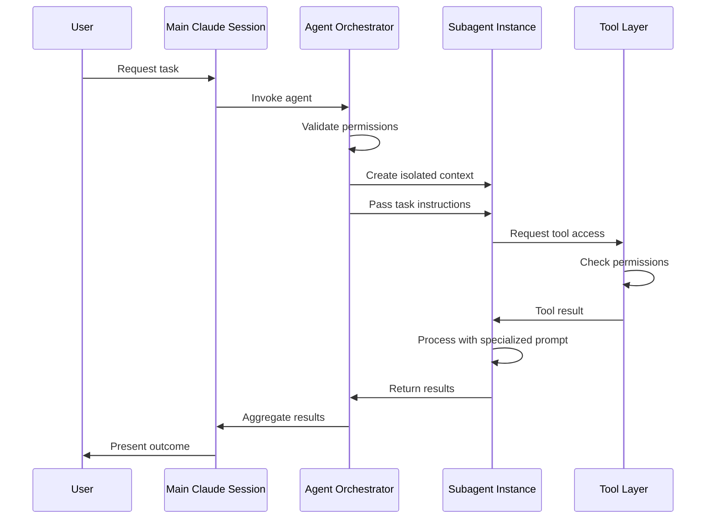
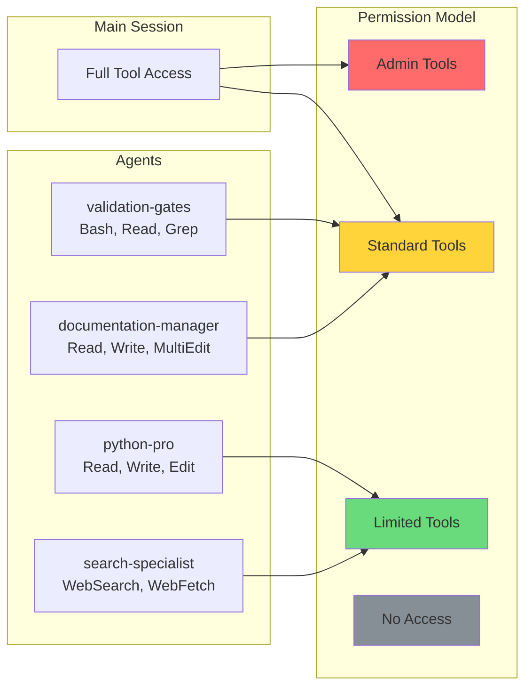

# 🤖 Agents Documentation

> **Complete guide to Claude Code subagents and multi-agent workflows**

This directory contains comprehensive documentation for the Claude Code agents system. Agents are specialized AI assistants that can be invoked to handle complex tasks with dedicated expertise and tool permissions.

---

## 📑 Table of Contents

- [Overview](#-overview)
- [What are Subagents?](#-what-are-subagents)
- [Agent vs Command](#-agent-vs-command)
- [Quick Start](#-quick-start)
- [Agent System Architecture](#-agent-system-architecture)
- [Navigation to Documentation](#-navigation-to-documentation)
- [Visual Diagrams](#-visual-diagrams)
- [Common Use Cases](#-common-use-cases)
- [Best Practices](#-best-practices)
- [Troubleshooting](#-troubleshooting)
- [Related Documentation](#-related-documentation)

---

## 🎯 Overview

Claude Code's agent system enables specialized AI assistants to handle complex tasks with dedicated context, tools, and expertise. Each agent:

- **Operates independently** - Separate Claude instance with isolated context
- **Has specific expertise** - Specialized prompts and knowledge for particular domains
- **Controlled tool access** - Only the tools needed for their job
- **Automatic or manual** - Can be invoked explicitly or automatically by commands
- **Parallel execution** - Multiple agents can run simultaneously

### Why Use Agents?

**Traditional Approach (Single AI)**:
```
You: "Review this code, update docs, and run tests"
Claude: [tries to do everything, context gets mixed]
```

**Agent Approach (Multiple Specialists)**:
```
You: /review-and-validate
├→ architect-reviewer agent (code review)
├→ documentation-manager agent (update docs)
└→ validation-gates agent (run tests)
```

### Key Benefits

✅ **Specialization** - Each agent is expert in their domain
✅ **Isolation** - Agents don't interfere with each other
✅ **Parallelism** - Multiple agents work simultaneously
✅ **Clarity** - Clear separation of responsibilities
✅ **Reusability** - Agents used across multiple workflows
✅ **Consistency** - Same agent = same quality every time

---

## 🔍 What are Subagents?

### Definition

A **subagent** is an independent Claude instance with:

1. **Custom System Prompt** - Specialized instructions and expertise
2. **Tool Permissions** - Specific subset of available tools (Read, Write, Bash, etc.)
3. **Isolated Context** - Separate conversation window
4. **Defined Purpose** - Clear responsibility and scope

### How Subagents Work

```
┌─────────────────────────────────────────────┐
│         Main Claude Session                 │
│  (Your conversation with Claude Code)       │
└────────────────┬────────────────────────────┘
                 │
                 │ Invokes Agent
                 ▼
┌─────────────────────────────────────────────┐
│         Subagent Instance                   │
│  ┌─────────────────────────────────────┐   │
│  │ System Prompt (Specialized Role)    │   │
│  ├─────────────────────────────────────┤   │
│  │ Tool Access (Limited Permissions)   │   │
│  ├─────────────────────────────────────┤   │
│  │ Context (Task-specific Information) │   │
│  └─────────────────────────────────────┘   │
│                                             │
│  Executes task independently                │
└────────────────┬────────────────────────────┘
                 │
                 │ Returns Results
                 ▼
┌─────────────────────────────────────────────┐
│         Main Session                        │
│  Receives results, continues workflow       │
└─────────────────────────────────────────────┘
```

### Agent Lifecycle

1. **Creation** - Agent defined in `.claude/agents/` directory
2. **Invocation** - Called by command or explicit request
3. **Execution** - Runs independently with given context
4. **Completion** - Returns results to caller
5. **Cleanup** - Agent context discarded (stateless)

### Context Isolation

Each agent has its own isolated context window:

```
Main Session Context:
├─ Full conversation history
├─ Project context
├─ All tool access
└─ Knowledge of all agents

Agent Context (isolated):
├─ System prompt (role definition)
├─ Task-specific instructions
├─ Limited tool access
└─ No history from main session
```

**Why isolation matters**:
- Prevents context pollution
- Maintains focus on specific task
- Enables parallel execution
- Reduces token usage
- Improves response quality

---

## ⚖️ Agent vs Command

### When to Use Agents

Use agents when you need:

✅ **Specialized expertise** - Domain-specific knowledge (Python, APIs, testing)
✅ **Tool isolation** - Limit what the AI can do
✅ **Parallel execution** - Multiple tasks simultaneously
✅ **Reusable logic** - Same capability across workflows
✅ **Complex tasks** - Multi-step processes requiring focus

**Example**: Python code refactoring with testing
```markdown
# Use python-pro agent
- Specialized Python expertise
- Only needs Read, Write, Edit tools
- Focused on Python best practices
- Reusable across multiple Python tasks
```

### When to Use Commands

Use commands when you need:

✅ **User interaction** - Direct slash command invocation
✅ **Workflow orchestration** - Coordinate multiple agents
✅ **Parameter handling** - Accept and parse user input
✅ **Sequential steps** - Define order of operations
✅ **Conditional logic** - If/then workflow decisions

**Example**: Full code review workflow
```markdown
# Use /review-complete command
- Accept file path as parameter
- Invoke architect-reviewer agent
- Then invoke validation-gates agent
- Finally invoke documentation-manager agent
- Report consolidated results
```

### Comparison Matrix

| Aspect | Agent | Command |
|--------|-------|---------|
| **Purpose** | Specialized task execution | User-facing workflow |
| **Invocation** | By command or explicit call | By user with `/` |
| **Parameters** | Receives context/instructions | Accepts user arguments |
| **Tool Access** | Limited subset | Can use any tools |
| **Composition** | Cannot invoke other agents | Can invoke multiple agents |
| **Parallelism** | Can run in parallel | Orchestrates parallel agents |
| **Reusability** | High (used by many commands) | Medium (user invokes directly) |
| **Complexity** | Focused on one domain | Can be complex workflow |

### Decision Tree

```
Do you need user-facing interaction?
├─ YES → Use Command
│   └─ Command can invoke agents internally
└─ NO → Use Agent
    └─ Agent focused on specific task

Is this a workflow with multiple steps?
├─ YES → Use Command
│   └─ Orchestrate agents for each step
└─ NO → Use Agent
    └─ Single-purpose execution

Do you need to coordinate multiple agents?
├─ YES → Use Command
│   └─ Commands coordinate agents
└─ NO → Use Agent
    └─ Agent executes independently

Do you need specialized expertise?
├─ YES → Use Agent
│   └─ Dedicated system prompt
└─ NO → Use Command
    └─ General-purpose orchestration
```

---

## 🚀 Quick Start

### Installing Agents

**Project-Specific Agents** (recommended):
```bash
# Create agents directory
mkdir -p .claude/agents/

# Copy agent file
cp ~/templates/agents/my-agent.md .claude/agents/
```

**Global Agents** (available in all projects):
```bash
# Create global agents directory
mkdir -p ~/.claude/agents/

# Copy agent file
cp ~/templates/agents/my-agent.md ~/.claude/agents/
```

### Using Agents

**1. Explicit Invocation**:
```bash
# In your conversation with Claude Code
"Please use the python-pro agent to refactor this code"

# Claude will invoke the agent automatically
```

**2. From Commands**:
```markdown
# In a command file
---
description: Refactor Python code
---

Invoke the python-pro agent to refactor the code in $ARGUMENTS
```

**3. Automatic Invocation**:
```markdown
# Some agents are called automatically by commands
/review-complete → automatically invokes architect-reviewer
```

### First Steps with Agents

**1. List Available Agents**:
```bash
# Check what agents are available
ls .claude/agents/
ls ~/.claude/agents/
```

**2. Read Agent Documentation**:
```bash
# View agent capabilities
cat .claude/agents/python-pro.md
```

**3. Test Simple Agent**:
```bash
# Try a basic agent
"Use the documentation-manager agent to update the README"
```

**4. Try Multi-Agent Workflow**:
```bash
# Use a command that coordinates agents
/review-and-validate
```

### Essential First Agents

```bash
# Documentation updates
documentation-manager → Update docs when code changes

# Code validation
validation-gates → Run tests and validate quality

# Python expertise
python-pro → Python-specific development tasks

# Research and information
search-specialist → Web research and fact-finding

# Visual diagrams
mermaid-expert → Create technical diagrams
```

---

## 🏗️ Agent System Architecture

### High-Level Overview

```
┌─────────────────────────────────────────────────────────────┐
│                    Claude Code Core                         │
│  ┌──────────────────────────────────────────────────────┐   │
│  │              Main Session Manager                    │   │
│  └──────────────────┬───────────────────────────────────┘   │
│                     │                                        │
│  ┌──────────────────▼───────────────────────────────────┐   │
│  │            Agent Orchestrator                        │   │
│  │  - Load agent definitions                            │   │
│  │  - Validate permissions                              │   │
│  │  - Create isolated contexts                          │   │
│  │  - Manage parallel execution                         │   │
│  └──────────────────┬───────────────────────────────────┘   │
│                     │                                        │
└─────────────────────┼────────────────────────────────────────┘
                      │
        ┌─────────────┼─────────────┐
        │             │             │
   ┌────▼───┐    ┌───▼────┐   ┌───▼────┐
   │ Agent  │    │ Agent  │   │ Agent  │
   │   1    │    │   2    │   │   3    │
   └────┬───┘    └───┬────┘   └───┬────┘
        │            │            │
        └────────────┴────────────┘
              Results Return
```

### Component Layers

**1. Agent Definition Layer**:
- Markdown files in `.claude/agents/`
- YAML frontmatter configuration
- System prompt content
- Tool permission specification

**2. Agent Registry Layer**:
- Discovers available agents
- Parses agent configurations
- Validates syntax and permissions
- Maintains agent metadata

**3. Agent Orchestration Layer**:
- Receives agent invocation requests
- Creates isolated contexts
- Manages parallel execution
- Handles result aggregation

**4. Agent Execution Layer**:
- Independent Claude instances
- Tool permission enforcement
- Context isolation
- Result generation

### Communication Flow

```
User Request
    │
    ▼
Command Parser
    │
    ▼
Agent Invocation
    │
    ├─────────────────────────────┐
    │                             │
    ▼                             ▼
Agent 1 (Serial)            Agent 2 (Parallel)
    │                             │
    │                        Agent 3 (Parallel)
    │                             │
    ▼                             │
Wait for completion               │
    │◄────────────────────────────┘
    │
    ▼
Aggregate Results
    │
    ▼
Present to User
```

### Execution Modes

**1. Serial Execution**:
```
Agent A → Complete → Agent B → Complete → Agent C
```

**2. Parallel Execution**:
```
Agent A ─┐
Agent B  ├→ All Complete → Aggregate
Agent C ─┘
```

**3. Conditional Execution**:
```
Agent A → Success? ─┬─ YES → Agent B
                    └─ NO  → Agent C
```

**4. Pipeline Execution**:
```
Agent A (output) → Agent B (input from A) → Agent C (input from B)
```

---

## 📚 Navigation to Documentation

### Core Agent Documentation

| Document | Description | Lines | Priority |
|----------|-------------|-------|----------|
| **[README.md](./README.md)** | Overview and quick start | ~1500 | HIGH |
| **[agent-architecture.md](./agent-architecture.md)** | System architecture | ~2000 | HIGH |
| **[agent-catalog.md](./agent-catalog.md)** | Complete agent reference | ~3000 | HIGH |
| **[creating-agents.md](./creating-agents.md)** | Build custom agents | ~2000 | MEDIUM |
| **[agent-examples.md](./agent-examples.md)** | Real-world examples | ~1500 | MEDIUM |

### Quick Navigation Map

```
agents/
├── README.md (You are here)
│   ├─ Overview and concepts
│   ├─ Quick start guide
│   └─ Agent vs Command
│
├── agent-architecture.md
│   ├─ Complete system architecture
│   ├─ Agent lifecycle
│   ├─ Context isolation
│   ├─ Tool permissions
│   └─ Performance characteristics
│
├── agent-catalog.md
│   ├─ All 14+ available agents
│   ├─ Purpose and capabilities
│   ├─ Usage examples
│   └─ Best practices per agent
│
├── creating-agents.md
│   ├─ Step-by-step guide
│   ├─ Agent file structure
│   ├─ System prompt writing
│   ├─ Tool permissions
│   └─ Testing and debugging
│
└── agent-examples.md
    ├─ Multi-agent workflows
    ├─ Code review workflows
    ├─ Documentation generation
    └─ Real-world scenarios
```

### What to Read First

**For Agent Users**:
1. This README (overview and quick start)
2. [agent-catalog.md](./agent-catalog.md) (available agents)
3. [agent-examples.md](./agent-examples.md) (see them in action)

**For Agent Creators**:
1. This README (architecture overview)
2. [agent-architecture.md](./agent-architecture.md) (detailed architecture)
3. [creating-agents.md](./creating-agents.md) (build your own)
4. [agent-examples.md](./agent-examples.md) (patterns and templates)

**For System Architects**:
1. [agent-architecture.md](./agent-architecture.md) (complete system design)
2. [agent-catalog.md](./agent-catalog.md) (understand capabilities)
3. [creating-agents.md](./creating-agents.md) (extension patterns)

---

## 📊 Visual Diagrams

### Agent Invocation Flow



### Agent Context Isolation

```mermaid
graph TB
    subgraph Main["Main Claude Session"]
        MC[Main Context Window]
        MH[Conversation History]
        MP[Project Knowledge]
    end

    subgraph Agent1["Agent 1: Python Pro"]
        A1C[Isolated Context]
        A1P[Python-Specific Prompt]
        A1T[Tools: Read, Write, Edit]
    end

    subgraph Agent2["Agent 2: Validation Gates"]
        A2C[Isolated Context]
        A2P[Testing-Specific Prompt]
        A2T[Tools: Bash, Read]
    end

    subgraph Agent3["Agent 3: Documentation Manager"]
        A3C[Isolated Context]
        A3P[Docs-Specific Prompt]
        A3T[Tools: Read, Write, Grep]
    end

    MC -->|Invoke with task| A1C
    MC -->|Invoke with task| A2C
    MC -->|Invoke with task| A3C

    A1C -.->|Results only| MC
    A2C -.->|Results only| MC
    A3C -.->|Results only| MC

    A1C x--xNo access--x A2C
    A2C x--xNo access--x A3C
    A3C x--xNo access--x A1C

    style Main fill:#e1f5ff
    style Agent1 fill:#ffe1e1
    style Agent2 fill:#e1ffe1
    style Agent3 fill:#fff4e1
```

### Tool Permission Hierarchy



### Parallel Agent Execution

```mermaid
gantt
    title Multi-Agent Parallel Workflow
    dateFormat X
    axisFormat %s

    section Orchestration
    Parse Request       :0, 1s
    Invoke Agents       :1s, 1s
    Aggregate Results   :15s, 2s

    section Agent 1
    Python Refactor     :2s, 8s

    section Agent 2
    Run Tests          :2s, 6s

    section Agent 3
    Update Docs        :2s, 5s

    section Agent 4
    Security Scan      :2s, 4s
```

---

## 💼 Common Use Cases

### 1. Code Review Workflow

**Scenario**: Review code changes before commit

**Agents Used**:
- `architect-reviewer` - Architectural analysis
- `validation-gates` - Run tests and checks
- `documentation-manager` - Update documentation

**Workflow**:
```bash
/review-complete
├─ Analyze changed files
├─ architect-reviewer → Review architecture
├─ validation-gates → Run tests
├─ documentation-manager → Check docs
└─ Aggregate feedback
```

**Benefits**:
- Comprehensive review from multiple angles
- Parallel execution = faster feedback
- Consistent quality checks

### 2. Documentation Generation

**Scenario**: Generate complete documentation for new feature

**Agents Used**:
- `docs-architect` - Plan documentation structure
- `api-documenter` - API reference
- `tutorial-engineer` - Tutorials and guides
- `mermaid-expert` - Diagrams

**Workflow**:
```bash
/docs-generate "new authentication feature"
├─ docs-architect → Plan structure
├─ api-documenter → API docs (parallel)
├─ tutorial-engineer → Tutorials (parallel)
├─ mermaid-expert → Diagrams (parallel)
└─ Assemble complete documentation
```

### 3. Python Project Setup

**Scenario**: Set up new Python project with best practices

**Agents Used**:
- `python-pro` - Project structure
- `data-engineer` - Database setup (if needed)
- `validation-gates` - Testing setup

**Workflow**:
```bash
/python-project-init "data-processing-service"
├─ python-pro → Create structure
├─ python-pro → Setup dependencies
├─ data-engineer → Database config
├─ validation-gates → Test framework
└─ Validate everything works
```

### 4. Research and Implementation

**Scenario**: Research best practices then implement

**Agents Used**:
- `search-specialist` - Research
- `ai-engineer` - Implementation
- `validation-gates` - Validation

**Workflow**:
```bash
/research-implement "RAG system with Qdrant"
├─ search-specialist → Research RAG patterns
├─ search-specialist → Find Qdrant examples
├─ ai-engineer → Implement based on research
├─ validation-gates → Test implementation
└─ Report results
```

### 5. API Development

**Scenario**: Build, document, and test API

**Agents Used**:
- `python-pro` - API implementation
- `api-documenter` - OpenAPI spec
- `validation-gates` - API tests

**Workflow**:
```bash
/api-develop "user authentication endpoints"
├─ python-pro → Implement endpoints
├─ api-documenter → OpenAPI spec (parallel)
├─ validation-gates → Integration tests
└─ Deploy-ready API
```

### 6. Architecture Review

**Scenario**: Review system architecture before major change

**Agents Used**:
- `architect-reviewer` - Architecture analysis
- `mermaid-expert` - Architecture diagrams
- `reference-builder` - Document patterns

**Workflow**:
```bash
/architecture-review
├─ architect-reviewer → Analyze current state
├─ architect-reviewer → Evaluate proposed changes
├─ mermaid-expert → Create diagrams
├─ reference-builder → Document decisions
└─ Architecture decision record (ADR)
```

---

## 💡 Best Practices

### Agent Design

✅ **DO**:
- Give agents focused responsibilities
- Use descriptive, clear system prompts
- Grant only necessary tools
- Test agents in isolation
- Document expected behavior
- Version control agent definitions

❌ **DON'T**:
- Create overly broad agents
- Grant excessive permissions
- Mix unrelated responsibilities
- Skip testing
- Leave prompts vague
- Hardcode project-specific details

### Agent Usage

✅ **DO**:
- Choose the right agent for the task
- Provide clear context to agents
- Use parallel execution when possible
- Monitor agent performance
- Review agent outputs
- Learn from agent results

❌ **DON'T**:
- Use agents for simple tasks
- Overload agents with too much context
- Chain too many agents sequentially
- Ignore agent errors
- Skip validation of results
- Blindly trust agent outputs

### Agent Orchestration

✅ **DO**:
- Plan agent workflows in advance
- Use commands to coordinate agents
- Handle agent failures gracefully
- Aggregate results meaningfully
- Provide feedback to users
- Log agent execution for debugging

❌ **DON'T**:
- Create circular agent dependencies
- Ignore execution order requirements
- Forget error handling
- Mix serial and parallel incorrectly
- Create overly complex workflows
- Skip performance testing

### Security Considerations

✅ **DO**:
- Follow principle of least privilege
- Review tool permissions carefully
- Validate agent inputs
- Audit agent tool usage
- Use "ask" permission for risky operations
- Document security implications

❌ **DON'T**:
- Grant Bash access unless necessary
- Allow unrestricted file system access
- Skip input validation
- Ignore permission violations
- Disable security prompts
- Trust unvalidated agent outputs

---

## 🐛 Troubleshooting

### Common Issues

**1. Agent Not Found**

**Symptoms**:
```
Error: Agent 'my-agent' not found
```

**Solutions**:
```bash
# Check agent file exists
ls .claude/agents/my-agent.md
ls ~/.claude/agents/my-agent.md

# Verify filename matches agent name in frontmatter
cat .claude/agents/my-agent.md

# Check YAML frontmatter syntax
# Must have "name:" field matching filename
```

**2. Permission Denied**

**Symptoms**:
```
Error: Agent 'python-pro' denied access to tool 'Bash'
```

**Solutions**:
```markdown
# In agent file, add tool to permissions
---
name: python-pro
tools: Read, Write, Edit, Bash
---

# Or modify tool permissions in settings.local.json
```

**3. Agent Fails Silently**

**Symptoms**:
- Agent invoked but no output
- Workflow hangs

**Solutions**:
```bash
# Check Claude Code output for errors
# Enable verbose logging
# Test agent in isolation
# Verify agent prompt syntax
# Check for infinite loops in agent logic
```

**4. Context Too Large**

**Symptoms**:
```
Error: Context window exceeded
```

**Solutions**:
```markdown
# Reduce context passed to agent
# Use grep/search to find specific files
# Avoid passing entire codebase
# Break task into smaller agent calls
# Use multi-agent pipeline instead
```

**5. Parallel Execution Issues**

**Symptoms**:
- Agents interfere with each other
- Race conditions
- Inconsistent results

**Solutions**:
```markdown
# Ensure agents don't write to same files
# Use file locking if needed
# Separate work into non-overlapping areas
# Consider serial execution for dependent tasks
# Use coordination command to manage agents
```

### Debugging Techniques

**1. Test Agent Isolation**:
```bash
# Invoke agent directly with simple task
"Use python-pro agent to explain this code: [simple example]"
```

**2. Check Agent Definition**:
```bash
# Validate YAML frontmatter
cat .claude/agents/my-agent.md

# Look for syntax errors
# Verify tool names are correct
# Check description is clear
```

**3. Review Tool Permissions**:
```bash
# Check what tools agent has access to
cat .claude/agents/my-agent.md | grep "tools:"

# Compare with settings.local.json permissions
cat .claude/settings.local.json
```

**4. Monitor Agent Execution**:
```markdown
# Add logging to agent workflow
# Track which agents are invoked
# Monitor tool usage
# Record execution times
```

**5. Simplify and Isolate**:
```markdown
# Remove complex logic
# Test with minimal input
# Verify basic functionality
# Add complexity gradually
```

### Getting Help

**1. Check Documentation**:
- This README
- [agent-architecture.md](./agent-architecture.md)
- [agent-catalog.md](./agent-catalog.md)
- [creating-agents.md](./creating-agents.md)

**2. Review Examples**:
```bash
# Look at working agent examples
ls .claude/agents/
cat .claude/agents/python-pro.md
```

**3. Test with Known-Good Agents**:
```bash
# Try a standard agent first
"Use documentation-manager agent to update README"
```

**4. Check Architecture Documentation**:
- [architecture/README.md](../architecture/README.md)
- [architecture/system-design.md](../architecture/system-design.md)

---

## 🔗 Related Documentation

### Essential Reading

| Document | Purpose | Priority |
|----------|---------|----------|
| [Agent Architecture](./agent-architecture.md) | Complete system design | HIGH |
| [Agent Catalog](./agent-catalog.md) | All available agents | HIGH |
| [Creating Agents](./creating-agents.md) | Build custom agents | MEDIUM |
| [Agent Examples](./agent-examples.md) | Real-world workflows | MEDIUM |

### Architecture Documentation

| Document | Purpose |
|----------|---------|
| [System Design](../architecture/system-design.md) | Overall architecture |
| [Data Flow](../architecture/data-flow.md) | How agents execute |
| [MCP Integration](../architecture/mcp-integration.md) | External capabilities |

### Related Components

| Component | Documentation |
|-----------|---------------|
| **Commands** | [commands/README.md](../commands/README.md) |
| **Hooks** | [hooks/README.md](../hooks/README.md) |
| **Settings** | [settings/README.md](../settings/README.md) |
| **MCP Servers** | [architecture/mcp-integration.md](../architecture/mcp-integration.md) |

---

## 📊 Agent Catalog Quick Reference

### By Category

**Development Agents**:
- `python-pro` - Python expertise
- `ai-engineer` - LLM and AI applications
- `data-engineer` - Data pipelines and databases

**Documentation Agents**:
- `documentation-manager` - General documentation
- `api-documenter` - API documentation
- `tutorial-engineer` - Tutorials and guides
- `docs-architect` - Documentation planning

**Quality Agents**:
- `validation-gates` - Testing and validation
- `architect-reviewer` - Architecture review

**Research Agents**:
- `search-specialist` - Web research
- `reference-builder` - Reference compilation

**Visualization Agents**:
- `mermaid-expert` - Technical diagrams

### By Tool Access

**Read-Only Agents**:
- `search-specialist` (Read + WebSearch)
- `architect-reviewer` (Read + Grep)

**Write-Capable Agents**:
- `documentation-manager` (Read, Write, MultiEdit)
- `python-pro` (Read, Write, Edit)
- `api-documenter` (Read, Write)

**Bash-Capable Agents**:
- `validation-gates` (Bash, Read, Edit)
- `data-engineer` (Bash, Read, Write)

### By Execution Speed

**Fast (<30s)**:
- `mermaid-expert`
- `reference-builder`
- `architect-reviewer`

**Medium (30s-2min)**:
- `python-pro`
- `documentation-manager`
- `api-documenter`

**Slow (2min+)**:
- `search-specialist` (research intensive)
- `validation-gates` (runs tests)
- `tutorial-engineer` (comprehensive)

---

## 🎯 Quick Reference Cards

### Essential Agents Card

```
┌──────────────────────────────────────────┐
│       ESSENTIAL AGENTS                   │
├──────────────────────────────────────────┤
│ validation-gates         Testing & QA    │
│ documentation-manager    Update docs     │
│ python-pro               Python expert   │
│ search-specialist        Research        │
│ mermaid-expert          Diagrams         │
└──────────────────────────────────────────┘
```

### Agent Selection Guide

```
┌────────────────────────────────────────────────┐
│  NEED                    USE                   │
├────────────────────────────────────────────────┤
│  Python code             python-pro            │
│  Run tests               validation-gates      │
│  Update docs             documentation-manager │
│  Web research            search-specialist     │
│  API docs                api-documenter        │
│  Architecture review     architect-reviewer    │
│  Technical diagrams      mermaid-expert        │
│  LLM features            ai-engineer           │
│  Database work           data-engineer         │
│  Tutorials               tutorial-engineer     │
└────────────────────────────────────────────────┘
```

---

## ✅ Agent Documentation Checklist

- [x] Overview and introduction
- [x] What are subagents explanation
- [x] Agent vs Command comparison
- [x] Quick start guide
- [x] Agent system architecture overview
- [x] Navigation to all documentation
- [x] Visual diagrams (Mermaid)
- [x] Common use cases
- [x] Best practices
- [x] Troubleshooting
- [x] Related documentation
- [x] Quick reference cards

---

## 📝 Document Information

**Version**: 1.0
**Last Updated**: 2025-01-15
**Maintainer**: Agent System Team
**Status**: Active

### Change Log

- **2025-01-15**: Initial agent system documentation
  - Created comprehensive agent hub
  - Documented agent architecture
  - Added quick start guide
  - Included visual diagrams and examples

---

**Navigate**: [← Back to Main](../README.md) | [Agent Architecture →](./agent-architecture.md) | [Agent Catalog →](./agent-catalog.md) | [Creating Agents →](./creating-agents.md)

---

*Built with dedication for developers who love specialized AI assistants*
