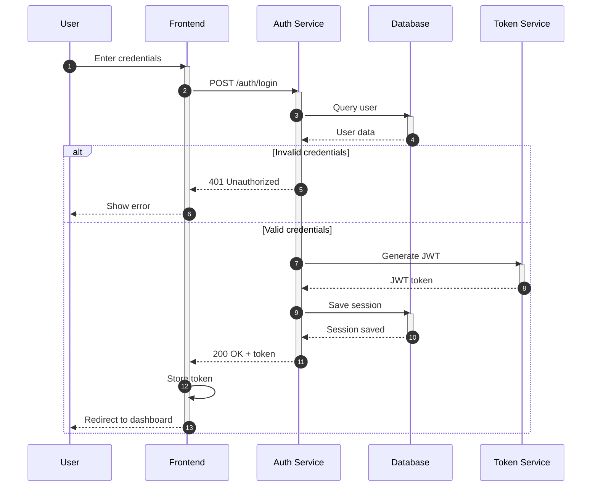
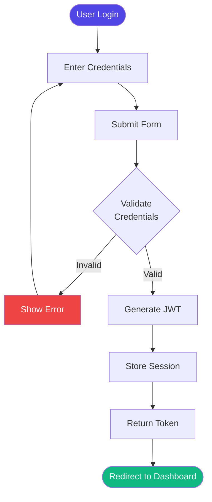

# 📚 Agent Catalog

> **Complete reference for all available Claude Code agents**

This comprehensive catalog documents all available agents in the Claude Code system, including their purpose, capabilities, tool permissions, usage examples, and best practices.

---

## 📑 Table of Contents

- [Overview](#-overview)
- [Agent Categories](#-agent-categories)
- [Quick Reference Table](#-quick-reference-table)
- [Development Agents](#-development-agents)
- [Documentation Agents](#-documentation-agents)
- [Quality Assurance Agents](#-quality-assurance-agents)
- [Research Agents](#-research-agents)
- [Visualization Agents](#-visualization-agents)
- [Specialized Agents](#-specialized-agents)
- [Agent Selection Guide](#-agent-selection-guide)
- [Multi-Agent Workflows](#-multi-agent-workflows)
- [Related Documentation](#-related-documentation)

---

## 🎯 Overview

This catalog documents **14+ specialized agents** covering development, documentation, testing, research, and visualization tasks. Each agent entry provides:

- **Purpose and capabilities**
- **Tool permissions**
- **Usage examples**
- **Best practices**
- **Common use cases**
- **Performance characteristics**

---

## 📂 Agent Categories

### Development Agents
- `python-pro` - Python expertise
- `ai-engineer` - LLM and AI applications
- `data-engineer` - Data pipelines and analytics

### Documentation Agents
- `documentation-manager` - General documentation
- `docs-architect` - Comprehensive technical docs
- `api-documenter` - API documentation
- `tutorial-engineer` - Tutorials and guides
- `reference-builder` - Reference documentation

### Quality Assurance Agents
- `validation-gates` - Testing and validation
- `architect-reviewer` - Architecture review

### Research Agents
- `search-specialist` - Web research and information gathering

### Visualization Agents
- `mermaid-expert` - Technical diagrams

### Specialized Agents
- `prp-quality-agent` - PRP template quality
- `prp-validation-gate-agent` - PRP validation

---

## 📊 Quick Reference Table

| Agent | Category | Tools | Speed | Model | Use When |
|-------|----------|-------|-------|-------|----------|
| `python-pro` | Development | Read, Write, Edit | Medium | Sonnet | Python development |
| `ai-engineer` | Development | Read, Write, Bash | Medium | Opus | LLM features |
| `data-engineer` | Development | Read, Write, Bash | Medium | Sonnet | Data pipelines |
| `validation-gates` | QA | Bash, Read, Edit, Grep | Slow | Default | Testing & validation |
| `architect-reviewer` | QA | Read, Grep | Fast | Opus | Architecture review |
| `documentation-manager` | Docs | Read, Write, MultiEdit, Grep | Fast | Default | Update docs |
| `docs-architect` | Docs | Read, Write, Grep, Glob | Medium | Opus | System documentation |
| `api-documenter` | Docs | Read, Write | Fast | Haiku | API documentation |
| `tutorial-engineer` | Docs | Read, Write | Medium | Opus | Tutorials |
| `reference-builder` | Docs | Read, Write | Fast | Haiku | Reference docs |
| `search-specialist` | Research | WebSearch, WebFetch | Slow | Haiku | Web research |
| `mermaid-expert` | Visualization | Write | Fast | Sonnet | Diagrams |
| `prp-quality-agent` | Specialized | Read, Write, Edit | Medium | Default | PRP quality |
| `prp-validation-gate-agent` | Specialized | Bash, Read | Medium | Default | PRP validation |

---

## 💻 Development Agents

### 1. python-pro

**Purpose**: Expert Python development with advanced features and best practices

**Description**: Specializes in idiomatic Python code using decorators, generators, async/await, type hints, and design patterns. Focuses on performance optimization and comprehensive testing.

**Tools**: `Read`, `Write`, `Edit`

**Model**: `sonnet`

**Focus Areas**:
- Advanced Python features (decorators, metaclasses, descriptors)
- Async/await and concurrent programming
- Performance optimization and profiling
- Design patterns and SOLID principles
- Comprehensive testing (pytest, mocking, fixtures)
- Type hints and static analysis (mypy, ruff)

**When to Use**:
- ✅ Python code refactoring
- ✅ Implementing complex Python features
- ✅ Performance optimization
- ✅ Adding type hints
- ✅ Improving test coverage
- ✅ Design pattern implementation

**Example Invocation**:
```
"Use python-pro agent to refactor this code with type hints and better error handling"
```

**Usage Pattern**:
```python
# Input: Legacy Python code
def process_data(data):
    result = []
    for item in data:
        if item > 0:
            result.append(item * 2)
    return result

# python-pro agent output:
from typing import List, Iterator

def process_data(data: List[float]) -> Iterator[float]:
    """Process data by doubling positive values.

    Args:
        data: List of numeric values to process

    Yields:
        Doubled positive values

    Raises:
        TypeError: If data contains non-numeric values
    """
    return (item * 2 for item in data if item > 0)
```

**Output Format**:
- Clean Python code with type hints
- Unit tests with pytest and fixtures
- Performance benchmarks for critical paths
- Documentation with docstrings
- Refactoring suggestions

**Best Practices**:
- Provide context about performance requirements
- Mention if code will be used in async context
- Specify Python version if relevant
- Include existing tests for validation

**Performance**: 30-60 seconds, 5,000-10,000 tokens

---

### 2. ai-engineer

**Purpose**: Build LLM applications, RAG systems, and AI-powered features

**Description**: Specializes in LLM integration, vector databases, prompt engineering, and agent orchestration. Expert in AI API integrations and token optimization.

**Tools**: `Read`, `Write`, `Bash`

**Model**: `opus`

**Focus Areas**:
- LLM integration (OpenAI, Anthropic, local models)
- RAG systems with vector databases (Qdrant, Pinecone, Weaviate)
- Prompt engineering and optimization
- Agent frameworks (LangChain, LangGraph, CrewAI)
- Embedding strategies and semantic search
- Token optimization and cost management

**When to Use**:
- ✅ Implementing LLM features
- ✅ Building RAG systems
- ✅ Prompt optimization
- ✅ Agent orchestration
- ✅ Semantic search
- ✅ AI API integrations

**Example Invocation**:
```
"Use ai-engineer agent to implement a RAG system using Qdrant for documentation search"
```

**Usage Pattern**:
```python
# ai-engineer creates complete RAG implementation
from qdrant_client import QdrantClient
from openai import OpenAI

class DocumentationRAG:
    def __init__(self):
        self.qdrant = QdrantClient(":memory:")
        self.openai = OpenAI()

    def search(self, query: str, limit: int = 5):
        # Generate embedding
        embedding = self.openai.embeddings.create(
            input=query,
            model="text-embedding-3-small"
        )

        # Search vector DB
        results = self.qdrant.search(
            collection_name="docs",
            query_vector=embedding.data[0].embedding,
            limit=limit
        )

        return results
```

**Output Format**:
- LLM integration code with error handling
- RAG pipeline with chunking strategy
- Prompt templates with variables
- Vector database setup
- Token usage tracking
- Evaluation metrics

**Best Practices**:
- Specify target LLM provider
- Mention budget constraints
- Include sample data if available
- State performance requirements

**Performance**: 60-120 seconds, 10,000-20,000 tokens

---

### 3. data-engineer

**Purpose**: Build ETL pipelines, data warehouses, and streaming architectures

**Description**: Specializes in scalable data pipelines with Airflow, Spark optimization, Kafka streams, and data warehouse design. Expert in data quality and cost optimization.

**Tools**: `Read`, `Write`, `Bash`

**Model**: `sonnet`

**Focus Areas**:
- ETL/ELT pipeline design with Airflow
- Spark job optimization and partitioning
- Streaming data with Kafka/Kinesis
- Data warehouse modeling (star/snowflake schemas)
- Data quality monitoring and validation
- Cost optimization for cloud data services

**When to Use**:
- ✅ ETL pipeline design
- ✅ Data warehouse modeling
- ✅ Streaming data processing
- ✅ Data quality checks
- ✅ Spark optimization
- ✅ Airflow DAG creation

**Example Invocation**:
```
"Use data-engineer agent to create an Airflow DAG for daily user data processing"
```

**Usage Pattern**:
```python
# data-engineer creates production-ready DAG
from airflow import DAG
from airflow.operators.python import PythonOperator
from airflow.providers.amazon.aws.hooks.s3 import S3Hook
from datetime import datetime, timedelta

default_args = {
    'owner': 'data-team',
    'depends_on_past': False,
    'start_date': datetime(2025, 1, 1),
    'email_on_failure': True,
    'email_on_retry': False,
    'retries': 3,
    'retry_delay': timedelta(minutes=5),
}

dag = DAG(
    'user_data_processing',
    default_args=default_args,
    schedule_interval='@daily',
    catchup=False
)

# Idempotent processing with data quality checks
def process_user_data(**context):
    # Implementation with error handling
    pass
```

**Output Format**:
- Airflow DAG with error handling
- Spark job with optimizations
- Data warehouse schema
- Data quality checks
- Monitoring configuration
- Cost estimates

**Best Practices**:
- Specify data volume and frequency
- Mention cloud platform (AWS/Azure/GCP)
- Include data quality requirements
- State SLA requirements

**Performance**: 45-90 seconds, 8,000-15,000 tokens

---

## 📝 Documentation Agents

### 4. documentation-manager

**Purpose**: Maintain and update documentation when code changes

**Description**: Proactively updates documentation to stay synchronized with code changes. Ensures README accuracy, maintains API docs, and keeps documentation comprehensive and helpful.

**Tools**: `Read`, `Write`, `Edit`, `MultiEdit`, `Grep`, `Glob`, `ls`

**Model**: `default`

**Core Responsibilities**:
- Documentation synchronization with code
- README accuracy maintenance
- API documentation updates
- Structure organization (README, docs/, API.md, etc.)
- Documentation quality standards
- Proactive documentation tasks
- Documentation validation

**When to Use**:
- ✅ After code changes
- ✅ New features added
- ✅ Dependencies changed
- ✅ API modifications
- ✅ Configuration updates
- ✅ Breaking changes

**Example Invocation**:
```
"Use documentation-manager agent to update docs for the new authentication feature in auth.py"
```

**Usage Pattern**:
```markdown
# documentation-manager updates multiple docs

## README.md updates:
- Add authentication to features list
- Update installation with new dependencies
- Add authentication configuration section

## docs/authentication.md (new file):
- Complete authentication guide
- Configuration options
- Usage examples
- Security considerations

## API.md updates:
- New /auth endpoints
- Authentication headers
- Error responses
```

**Output Format**:
- Updated documentation files
- Cross-reference updates
- New documentation sections
- Code examples
- Configuration guides

**Best Practices**:
- Tell agent which files changed
- Mention type of changes (feature, bugfix, refactor)
- Specify if breaking changes
- Indicate target audience

**Performance**: 20-45 seconds, 3,000-8,000 tokens

---

### 5. docs-architect

**Purpose**: Create comprehensive technical documentation and system manuals

**Description**: Creates long-form technical documentation (10-100+ pages) that captures architecture, design patterns, and implementation details. Produces technical deep-dives and ebooks.

**Tools**: `Read`, `Write`, `Grep`, `Glob`

**Model**: `opus`

**Core Competencies**:
- Codebase analysis
- Technical writing
- System thinking
- Documentation architecture
- Visual communication

**Documentation Process**:
1. Discovery Phase - Analyze codebase structure
2. Structuring Phase - Create logical hierarchy
3. Writing Phase - Progressive disclosure of complexity

**When to Use**:
- ✅ System documentation
- ✅ Architecture guides
- ✅ Technical manuals
- ✅ Comprehensive references
- ✅ Onboarding documentation
- ✅ Design decision records

**Example Invocation**:
```
"Use docs-architect agent to create comprehensive system documentation for the entire codebase"
```

**Usage Pattern**:
```markdown
# docs-architect creates structured manual

# 1. Executive Summary (1 page)
Overview for stakeholders

# 2. Architecture Overview (10 pages)
- System boundaries
- Key components
- Architectural patterns
- Mermaid diagrams

# 3. Core Components (30 pages)
Deep dive into each module

# 4. Data Models (15 pages)
Schema design and data flow

# 5. Integration Points (10 pages)
APIs, events, dependencies

# 6. Deployment (8 pages)
Infrastructure and operations

# 7. Performance (5 pages)
Bottlenecks and optimizations

# 8. Security (7 pages)
Authentication, authorization

# 9. Appendices (10 pages)
Glossary, references
```

**Output Format**:
- Multi-chapter documentation (10-100+ pages)
- Progressive complexity
- Code examples with explanations
- Architectural diagrams
- Design rationale
- Cross-references

**Best Practices**:
- Provide complete codebase access
- Specify target audience
- Mention documentation length goal
- Include any existing documentation

**Performance**: 120-300 seconds, 30,000-80,000 tokens

---

### 6. api-documenter

**Purpose**: Create OpenAPI/Swagger specs and developer documentation

**Description**: Creates comprehensive API documentation with OpenAPI specs, SDK generation, interactive docs, and versioning strategies.

**Tools**: `Read`, `Write`

**Model**: `haiku`

**Focus Areas**:
- OpenAPI 3.0/Swagger specifications
- SDK generation and client libraries
- Interactive documentation (Postman/Insomnia)
- Versioning strategies
- Code examples in multiple languages
- Authentication and error documentation

**When to Use**:
- ✅ API documentation
- ✅ OpenAPI spec generation
- ✅ SDK documentation
- ✅ API versioning guides
- ✅ Error code documentation
- ✅ Authentication guides

**Example Invocation**:
```
"Use api-documenter agent to create OpenAPI spec for the user management API"
```

**Usage Pattern**:
```yaml
# api-documenter creates complete OpenAPI spec
openapi: 3.0.0
info:
  title: User Management API
  version: 1.0.0
  description: Comprehensive user management endpoints

paths:
  /users:
    get:
      summary: List all users
      parameters:
        - name: limit
          in: query
          schema:
            type: integer
            default: 10
      responses:
        '200':
          description: Successful response
          content:
            application/json:
              schema:
                type: array
                items:
                  $ref: '#/components/schemas/User'
              examples:
                success:
                  value:
                    - id: 1
                      name: "John Doe"
                      email: "john@example.com"
```

**Output Format**:
- Complete OpenAPI specification
- Request/response examples
- Authentication setup guide
- Error code reference
- SDK usage examples
- Postman collection

**Best Practices**:
- Provide API code or existing docs
- Specify API version
- Mention authentication method
- Include example data

**Performance**: 30-60 seconds, 5,000-10,000 tokens

---

### 7. tutorial-engineer

**Purpose**: Create step-by-step tutorials and educational content

**Description**: Transforms complex concepts into progressive learning experiences with hands-on examples. Expert in pedagogical design and progressive skill building.

**Tools**: `Read`, `Write`

**Model**: `opus`

**Core Expertise**:
- Pedagogical design
- Progressive disclosure
- Hands-on learning
- Error anticipation
- Multiple learning styles

**Tutorial Structure**:
- Opening: Learning objectives, prerequisites, time estimate
- Progressive sections: Concept → Example → Practice → Challenges
- Closing: Summary, next steps, resources

**When to Use**:
- ✅ Onboarding guides
- ✅ Feature tutorials
- ✅ Concept explanations
- ✅ Learning paths
- ✅ Workshop materials
- ✅ Educational content

**Example Invocation**:
```
"Use tutorial-engineer agent to create a tutorial for the new authentication system"
```

**Usage Pattern**:
```markdown
# tutorial-engineer creates progressive tutorial

# Building Secure Authentication: A Step-by-Step Tutorial

## What You'll Learn
By the end of this tutorial, you'll be able to:
- Implement JWT-based authentication
- Handle user registration and login
- Secure API endpoints
- Manage sessions

## Prerequisites
- Python 3.9+
- Basic understanding of HTTP
- Familiarity with REST APIs

## Time Estimate: 45 minutes

## Step 1: Understanding JWT (5 minutes)
[Theory with analogies]
[Minimal example]

## Step 2: User Registration (10 minutes)
[Step-by-step walkthrough]
[Code with inline comments]
[Run and test]

## Step 3: Login Flow (10 minutes)
[Build on previous step]
[Common pitfalls]
[Debug exercise]

...
```

**Output Format**:
- Step-by-step tutorials
- Runnable code examples
- Progressive complexity
- Practice exercises
- Troubleshooting guides
- Self-assessment checkpoints

**Best Practices**:
- Specify target skill level
- Mention tutorial length goal
- Include learning objectives
- Provide example code

**Performance**: 60-120 seconds, 15,000-30,000 tokens

---

### 8. reference-builder

**Purpose**: Create exhaustive technical references and specifications

**Description**: Creates comprehensive, searchable reference documentation covering every parameter, method, and configuration option. Definitive source of truth.

**Tools**: `Read`, `Write`

**Model**: `haiku`

**Core Capabilities**:
- Exhaustive coverage
- Precise categorization
- Cross-referencing
- Example generation
- Edge case documentation

**Reference Types**:
- API references
- Configuration guides
- Schema documentation

**When to Use**:
- ✅ API reference docs
- ✅ Configuration references
- ✅ Complete specifications
- ✅ Parameter documentation
- ✅ Schema definitions
- ✅ Error code catalogs

**Example Invocation**:
```
"Use reference-builder agent to create complete configuration reference"
```

**Usage Pattern**:
```markdown
# reference-builder creates exhaustive reference

# Configuration Reference

## Database Configuration

### `database.host`

**Type**: `string`
**Default**: `"localhost"`
**Required**: Yes
**Since**: v1.0.0
**Environment Variable**: `DB_HOST`

**Description**:
Hostname or IP address of the database server. Supports IPv4, IPv6, and domain names.

**Valid Values**:
- IPv4: `192.168.1.100`
- IPv6: `[2001:db8::1]`
- Domain: `db.example.com`
- Localhost: `localhost` or `127.0.0.1`

**Examples**:
```json
{
  "database": {
    "host": "localhost"
  }
}
```

**See Also**:
- [`database.port`](#databaseport)
- [`database.ssl`](#databasessl)
```

**Output Format**:
- Complete parameter listings
- Default values and ranges
- Examples for every feature
- Cross-references
- Compatibility matrices
- Migration guides

**Best Practices**:
- Provide complete codebase or specs
- Specify versioning scheme
- Include deprecated features
- Mention target format

**Performance**: 30-90 seconds, 8,000-20,000 tokens

---

## ✅ Quality Assurance Agents

### 9. validation-gates

**Purpose**: Testing, validation, and quality assurance

**Description**: Proactively runs tests, validates code changes, ensures quality gates are met, and iterates on fixes until all tests pass. Never gives up until quality standards are achieved.

**Tools**: `Bash`, `Read`, `Edit`, `MultiEdit`, `Grep`, `Glob`, `TodoWrite`

**Model**: `default`

**Core Responsibilities**:
- Automated testing execution
- Test coverage management
- Iterative fix process
- Validation gates checklist
- Test writing standards

**Validation Checklist**:
- ✅ All unit tests pass
- ✅ Integration tests pass
- ✅ Linting produces no errors
- ✅ Type checking passes
- ✅ Code formatting correct
- ✅ Build succeeds
- ✅ No security vulnerabilities
- ✅ Performance benchmarks met

**When to Use**:
- ✅ After implementing features
- ✅ Before commits
- ✅ Code review validation
- ✅ Regression testing
- ✅ Test generation
- ✅ Quality gate enforcement

**Example Invocation**:
```
"Use validation-gates agent to validate the new authentication feature and ensure all tests pass"
```

**Usage Pattern**:
```bash
# validation-gates runs comprehensive checks

# 1. Run linting
$ ruff check .
✅ No linting errors

# 2. Type checking
$ mypy .
✅ Type checking passed

# 3. Run tests
$ pytest --cov
==== test session starts ====
tests/test_auth.py::test_login_success PASSED
tests/test_auth.py::test_login_failure PASSED
tests/test_auth.py::test_token_validation PASSED
==== 15 passed in 2.43s ====

Coverage: 94%
✅ All tests passed

# 4. Build check
$ python -m build
✅ Build successful

# Summary
✅ All validation gates passed
```

**Output Format**:
- Test execution results
- Coverage reports
- Linting results
- Build status
- Fix implementations (if failures)
- Iteration log

**Best Practices**:
- Be specific about features tested
- Mention test framework (pytest, jest, etc.)
- Include coverage requirements
- Specify validation gates

**Performance**: 60-180 seconds (depends on test suite), 8,000-15,000 tokens

---

### 10. architect-reviewer

**Purpose**: Review code changes for architectural consistency

**Description**: Reviews code through an architectural lens, ensuring consistency with established patterns and principles. Checks SOLID compliance, dependency direction, and maintainability.

**Tools**: `Read`, `Grep`

**Model**: `opus`

**Core Responsibilities**:
- Pattern adherence verification
- SOLID compliance checking
- Dependency analysis
- Abstraction level verification
- Future-proofing assessment

**Review Process**:
1. Map change within architecture
2. Identify boundaries crossed
3. Check pattern consistency
4. Evaluate modularity impact
5. Suggest improvements

**When to Use**:
- ✅ After structural changes
- ✅ New services/modules
- ✅ API modifications
- ✅ Major refactoring
- ✅ Architecture evaluation
- ✅ Code review enhancement

**Example Invocation**:
```
"Use architect-reviewer agent to review the new payment service architecture"
```

**Usage Pattern**:
```markdown
# architect-reviewer provides structured review

# Architecture Review: Payment Service

## Impact Assessment: **HIGH**

The new payment service introduces a critical financial transaction boundary.

## Pattern Compliance

✅ **Service Layer Pattern**: Correctly implements service abstraction
✅ **Repository Pattern**: Database access properly isolated
⚠️ **Event-Driven**: Missing domain events for payment state changes
❌ **Dependency Injection**: Direct instantiation of PaymentGateway

## SOLID Principles

✅ **Single Responsibility**: Each class has focused responsibility
✅ **Open/Closed**: Payment methods extensible via strategy pattern
❌ **Liskov Substitution**: PaymentGateway implementations not truly substitutable
✅ **Interface Segregation**: Interfaces appropriately sized
⚠️ **Dependency Inversion**: Depends on concrete PaymentGateway class

## Specific Violations

### High Priority

1. **Circular Dependency** (Line 45, payment_service.py)
   ```python
   # Current: payment_service → user_service → payment_service
   # Fix: Introduce payment_events for decoupling
   ```

2. **God Object** (PaymentProcessor, 450 lines)
   ```python
   # Split into:
   # - PaymentValidator
   # - PaymentExecutor
   # - PaymentLogger
   ```

## Recommended Refactoring

1. Introduce payment domain events
2. Implement dependency injection for PaymentGateway
3. Split PaymentProcessor using SRP
4. Add integration tests for payment flows

## Long-Term Implications

**Positive**:
- Clear service boundary enables future payment method additions
- Repository pattern makes database migration easier

**Negative**:
- Tight coupling to PaymentGateway makes testing difficult
- Missing events complicates future audit requirements
- God object will become maintenance burden

## Estimated Refactoring Effort: 4-6 hours
```

**Output Format**:
- Impact assessment (High/Medium/Low)
- Pattern compliance checklist
- SOLID principle violations
- Specific code issues with line numbers
- Recommended refactoring
- Long-term implications
- Effort estimates

**Best Practices**:
- Provide context about system architecture
- Mention existing patterns to follow
- Include related services/modules
- Specify architectural principles

**Performance**: 45-90 seconds, 8,000-15,000 tokens

---

## 🔍 Research Agents

### 11. search-specialist

**Purpose**: Expert web research using advanced search techniques

**Description**: Masters search operators, result filtering, and multi-source verification. Handles competitive analysis, fact-checking, and deep research. Synthesizes information across sources.

**Tools**: `WebSearch`, `WebFetch`, `Read`

**Model**: `haiku`

**Focus Areas**:
- Advanced search query formulation
- Domain-specific searching and filtering
- Result quality evaluation
- Information synthesis
- Fact verification and cross-referencing
- Historical and trend analysis

**Search Strategies**:
- Query optimization (exact phrases, exclusions, timeframes)
- Domain filtering (allowed/blocked domains)
- WebFetch deep dive (full content extraction)

**When to Use**:
- ✅ Technical research
- ✅ Best practices investigation
- ✅ Competitive analysis
- ✅ Trend analysis
- ✅ Fact verification
- ✅ Multi-source synthesis

**Example Invocation**:
```
"Use search-specialist agent to research best practices for implementing RAG systems with Qdrant"
```

**Usage Pattern**:
```markdown
# search-specialist conducts comprehensive research

# Research Report: RAG Systems with Qdrant

## Research Methodology

**Queries Used**:
1. "RAG system architecture Qdrant best practices"
2. "vector database optimization Qdrant performance"
3. "semantic search implementation patterns 2024"
4. "embedding strategies for document retrieval"

**Sources**:
- Qdrant official documentation (qdrant.tech)
- Academic papers (arxiv.org)
- Engineering blogs (High-quality sources)
- GitHub repositories (Production examples)

## Key Findings

### 1. Architecture Patterns

**Consensus**: Hybrid search (dense + sparse) outperforms pure vector search

**Sources**:
- [Qdrant Hybrid Search Guide](https://qdrant.tech/articles/hybrid-search/)
- [Engineering Blog: RAG in Production](...)
- [Research Paper: arxiv.org/abs/...]

**Key Insight**: Combine semantic (vector) and keyword (BM25) search with score fusion

### 2. Embedding Strategies

**Best Practice**: Use domain-specific fine-tuned embeddings

**Sources**:
- 5 sources confirm this approach
- Production examples at [GitHub repo...]

**Implementation**:
```python
# Recommended approach
from sentence_transformers import SentenceTransformer

model = SentenceTransformer('multi-qa-mpnet-base-dot-v1')
# 768-dim embeddings optimized for Q&A
```

### 3. Performance Optimization

**Critical Finding**: HNSW index parameters significantly impact performance

**Recommendations**:
- m=16 for recall/speed balance
- ef_construct=100 for quality
- ef=64 for search speed

**Benchmarks** (from 3 sources):
- Search latency: <50ms at 1M vectors
- Recall@10: 0.95+
- Memory: ~1.2GB per 1M vectors

## Contradictions Identified

**Topic**: Chunking Strategy

**Position A** (2 sources): Fixed 512-token chunks
**Position B** (3 sources): Semantic chunking based on paragraphs

**Resolution**: Use semantic chunking for better context preservation, with max 512 tokens

## Recommendations

1. **Architecture**: Implement hybrid search from start
2. **Embeddings**: Use multi-qa-mpnet-base-dot-v1
3. **Chunking**: Semantic with 512-token max
4. **Index**: HNSW with m=16, ef_construct=100
5. **Monitoring**: Track recall@10 and latency

## Further Research Needed

- Long-term performance with 10M+ vectors
- Cost optimization for cloud deployments
- Multi-language embedding strategies

## Total Sources: 17
## High-Quality Sources: 12
## Conflicting Information: 2 topics
## Research Time: 3 minutes
```

**Output Format**:
- Research methodology
- Curated findings with sources
- Credibility assessment
- Synthesis with insights
- Contradictions identified
- Recommendations
- Further research topics

**Best Practices**:
- Provide clear research objective
- Mention preferred sources if any
- Specify depth (quick overview vs deep dive)
- Include timeframe if relevant

**Performance**: 90-180 seconds, 12,000-25,000 tokens

---

## 📊 Visualization Agents

### 12. mermaid-expert

**Purpose**: Create Mermaid diagrams for technical visualization

**Description**: Creates professional Mermaid diagrams for flowcharts, sequence diagrams, ERDs, architecture diagrams, and more. Masters all diagram types and styling.

**Tools**: `Write`

**Model**: `sonnet`

**Focus Areas**:
- Flowcharts and decision trees
- Sequence diagrams for APIs/interactions
- Entity Relationship Diagrams (ERD)
- State diagrams and user journeys
- Gantt charts for timelines
- Architecture and network diagrams

**Diagram Types**:
- graph (flowchart), sequenceDiagram, classDiagram
- stateDiagram-v2, erDiagram, gantt, pie
- gitGraph, journey, quadrantChart, timeline

**When to Use**:
- ✅ System architecture diagrams
- ✅ API sequence flows
- ✅ Database ERDs
- ✅ State machines
- ✅ Process flowcharts
- ✅ Timeline visualization

**Example Invocation**:
```
"Use mermaid-expert agent to create a sequence diagram for the authentication flow"
```

**Usage Pattern**:
````markdown
# mermaid-expert creates professional diagrams

## Authentication Flow Sequence Diagram



## Alternative: Styled Version

```mermaid
%%{init: {'theme':'base', 'themeVariables': { 'primaryColor':'#4F46E5'}}}%%
sequenceDiagram
    [Same diagram with styling]
```

## Alternative: Flowchart Version


````

**Output Format**:
- Complete Mermaid diagram code
- Multiple diagram type options
- Styled and unstyled versions
- Rendering instructions
- Accessibility notes
- Export recommendations

**Best Practices**:
- Describe what needs to be visualized
- Mention preferred diagram type if known
- Specify if styling needed
- Include complexity level (simple/detailed)

**Performance**: 15-30 seconds, 2,000-5,000 tokens

---

## 🎯 Specialized Agents

### 13. prp-quality-agent

**Purpose**: Ensure PRP template quality and consistency

**Description**: Reviews PRP (Product Requirement Prompt) templates for completeness, clarity, and adherence to PRP standards. Validates template structure and content quality.

**Tools**: `Read`, `Write`, `Edit`

**Model**: `default`

**Focus Areas**:
- PRP template structure validation
- Content completeness checking
- Example quality assessment
- Consistency with PRP patterns
- Best practices enforcement

**When to Use**:
- ✅ PRP template creation
- ✅ PRP quality review
- ✅ Template standardization
- ✅ PRP improvement
- ✅ Template validation

**Example Invocation**:
```
"Use prp-quality-agent to review the MCP server PRP template"
```

**Best Practices**:
- Provide complete PRP template
- Mention target use case
- Include any existing standards
- Specify quality criteria

**Performance**: 30-60 seconds, 5,000-10,000 tokens

---

### 14. prp-validation-gate-agent

**Purpose**: Validate PRP implementations and outputs

**Description**: Tests PRP-generated code and outputs against validation criteria. Ensures PRP implementations meet requirements and quality standards.

**Tools**: `Bash`, `Read`

**Model**: `default`

**Focus Areas**:
- PRP output validation
- Test execution
- Requirement verification
- Quality gate checking

**When to Use**:
- ✅ PRP output validation
- ✅ Implementation testing
- ✅ Quality assurance
- ✅ Requirement verification

**Example Invocation**:
```
"Use prp-validation-gate-agent to validate the generated MCP server code"
```

**Best Practices**:
- Specify validation criteria
- Include test requirements
- Mention success metrics
- Provide expected outputs

**Performance**: 45-90 seconds, 6,000-12,000 tokens

---

## 🧭 Agent Selection Guide

### Decision Tree

```
What do you need?

├─ Code Development
│  ├─ Python? → python-pro
│  ├─ LLM/AI? → ai-engineer
│  └─ Data pipelines? → data-engineer
│
├─ Documentation
│  ├─ Update existing? → documentation-manager
│  ├─ Comprehensive manual? → docs-architect
│  ├─ API docs? → api-documenter
│  ├─ Tutorial? → tutorial-engineer
│  └─ Reference? → reference-builder
│
├─ Quality Assurance
│  ├─ Testing? → validation-gates
│  └─ Architecture review? → architect-reviewer
│
├─ Research
│  └─ Web research? → search-specialist
│
├─ Visualization
│  └─ Diagrams? → mermaid-expert
│
└─ PRP Templates
   ├─ Quality review? → prp-quality-agent
   └─ Validation? → prp-validation-gate-agent
```

### By Task Type

| Task | Recommended Agent | Alternative |
|------|------------------|-------------|
| Python refactoring | `python-pro` | - |
| RAG system | `ai-engineer` | - |
| ETL pipeline | `data-engineer` | - |
| Update README | `documentation-manager` | - |
| System manual | `docs-architect` | `reference-builder` |
| API specification | `api-documenter` | `reference-builder` |
| Learning tutorial | `tutorial-engineer` | `documentation-manager` |
| Parameter reference | `reference-builder` | `api-documenter` |
| Run tests | `validation-gates` | - |
| Architecture review | `architect-reviewer` | - |
| Best practices research | `search-specialist` | - |
| Sequence diagram | `mermaid-expert` | - |
| PRP template quality | `prp-quality-agent` | - |

### By Programming Language

| Language | Agent | Notes |
|----------|-------|-------|
| Python | `python-pro` | Primary Python expert |
| Python (Data) | `data-engineer` | Data-focused Python |
| Python (AI) | `ai-engineer` | AI/ML Python code |
| JavaScript/TypeScript | General | No specialized agent yet |
| Go | General | No specialized agent yet |
| Rust | General | No specialized agent yet |

### By Output Type

| Output | Agent | Typical Size |
|--------|-------|--------------|
| Code | `python-pro`, `ai-engineer`, `data-engineer` | 100-500 lines |
| Tests | `validation-gates` | 50-200 lines |
| README | `documentation-manager` | 500-2000 lines |
| Manual | `docs-architect` | 5000-50000 lines |
| API Spec | `api-documenter` | 500-3000 lines |
| Tutorial | `tutorial-engineer` | 1000-5000 lines |
| Reference | `reference-builder` | 2000-10000 lines |
| Diagram | `mermaid-expert` | 20-100 lines |
| Research Report | `search-specialist` | 1000-3000 lines |

---

## 🔄 Multi-Agent Workflows

### Common Multi-Agent Patterns

#### 1. Complete Feature Implementation

```
Feature Request →
├─ search-specialist (research best practices)
├─ python-pro (implement feature)
├─ validation-gates (run tests)
└─ documentation-manager (update docs)
```

**Example**:
```bash
/implement-feature "Add rate limiting to API"
```

#### 2. Comprehensive Documentation

```
Documentation Request →
├─ docs-architect (system overview)
├─ api-documenter (API reference) [parallel]
├─ tutorial-engineer (tutorials) [parallel]
├─ mermaid-expert (diagrams) [parallel]
└─ reference-builder (configuration reference)
```

**Example**:
```bash
/document-system
```

#### 3. Code Review Workflow

```
Code Changes →
├─ architect-reviewer (architecture)
├─ validation-gates (tests and quality) [parallel]
└─ documentation-manager (docs updated?)
```

**Example**:
```bash
/review-complete
```

#### 4. Research and Implementation

```
Research Topic →
├─ search-specialist (research)
└─ [Conditional on research]
    ├─ python-pro (Python implementation)
    ├─ ai-engineer (AI implementation)
    └─ data-engineer (Data implementation)
```

**Example**:
```bash
/research-implement "Vector database optimization"
```

#### 5. Quality Assurance Pipeline

```
Code Completion →
├─ validation-gates (unit tests)
├─ validation-gates (integration tests)
├─ architect-reviewer (architecture review)
└─ [If all pass]
    └─ documentation-manager (finalize docs)
```

---

## 🔗 Related Documentation

### Essential Reading

| Document | Purpose |
|----------|---------|
| [Agents README](./README.md) | Overview and quick start |
| [Agent Architecture](./agent-architecture.md) | System architecture |
| [Creating Agents](./creating-agents.md) | Build custom agents |
| [Agent Examples](./agent-examples.md) | Real-world workflows |

### Related Components

| Component | Documentation |
|-----------|---------------|
| **Commands** | [commands/README.md](../commands/README.md) |
| **Hooks** | [hooks/README.md](../hooks/README.md) |
| **Settings** | [settings/README.md](../settings/README.md) |

---

## 📝 Document Information

**Version**: 1.0
**Last Updated**: 2025-01-15
**Maintainer**: Agent System Team
**Status**: Active

---

**Navigate**: [← Back to Agents](./README.md) | [Agent Architecture ←](./agent-architecture.md) | [Creating Agents →](./creating-agents.md) | [Examples →](./agent-examples.md)

---

*Complete catalog of 14+ specialized agents ready to enhance your development workflow*
