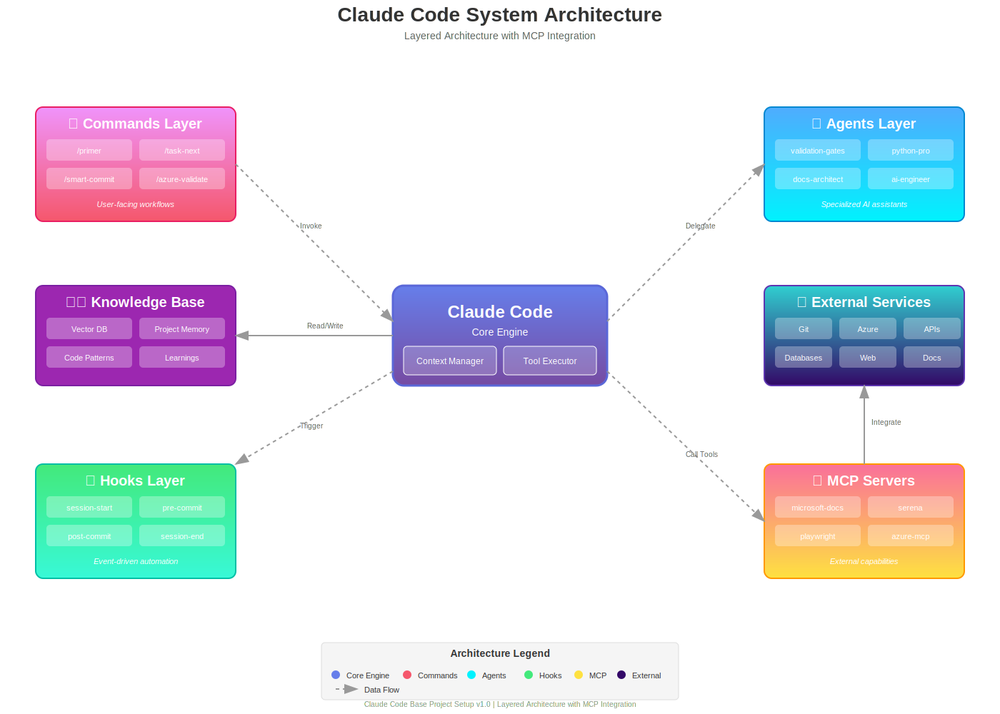
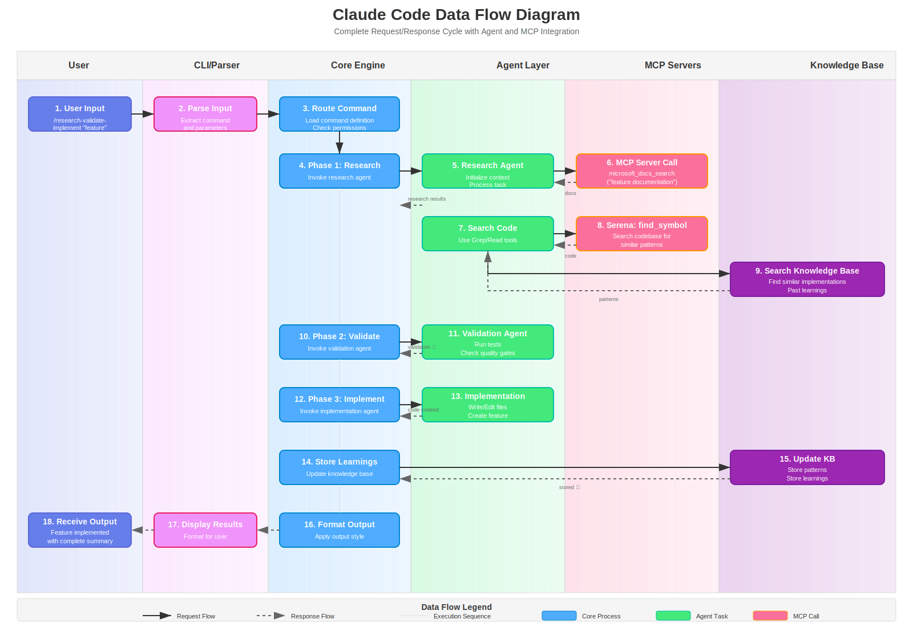

# 🏗️ Architecture Documentation

> **Complete architectural reference for Claude Code base project setup**

This directory contains comprehensive architectural documentation covering system design, data flows, integration patterns, and technical decisions.

---

## 📑 Table of Contents

- [Overview](#-overview)
- [Documentation Structure](#-documentation-structure)
- [Quick Start for Architects](#-quick-start-for-architects)
- [Key Architectural Principles](#-key-architectural-principles)
- [System Components](#-system-components)
- [Architecture Diagrams](#-architecture-diagrams)
- [Architecture Decision Records](#-architecture-decision-records-adr)
- [Related Documentation](#-related-documentation)

---

## 🎯 Overview

The Claude Code base project implements a sophisticated, multi-layered architecture designed for extensibility, maintainability, and developer productivity. The system combines:

- **Command-driven workflows** - Slash commands for common tasks
- **Intelligent agents** - Specialized subagents for complex operations
- **Event-driven hooks** - Lifecycle hooks for automation
- **MCP server integration** - Nine specialized MCP servers for enhanced capabilities
- **Knowledge management** - Persistent learning and pattern recognition

### Architectural Goals

✅ **Modularity** - Independent, composable components
✅ **Extensibility** - Easy customization and extension
✅ **Maintainability** - Clear separation of concerns
✅ **Performance** - Optimized for fast execution
✅ **Reliability** - Robust error handling and recovery
✅ **Security** - Permission-based access control
✅ **Developer Experience** - Intuitive workflows and clear patterns

---

## 📚 Documentation Structure

### Core Architecture Documents

| Document | Description | Audience |
|----------|-------------|----------|
| **[System Design](./system-design.md)** | Complete system architecture, components, and interactions | All developers |
| **[Data Flow](./data-flow.md)** | Data flow patterns, lifecycle, and state management | Backend developers |
| **[MCP Integration](./mcp-integration.md)** | MCP server integration patterns and usage | Integration developers |

### Architecture Diagrams

| Diagram | Description | Format |
|---------|-------------|--------|
| **[System Overview](./diagrams/system-overview.svg)** | High-level system architecture | SVG |
| **[Data Flow](./diagrams/data-flow.svg)** | Request/response flow patterns | SVG |

### Quick Reference

```
architecture/
├── README.md                      ← You are here
├── system-design.md              ← System architecture (3000 lines)
├── data-flow.md                  ← Data flow patterns (2500 lines)
├── mcp-integration.md            ← MCP integration (3000 lines)
└── diagrams/
    ├── system-overview.svg       ← System architecture diagram
    └── data-flow.svg             ← Data flow diagram
```

---

## 🚀 Quick Start for Architects

### Understanding the System in 5 Minutes

#### 1. **Review System Overview Diagram**

Start with the visual representation:

```bash
# Open the system overview diagram
code architecture/diagrams/system-overview.svg
```

**What you'll see:**
- Claude Code core at the center
- Four primary layers: Commands, Agents, Hooks, MCP Servers
- External integrations (Git, Azure, etc.)
- Data flow paths between components

#### 2. **Read System Design Overview**

Get the conceptual model:

```bash
# Read the system design introduction
code architecture/system-design.md
```

**Key sections to focus on:**
- Overall Architecture (lines 1-100)
- Component Overview (lines 100-300)
- Interaction Patterns (lines 500-800)

#### 3. **Understand Data Flow**

Learn how data moves through the system:

```bash
# Read data flow patterns
code architecture/data-flow.md
```

**Key sections:**
- Request/Response Flow (lines 1-200)
- Command Execution Flow (lines 200-500)
- Agent Invocation Flow (lines 500-800)

#### 4. **Explore MCP Integration**

Understand external capabilities:

```bash
# Read MCP integration patterns
code architecture/mcp-integration.md
```

**Key sections:**
- MCP Protocol Overview (lines 1-150)
- Server Catalog (lines 150-2000)
- Integration Patterns (lines 2000-2500)

#### 5. **Review Architecture Decisions**

Understand why things are designed the way they are:

```bash
# Read ADR section below or in system-design.md
```

### Architecture Walkthrough Commands

For hands-on exploration, use these commands:

```bash
# Validate directory structure
/structure-validate

# Check MCP server health
/mcp-health-check

# Review system configuration
cat .claude/settings.local.json

# Explore command structure
ls -la .claude/commands/

# Explore agent configurations
ls -la .claude/agents/

# Review hooks
ls -la .claude/hooks/
```

---

## 🎨 Key Architectural Principles

### 1. **Separation of Concerns**

Each layer has a distinct responsibility:

```
┌─────────────────────────────────────────┐
│         User Interface Layer            │
│  (Claude Code CLI / User Interaction)   │
└────────────────┬────────────────────────┘
                 │
┌────────────────▼────────────────────────┐
│          Command Layer                  │
│  (Slash commands, orchestration)        │
└────────────────┬────────────────────────┘
                 │
┌────────────────▼────────────────────────┐
│          Agent Layer                    │
│  (Specialized task execution)           │
└────────────────┬────────────────────────┘
                 │
┌────────────────▼────────────────────────┐
│          Tool Layer                     │
│  (File ops, git, bash, MCP servers)     │
└────────────────┬────────────────────────┘
                 │
┌────────────────▼────────────────────────┐
│          Infrastructure Layer           │
│  (Git, Azure, File System, Network)     │
└─────────────────────────────────────────┘
```

**Benefits:**
- Clear boundaries between components
- Easy to test and maintain
- Simple to extend or replace layers

### 2. **Event-Driven Architecture**

Hooks enable reactive automation:

```
Event Trigger → Hook Execution → Side Effects
     │                │                │
     │                │                └→ Update KB
     │                └→ Validate Code
     └→ Session Start → Check Health → Load Context
```

**Benefits:**
- Automatic workflow execution
- Decoupled components
- Easy to add new automations

### 3. **Composition Over Inheritance**

Commands compose agents and tools:

```markdown
# Command Structure
/research-validate-implement
  ├→ Task Agent (research)
  │   ├→ MCP: microsoft-docs
  │   ├→ MCP: serena
  │   └→ Tool: Grep
  ├→ Validation Gates Agent (validate)
  │   ├→ Tool: Bash (run tests)
  │   └→ Tool: Read (check results)
  └→ General Purpose Agent (implement)
      ├→ Tool: Write
      ├→ Tool: Edit
      └→ Hook: post-commit
```

**Benefits:**
- Flexible workflows
- Reusable components
- Easy to customize

### 4. **Progressive Enhancement**

Start simple, add complexity as needed:

```
Level 1: Basic Commands
  └→ Use built-in slash commands

Level 2: Custom Commands
  └→ Create project-specific commands

Level 3: Custom Agents
  └→ Build specialized agents

Level 4: Custom Hooks
  └→ Automate workflows

Level 5: Custom MCP Servers
  └→ Extend capabilities
```

**Benefits:**
- Low barrier to entry
- Grow with your needs
- Maintain simplicity

### 5. **Fail-Safe Defaults**

Safe defaults with explicit opt-in for powerful features:

```json
{
  "permissions": {
    "bash": {
      "allow": ["npm:*", "git status", "ls", "cat:*"],
      "deny": ["rm -rf", "sudo:*"],
      "ask": ["git push", "docker:*"]
    }
  }
}
```

**Benefits:**
- Prevent accidental damage
- Explicit approval for risky operations
- Audit trail for critical actions

### 6. **Stateless Components with Persistent Knowledge**

Components don't maintain state, but knowledge is preserved:

```
┌─────────────────────────────────────────┐
│       Stateless Components              │
│  (Commands, Agents, Hooks)              │
│  - No internal state                    │
│  - Pure functions when possible         │
└────────────────┬────────────────────────┘
                 │
                 │ Read/Write
                 ▼
┌─────────────────────────────────────────┐
│       Persistent Knowledge              │
│  - Knowledge Base (vector search)       │
│  - Project Memory (JSON)                │
│  - Session Context                      │
└─────────────────────────────────────────┘
```

**Benefits:**
- Easy to reason about
- Simple testing
- Knowledge survives restarts

### 7. **Explicit Over Implicit**

Clear, explicit configuration over magic:

```json
{
  "commands": {
    "my-command": {
      "file": ".claude/commands/my-command.md",
      "description": "Explicit command definition"
    }
  },
  "agents": {
    "my-agent": {
      "file": ".claude/agents/my-agent.md",
      "tools": ["Read", "Write", "Bash"],
      "description": "Explicit tool permissions"
    }
  }
}
```

**Benefits:**
- No hidden behavior
- Easy to debug
- Clear documentation

### 8. **Optimization for Developer Experience**

Fast feedback loops and clear error messages:

```bash
# Fast validation
/structure-validate
✅ All directories present
✅ All required files exist
✅ Configuration valid

# Clear error messages
❌ Error: MCP server 'microsoft-docs' not responding
   Suggestion: Run '/mcp-health-check' to diagnose
   Docs: architecture/mcp-integration.md:234
```

**Benefits:**
- Faster development
- Less frustration
- Self-service troubleshooting

---

## 🧩 System Components

### 1. Command Layer

**Purpose**: User-facing interface for common workflows

**Key Characteristics:**
- Markdown-based command definitions
- Parameter support with validation
- Orchestrates agents and tools
- Can invoke MCP servers

**Location**: `.claude/commands/`

**Examples:**
- `/primer` - Initialize project context
- `/task-next` - Get next task with research
- `/smart-commit` - Intelligent commit creation

**Documentation**: [commands/README.md](../commands/README.md)

### 2. Agent Layer

**Purpose**: Specialized AI assistants for complex tasks

**Key Characteristics:**
- Independent Claude instances
- Isolated context windows
- Specific tool permissions
- Specialized prompts and behavior

**Location**: `.claude/agents/`

**Examples:**
- `validation-gates` - Test execution and validation
- `documentation-manager` - Documentation updates
- `python-pro` - Python-specific development

**Documentation**: [agents/README.md](../agents/README.md)

### 3. Hook Layer

**Purpose**: Event-driven automation

**Key Characteristics:**
- Triggered by lifecycle events
- JavaScript, Python, or Shell scripts
- Configurable execution conditions
- Can block operations (e.g., pre-commit)

**Location**: `.claude/hooks/`

**Examples:**
- `session-start` - Initialize session
- `pre-commit` - Validate before commit
- `post-commit` - Extract patterns

**Documentation**: [hooks/README.md](../hooks/README.md)

### 4. MCP Server Layer

**Purpose**: Extended capabilities via Model Context Protocol

**Key Characteristics:**
- Long-running processes
- Specialized tools and resources
- Standard protocol interface
- Independent deployment

**Location**: Configured in `.claude/settings.local.json`

**Examples:**
- `microsoft-docs-mcp` - Microsoft documentation search
- `serena` - Code search and analysis
- `playwright` - Browser automation

**Documentation**: [architecture/mcp-integration.md](./mcp-integration.md)

### 5. Knowledge Layer

**Purpose**: Persistent learning and pattern recognition

**Key Characteristics:**
- Vector-based semantic search
- Project-specific memory
- Pattern extraction from code
- Cross-session persistence

**Location**: `.claude/knowledge/`

**Examples:**
- Project memory (JSON)
- Code patterns
- Learned solutions
- Research findings

**Documentation**: [commands/knowledge-management.md](../commands/knowledge-management.md)

### 6. Configuration Layer

**Purpose**: Centralized settings and permissions

**Key Characteristics:**
- JSON-based configuration
- Permission management
- MCP server configuration
- Output style preferences

**Location**: `.claude/settings.local.json`

**Documentation**: [settings/README.md](../settings/README.md)

---

## 📊 Architecture Diagrams

### System Overview



**Purpose**: High-level view of all components and their relationships

**What it shows:**
- Core Claude Code engine
- Four primary layers (Commands, Agents, Hooks, MCP Servers)
- External integrations
- Data flow paths
- Component interactions

**When to reference:**
- Understanding overall architecture
- Planning new features
- Explaining system to new developers
- Troubleshooting integration issues

### Data Flow Diagram



**Purpose**: Detailed view of how data moves through the system

**What it shows:**
- User input processing
- Command execution flow
- Agent invocation patterns
- MCP server communication
- Knowledge base updates
- Output generation

**When to reference:**
- Debugging workflow issues
- Optimizing performance
- Understanding state management
- Planning new workflows

---

## 📝 Architecture Decision Records (ADR)

### What are ADRs?

Architecture Decision Records document important architectural choices, their context, and rationale. They help teams understand why decisions were made and provide guidance for future changes.

### ADR Format

```markdown
# ADR-001: [Decision Title]

## Status
[Proposed | Accepted | Deprecated | Superseded]

## Context
[What is the issue/problem we're facing?]

## Decision
[What is the change we're proposing?]

## Consequences
[What becomes easier or more difficult?]

## Alternatives Considered
[What other options did we evaluate?]
```

### Key Architecture Decisions

#### ADR-001: Markdown-Based Command Definition

**Status**: Accepted

**Context**: Need simple, readable format for command definitions that non-developers can edit.

**Decision**: Use Markdown files with frontmatter for command definitions instead of JSON/YAML.

**Consequences**:
- ✅ Easy to read and edit
- ✅ Supports rich documentation
- ✅ Git-friendly
- ❌ Requires parsing logic

**Rationale**: Developer experience and accessibility trump slight implementation complexity.

#### ADR-002: Stateless Agent Design

**Status**: Accepted

**Context**: Agents need to be predictable and testable while handling complex workflows.

**Decision**: Agents are stateless—each invocation is independent.

**Consequences**:
- ✅ Predictable behavior
- ✅ Easy to test
- ✅ Parallel execution safe
- ❌ Must explicitly pass context
- ❌ Cannot maintain conversation history

**Rationale**: Reliability and testability are more important than conversational continuity.

#### ADR-003: Event-Driven Hooks System

**Status**: Accepted

**Context**: Need automation without hardcoding workflows into core system.

**Decision**: Implement lifecycle hooks triggered by events (session-start, pre-commit, etc.).

**Consequences**:
- ✅ Flexible automation
- ✅ Decoupled from core
- ✅ Easy to extend
- ❌ Can be hard to debug
- ❌ Performance overhead

**Rationale**: Extensibility and customization requirements justify the complexity.

#### ADR-004: MCP Server Integration

**Status**: Accepted

**Context**: Need to extend capabilities without bloating core system.

**Decision**: Use Model Context Protocol for integrating specialized services.

**Consequences**:
- ✅ Clean separation of concerns
- ✅ Independent deployment
- ✅ Language-agnostic
- ❌ Network overhead
- ❌ Additional setup complexity

**Rationale**: Modularity and extensibility are core requirements.

#### ADR-005: Permission-Based Security Model

**Status**: Accepted

**Context**: Need to prevent accidental destructive operations while maintaining flexibility.

**Decision**: Implement three-tier permission model: allow, deny, ask.

**Consequences**:
- ✅ Safe defaults
- ✅ Explicit dangerous operations
- ✅ Audit trail
- ❌ More configuration
- ❌ Can interrupt flow

**Rationale**: Safety is paramount, especially for team environments.

#### ADR-006: Vector-Based Knowledge Storage

**Status**: Accepted

**Context**: Need semantic search over project knowledge and learnings.

**Decision**: Use vector embeddings for knowledge base with semantic search.

**Consequences**:
- ✅ Semantic search capability
- ✅ Cross-project knowledge
- ✅ Pattern recognition
- ❌ Requires vector database
- ❌ More complex setup

**Rationale**: Intelligent knowledge retrieval is a core differentiator.

#### ADR-007: Azure-First Cloud Integration

**Status**: Accepted

**Context**: Need cloud integration for enterprise scenarios.

**Decision**: Build Azure-specific integrations first, design for multi-cloud later.

**Consequences**:
- ✅ Deep Azure integration
- ✅ Faster initial development
- ✅ Enterprise-ready
- ❌ Azure lock-in initially
- ❌ Need abstraction layer later

**Rationale**: Focus on one platform well, then expand.

#### ADR-008: Git-Based Configuration Management

**Status**: Accepted

**Context**: Need shareable, versionable configuration.

**Decision**: Store all configuration in Git (`.claude/` directory).

**Consequences**:
- ✅ Version controlled
- ✅ Team-shareable
- ✅ Audit trail
- ❌ Secrets management needed
- ❌ Merge conflicts possible

**Rationale**: Configuration as code is essential for team collaboration.

#### ADR-009: Hierarchical Command Organization

**Status**: Accepted

**Context**: Need to organize commands into logical categories.

**Decision**: Group commands by category (core, azure, git, knowledge, etc.).

**Consequences**:
- ✅ Easy to discover
- ✅ Logical grouping
- ✅ Clear naming conventions
- ❌ Longer command names
- ❌ More files to manage

**Rationale**: Discoverability is more important than brevity.

#### ADR-010: Explanatory Output Style

**Status**: Accepted

**Context**: Need balance between verbosity and educational value.

**Decision**: Default to explanatory style with insights and educational content.

**Consequences**:
- ✅ Better learning
- ✅ More context
- ✅ Clearer decisions
- ❌ More verbose
- ❌ Longer responses

**Rationale**: Developer education and understanding trump brevity.

### Creating New ADRs

When making significant architectural decisions:

1. **Copy ADR template**
```bash
cp architecture/adr-template.md architecture/adr-NNN-title.md
```

2. **Fill in sections**
- Context: What problem are you solving?
- Decision: What are you proposing?
- Consequences: What are the tradeoffs?
- Alternatives: What else did you consider?

3. **Get review**
```bash
/standards-review architecture/adr-NNN-title.md
```

4. **Update ADR index**
- Add to this document
- Update `architecture/system-design.md`

---

## 🔗 Related Documentation

### Essential Reading

| Document | Purpose | Priority |
|----------|---------|----------|
| [System Design](./system-design.md) | Detailed architecture | HIGH |
| [Data Flow](./data-flow.md) | Flow patterns | HIGH |
| [MCP Integration](./mcp-integration.md) | External capabilities | HIGH |
| [Commands Overview](../commands/README.md) | Command system | MEDIUM |
| [Agents Overview](../agents/README.md) | Agent system | MEDIUM |
| [Hooks Overview](../hooks/README.md) | Hook system | MEDIUM |

### Configuration References

| Document | Purpose |
|----------|---------|
| [Settings Overview](../settings/README.md) | Configuration guide |
| [Permissions](../settings/permissions.md) | Security settings |
| [MCP Server Setup](../settings/mcp-servers.md) | MCP configuration |

### Development Guides

| Document | Purpose |
|----------|---------|
| [Creating Commands](../commands/creating-custom-commands.md) | Command development |
| [Creating Agents](../agents/creating-agents.md) | Agent development |
| [Creating Hooks](../hooks/creating-hooks.md) | Hook development |

### Examples

| Document | Purpose |
|----------|---------|
| [Azure Deployment](../examples/azure-deployment.md) | Full deployment example |
| [API Development](../examples/api-development.md) | API workflow |
| [Multi-Agent Coordination](../examples/multi-agent.md) | Agent orchestration |

---

## 🎯 Architecture Review Checklist

### For New Features

When adding new features, ensure they align with architectural principles:

- [ ] **Separation of Concerns** - Is the feature in the right layer?
- [ ] **Composition** - Does it compose existing components?
- [ ] **Explicit Configuration** - Are settings clear and documented?
- [ ] **Security** - Are permissions properly configured?
- [ ] **Performance** - Have you considered performance implications?
- [ ] **Testability** - Can it be easily tested?
- [ ] **Documentation** - Is it documented with examples?
- [ ] **ADR** - Do you need an ADR for this decision?

### For Refactoring

When refactoring existing code:

- [ ] **Backward Compatibility** - Will existing workflows break?
- [ ] **Migration Path** - How will users upgrade?
- [ ] **Performance Impact** - Will it be faster or slower?
- [ ] **Documentation Updates** - What docs need updating?
- [ ] **ADR Update** - Do existing ADRs need updating?

### For Integration

When integrating new systems:

- [ ] **MCP Server** - Should this be an MCP server?
- [ ] **Hook** - Should this be a hook?
- [ ] **Command** - Should this be a command?
- [ ] **Agent** - Should this be an agent?
- [ ] **Error Handling** - How are errors handled?
- [ ] **Health Checks** - How is health monitored?
- [ ] **Documentation** - Is integration documented?

---

## 🚀 Next Steps

### For New Architects

1. **Read System Design** - Understand components and interactions
   ```bash
   code architecture/system-design.md
   ```

2. **Study Data Flow** - Learn how data moves through the system
   ```bash
   code architecture/data-flow.md
   ```

3. **Explore MCP Integration** - Understand external capabilities
   ```bash
   code architecture/mcp-integration.md
   ```

4. **Review Examples** - See patterns in action
   ```bash
   ls examples/
   ```

### For Feature Development

1. **Review Architecture Principles** - Ensure alignment
2. **Check Existing Patterns** - Reuse before creating
3. **Plan Component Placement** - Which layer?
4. **Consider ADR** - Document if significant
5. **Update Documentation** - Keep docs current

### For System Customization

1. **Understand Layers** - Which layer to customize?
2. **Review Extension Points** - Use provided hooks
3. **Follow Patterns** - Match existing style
4. **Test Thoroughly** - Validate changes
5. **Document** - Help future you and others

---

## 📖 Glossary

| Term | Definition |
|------|------------|
| **Command** | User-facing slash command (e.g., `/primer`) |
| **Agent** | Specialized AI assistant with specific tools |
| **Hook** | Event-driven automation script |
| **MCP Server** | External service providing additional capabilities |
| **Knowledge Base** | Vector-based storage for learnings and patterns |
| **ADR** | Architecture Decision Record |
| **Tool** | Built-in capability (Read, Write, Bash, etc.) |
| **Permission** | Access control setting (allow, deny, ask) |

---

## 🆘 Getting Help

### Architecture Questions

- **Understanding Components**: Read [system-design.md](./system-design.md)
- **Data Flow Issues**: Check [data-flow.md](./data-flow.md)
- **MCP Integration**: See [mcp-integration.md](./mcp-integration.md)
- **General Help**: Run `/troubleshoot` command

### Common Questions

**Q: How do I decide between a command, agent, or hook?**

A:
- **Command**: User-invoked workflow
- **Agent**: Complex task requiring specialized AI
- **Hook**: Automatic reaction to event

**Q: When should I create a new MCP server?**

A: When you need:
- Long-running process
- External service integration
- Capabilities beyond built-in tools
- Reusable across projects

**Q: How do I maintain backward compatibility?**

A:
- Version configuration
- Support old and new patterns
- Provide migration guides
- Deprecate gradually

**Q: What's the performance impact of hooks?**

A:
- Minimal for fast hooks (<1s)
- Can add up if many hooks
- Use async execution when possible
- Monitor with profiling tools

---

## 📚 Additional Resources

### Official Documentation

- [Claude Code Docs](https://docs.claude.com/claude-code)
- [MCP Protocol Spec](https://spec.modelcontextprotocol.io)
- [Azure Documentation](https://learn.microsoft.com/azure)

### Community Resources

- GitHub Discussions
- Community Examples
- Shared Templates
- Best Practices

### Internal References

- [Main README](../README.md)
- [Getting Started](../docs/getting-started.md)
- [Best Practices](../best-practices/README.md)
- [Troubleshooting](../troubleshooting/README.md)

---

## 📝 Document Information

**Version**: 1.0
**Last Updated**: 2025-01-15
**Maintainer**: Architecture Team
**Status**: Active

### Change Log

- **2025-01-15**: Initial architecture documentation
  - Created comprehensive architecture hub
  - Documented all components and principles
  - Added ADR framework
  - Included quick start guide

---

## ✅ Architecture Documentation Checklist

- [x] Overview and introduction
- [x] Documentation structure
- [x] Quick start for architects
- [x] Key architectural principles (10 principles)
- [x] System components (6 layers)
- [x] Architecture diagrams references
- [x] Architecture Decision Records (10 ADRs)
- [x] Related documentation links
- [x] Architecture review checklists
- [x] Next steps guidance
- [x] Glossary
- [x] Getting help section
- [x] Additional resources

---

**Navigate**: [← Back to Main](../README.md) | [System Design →](./system-design.md) | [Data Flow →](./data-flow.md) | [MCP Integration →](./mcp-integration.md)

---

*Built with ❤️ for developers who love well-architected systems*
