# 🔄 Data Flow Documentation

> **Complete data flow patterns, lifecycle management, and state transitions in Claude Code**

This document provides comprehensive coverage of data flow patterns throughout the system, including request/response flows, command execution, agent invocation, hook execution, MCP communication, knowledge base operations, and session lifecycle.

---

## 📑 Table of Contents

- [Overview](#-overview)
- [Request/Response Flow](#-requestresponse-flow)
- [Command Execution Flow](#-command-execution-flow)
- [Agent Invocation Flow](#-agent-invocation-flow)
- [Hook Execution Flow](#-hook-execution-flow)
- [MCP Server Communication](#-mcp-server-communication)
- [Knowledge Base Data Flow](#-knowledge-base-data-flow)
- [Session Lifecycle](#-session-lifecycle)
- [State Management](#-state-management)
- [Error Flow](#-error-flow)
- [Data Structures](#-data-structures)

---

## 🎯 Overview

### Data Flow Principles

Claude Code implements several key principles for data flow:

1. **Unidirectional Flow**: Data flows in predictable directions
2. **Immutability**: Data structures are immutable where possible
3. **Event-Driven**: Events trigger data transformations
4. **Stateless Components**: Components don't maintain internal state
5. **Persistent Knowledge**: Important data is persisted to knowledge base

### High-Level Data Flow

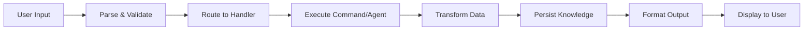
```mermaid
graph LR
    INPUT[User Input] --> PARSE[Parse & Validate]
    PARSE --> ROUTE[Route to Handler]
    ROUTE --> EXECUTE[Execute Command/Agent]
    EXECUTE --> TRANSFORM[Transform Data]
    TRANSFORM --> PERSIST[Persist Knowledge]
    PERSIST --> FORMAT[Format Output]
    FORMAT --> OUTPUT[Display to User]
```

---

## 📨 Request/Response Flow

### Basic Request Flow

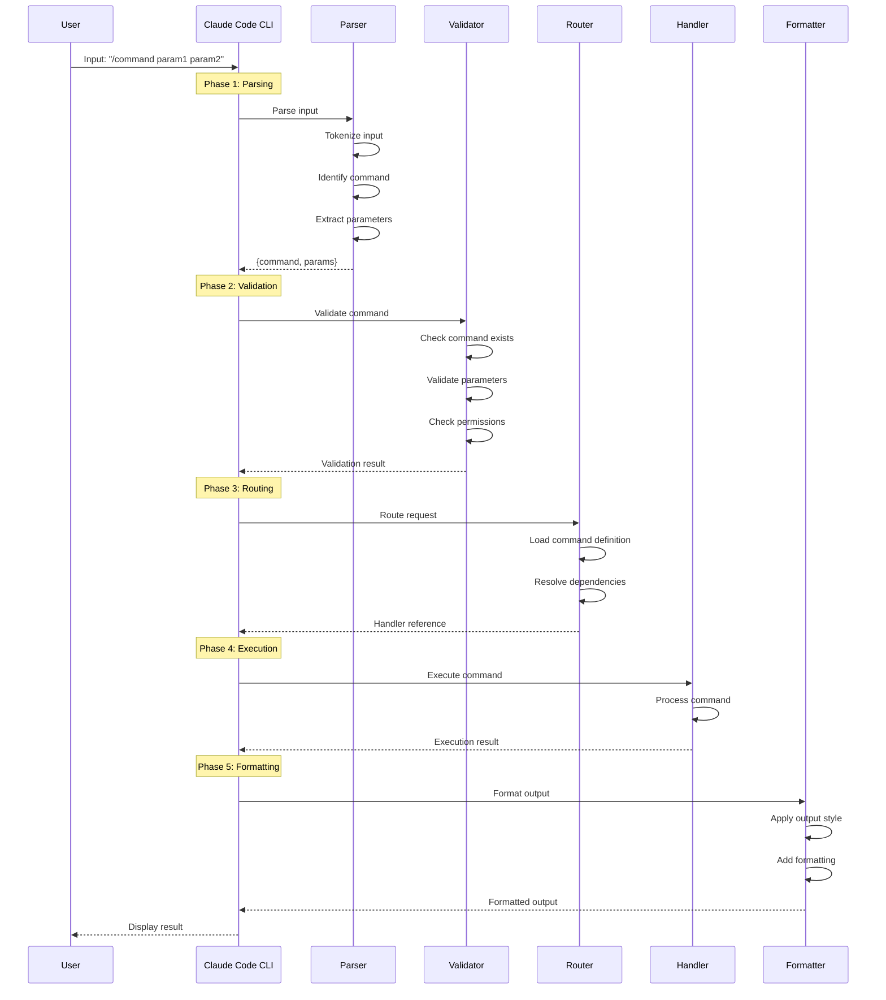
```mermaid
sequenceDiagram
    participant User
    participant CLI as Claude Code CLI
    participant Parser
    participant Validator
    participant Router
    participant Handler
    participant Formatter

    User->>CLI: Input: "/command param1 param2"

    Note over CLI: Phase 1: Parsing
    CLI->>Parser: Parse input
    Parser->>Parser: Tokenize input
    Parser->>Parser: Identify command
    Parser->>Parser: Extract parameters
    Parser-->>CLI: {command, params}

    Note over CLI: Phase 2: Validation
    CLI->>Validator: Validate command
    Validator->>Validator: Check command exists
    Validator->>Validator: Validate parameters
    Validator->>Validator: Check permissions
    Validator-->>CLI: Validation result

    Note over CLI: Phase 3: Routing
    CLI->>Router: Route request
    Router->>Router: Load command definition
    Router->>Router: Resolve dependencies
    Router-->>CLI: Handler reference

    Note over CLI: Phase 4: Execution
    CLI->>Handler: Execute command
    Handler->>Handler: Process command
    Handler-->>CLI: Execution result

    Note over CLI: Phase 5: Formatting
    CLI->>Formatter: Format output
    Formatter->>Formatter: Apply output style
    Formatter->>Formatter: Add formatting
    Formatter-->>CLI: Formatted output

    CLI-->>User: Display result
```

### Request Data Structure

```typescript
interface Request {
  // Input information
  raw_input: string;
  command: string;
  parameters: Record<string, any>;
  flags: string[];

  // Context information
  session_id: string;
  user_id: string;
  timestamp: number;

  // Environment
  working_directory: string;
  environment: Record<string, string>;

  // Permissions
  permissions: PermissionSet;
}
```

### Response Data Structure

```typescript
interface Response {
  // Status
  success: boolean;
  status_code: number;

  // Data
  data: any;
  metadata: Record<string, any>;

  // Timing
  duration_ms: number;
  timestamp: number;

  // Output
  message: string;
  formatted_output: string;

  // Errors
  errors: Error[];
  warnings: Warning[];
}
```

### Error Response Flow

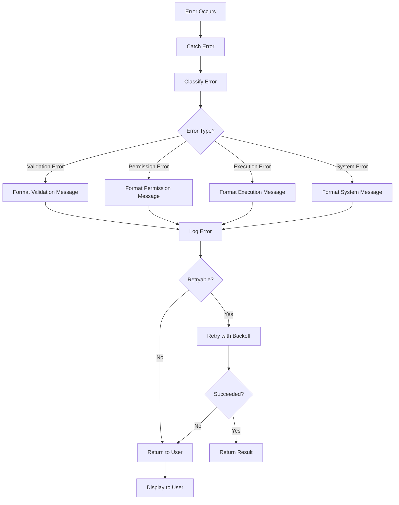
```mermaid
graph TB
    ERROR[Error Occurs] --> CATCH[Catch Error]
    CATCH --> CLASSIFY[Classify Error]

    CLASSIFY --> VALIDATION{Error Type?}

    VALIDATION -->|Validation Error| FORMAT_VAL[Format Validation Message]
    VALIDATION -->|Permission Error| FORMAT_PERM[Format Permission Message]
    VALIDATION -->|Execution Error| FORMAT_EXEC[Format Execution Message]
    VALIDATION -->|System Error| FORMAT_SYS[Format System Message]

    FORMAT_VAL --> LOG[Log Error]
    FORMAT_PERM --> LOG
    FORMAT_EXEC --> LOG
    FORMAT_SYS --> LOG

    LOG --> RETRY{Retryable?}

    RETRY -->|Yes| RETRY_LOGIC[Retry with Backoff]
    RETRY -->|No| USER_MSG[Return to User]

    RETRY_LOGIC --> SUCCESS{Succeeded?}
    SUCCESS -->|Yes| RESULT[Return Result]
    SUCCESS -->|No| USER_MSG

    USER_MSG --> USER[Display to User]
```

---

## ⚙️ Command Execution Flow

### Simple Command Execution

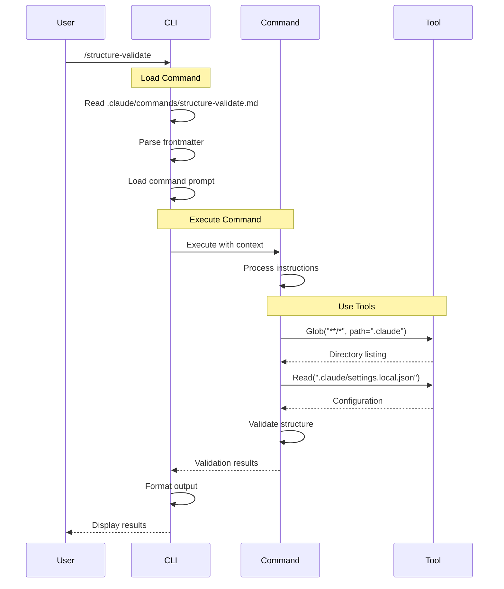
```mermaid
sequenceDiagram
    participant User
    participant CLI
    participant Command
    participant Tool

    User->>CLI: /structure-validate

    Note over CLI: Load Command
    CLI->>CLI: Read .claude/commands/structure-validate.md
    CLI->>CLI: Parse frontmatter
    CLI->>CLI: Load command prompt

    Note over CLI,Command: Execute Command
    CLI->>Command: Execute with context
    Command->>Command: Process instructions

    Note over Command,Tool: Use Tools
    Command->>Tool: Glob("**/*", path=".claude")
    Tool-->>Command: Directory listing

    Command->>Tool: Read(".claude/settings.local.json")
    Tool-->>Command: Configuration

    Command->>Command: Validate structure
    Command-->>CLI: Validation results

    CLI->>CLI: Format output
    CLI-->>User: Display results
```

### Complex Multi-Agent Command

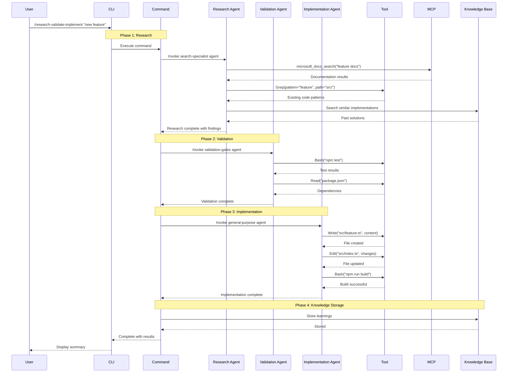
```mermaid
sequenceDiagram
    participant User
    participant CLI
    participant Command
    participant Agent1 as Research Agent
    participant Agent2 as Validation Agent
    participant Agent3 as Implementation Agent
    participant Tool
    participant MCP
    participant KB as Knowledge Base

    User->>CLI: /research-validate-implement "new feature"

    Note over CLI,Command: Phase 1: Research
    CLI->>Command: Execute command
    Command->>Agent1: Invoke search-specialist agent
    Agent1->>MCP: microsoft_docs_search("feature docs")
    MCP-->>Agent1: Documentation results
    Agent1->>Tool: Grep(pattern="feature", path="src/")
    Tool-->>Agent1: Existing code patterns
    Agent1->>KB: Search similar implementations
    KB-->>Agent1: Past solutions
    Agent1-->>Command: Research complete with findings

    Note over Command,Agent2: Phase 2: Validation
    Command->>Agent2: Invoke validation-gates agent
    Agent2->>Tool: Bash("npm test")
    Tool-->>Agent2: Test results
    Agent2->>Tool: Read("package.json")
    Tool-->>Agent2: Dependencies
    Agent2-->>Command: Validation complete

    Note over Command,Agent3: Phase 3: Implementation
    Command->>Agent3: Invoke general-purpose agent
    Agent3->>Tool: Write("src/feature.ts", content)
    Tool-->>Agent3: File created
    Agent3->>Tool: Edit("src/index.ts", changes)
    Tool-->>Agent3: File updated
    Agent3->>Tool: Bash("npm run build")
    Tool-->>Agent3: Build successful
    Agent3-->>Command: Implementation complete

    Note over Command,KB: Phase 4: Knowledge Storage
    Command->>KB: Store learnings
    KB-->>Command: Stored

    Command-->>CLI: Complete with results
    CLI-->>User: Display summary
```

### Command Execution States

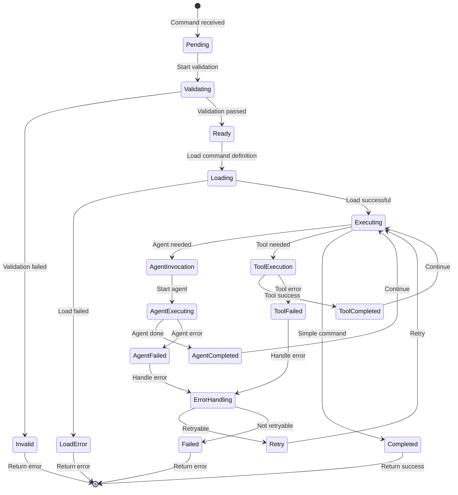
```mermaid
stateDiagram-v2
    [*] --> Pending: Command received
    Pending --> Validating: Start validation
    Validating --> Invalid: Validation failed
    Validating --> Ready: Validation passed

    Invalid --> [*]: Return error

    Ready --> Loading: Load command definition
    Loading --> LoadError: Load failed
    Loading --> Executing: Load successful

    LoadError --> [*]: Return error

    Executing --> AgentInvocation: Agent needed
    Executing --> ToolExecution: Tool needed
    Executing --> Completed: Simple command

    AgentInvocation --> AgentExecuting: Start agent
    AgentExecuting --> AgentCompleted: Agent done
    AgentExecuting --> AgentFailed: Agent error

    ToolExecution --> ToolCompleted: Tool success
    ToolExecution --> ToolFailed: Tool error

    AgentCompleted --> Executing: Continue
    ToolCompleted --> Executing: Continue

    AgentFailed --> ErrorHandling: Handle error
    ToolFailed --> ErrorHandling: Handle error

    ErrorHandling --> Retry: Retryable
    ErrorHandling --> Failed: Not retryable

    Retry --> Executing: Retry

    Failed --> [*]: Return error
    Completed --> [*]: Return success
```

### Command Data Flow

```typescript
// Input to command
interface CommandInput {
  command_name: string;
  parameters: Map<string, any>;
  context: {
    working_directory: string;
    session_id: string;
    user_preferences: UserPreferences;
  };
  permissions: PermissionSet;
}

// Command internal state
interface CommandState {
  phase: string;
  current_step: number;
  total_steps: number;
  agent_results: Map<string, any>;
  tool_results: Map<string, any>;
  errors: Error[];
  warnings: Warning[];
}

// Command output
interface CommandOutput {
  success: boolean;
  results: any;
  metadata: {
    duration_ms: number;
    agents_invoked: string[];
    tools_used: string[];
    files_modified: string[];
  };
  knowledge_stored: boolean;
}
```

---

## 🤖 Agent Invocation Flow

### Agent Lifecycle

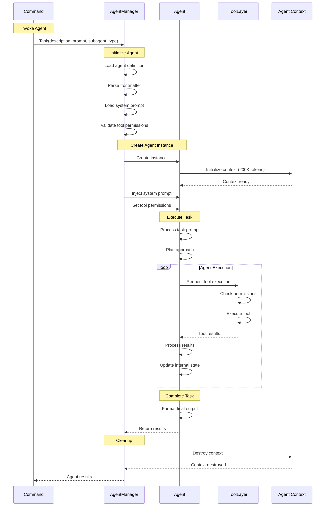
```mermaid
sequenceDiagram
    participant Command
    participant AgentManager
    participant Agent
    participant ToolLayer
    participant Context as Agent Context

    Note over Command: Invoke Agent
    Command->>AgentManager: Task(description, prompt, subagent_type)

    Note over AgentManager: Initialize Agent
    AgentManager->>AgentManager: Load agent definition
    AgentManager->>AgentManager: Parse frontmatter
    AgentManager->>AgentManager: Load system prompt
    AgentManager->>AgentManager: Validate tool permissions

    Note over AgentManager,Agent: Create Agent Instance
    AgentManager->>Agent: Create instance
    Agent->>Context: Initialize context (200K tokens)
    Context-->>Agent: Context ready
    AgentManager->>Agent: Inject system prompt
    AgentManager->>Agent: Set tool permissions

    Note over Agent: Execute Task
    Agent->>Agent: Process task prompt
    Agent->>Agent: Plan approach

    loop Agent Execution
        Agent->>ToolLayer: Request tool execution
        ToolLayer->>ToolLayer: Check permissions
        ToolLayer->>ToolLayer: Execute tool
        ToolLayer-->>Agent: Tool results
        Agent->>Agent: Process results
        Agent->>Agent: Update internal state
    end

    Note over Agent: Complete Task
    Agent->>Agent: Format final output
    Agent-->>AgentManager: Return results

    Note over AgentManager: Cleanup
    AgentManager->>Context: Destroy context
    Context-->>AgentManager: Context destroyed
    AgentManager-->>Command: Agent results
```

### Agent Context Isolation

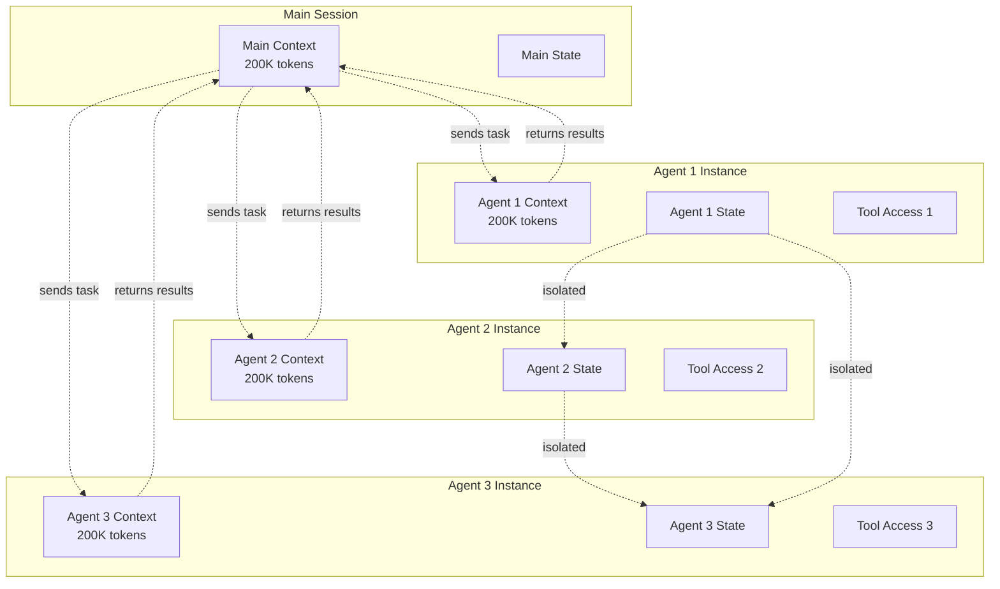
```mermaid
graph TB
    subgraph "Main Session"
        MAIN_CONTEXT[Main Context<br/>200K tokens]
        MAIN_STATE[Main State]
    end

    subgraph "Agent 1 Instance"
        AGENT1_CONTEXT[Agent 1 Context<br/>200K tokens]
        AGENT1_STATE[Agent 1 State]
        AGENT1_TOOLS[Tool Access 1]
    end

    subgraph "Agent 2 Instance"
        AGENT2_CONTEXT[Agent 2 Context<br/>200K tokens]
        AGENT2_STATE[Agent 2 State]
        AGENT2_TOOLS[Tool Access 2]
    end

    subgraph "Agent 3 Instance"
        AGENT3_CONTEXT[Agent 3 Context<br/>200K tokens]
        AGENT3_STATE[Agent 3 State]
        AGENT3_TOOLS[Tool Access 3]
    end

    MAIN_CONTEXT -.sends task.-> AGENT1_CONTEXT
    MAIN_CONTEXT -.sends task.-> AGENT2_CONTEXT
    MAIN_CONTEXT -.sends task.-> AGENT3_CONTEXT

    AGENT1_CONTEXT -.returns results.-> MAIN_CONTEXT
    AGENT2_CONTEXT -.returns results.-> MAIN_CONTEXT
    AGENT3_CONTEXT -.returns results.-> MAIN_CONTEXT

    AGENT1_STATE -.isolated.-> AGENT2_STATE
    AGENT2_STATE -.isolated.-> AGENT3_STATE
    AGENT1_STATE -.isolated.-> AGENT3_STATE
```

### Parallel Agent Execution

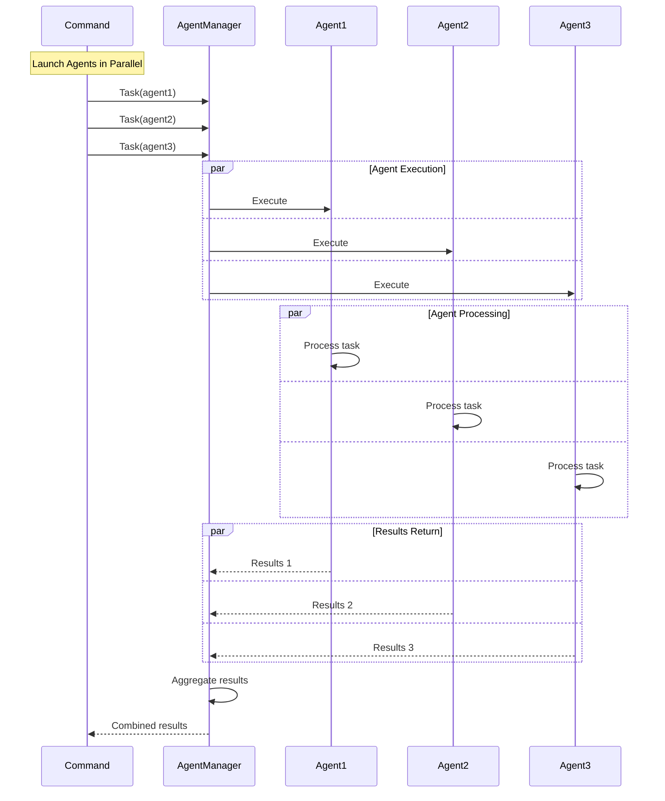
```mermaid
sequenceDiagram
    participant Command
    participant AgentManager
    participant Agent1
    participant Agent2
    participant Agent3

    Note over Command: Launch Agents in Parallel
    Command->>AgentManager: Task(agent1)
    Command->>AgentManager: Task(agent2)
    Command->>AgentManager: Task(agent3)

    par Agent Execution
        AgentManager->>Agent1: Execute
        and
        AgentManager->>Agent2: Execute
        and
        AgentManager->>Agent3: Execute
    end

    par Agent Processing
        Agent1->>Agent1: Process task
        and
        Agent2->>Agent2: Process task
        and
        Agent3->>Agent3: Process task
    end

    par Results Return
        Agent1-->>AgentManager: Results 1
        and
        Agent2-->>AgentManager: Results 2
        and
        Agent3-->>AgentManager: Results 3
    end

    AgentManager->>AgentManager: Aggregate results
    AgentManager-->>Command: Combined results
```

### Agent Data Flow

```typescript
// Agent invocation
interface AgentInvocation {
  description: string;
  prompt: string;
  subagent_type: string;
  context?: Record<string, any>;
}

// Agent instance
interface AgentInstance {
  id: string;
  type: string;
  system_prompt: string;
  tools: Tool[];
  mcp_servers: string[];
  context: AgentContext;
  state: AgentState;
}

// Agent context
interface AgentContext {
  token_limit: number;
  tokens_used: number;
  conversation_history: Message[];
  tool_results: ToolResult[];
}

// Agent state
interface AgentState {
  phase: string;
  progress: number;
  current_task: string;
  completed_tasks: string[];
  pending_tasks: string[];
}

// Agent result
interface AgentResult {
  success: boolean;
  output: any;
  metadata: {
    duration_ms: number;
    tokens_used: number;
    tools_called: string[];
    files_modified: string[];
  };
}
```

---

## 🪝 Hook Execution Flow

### Hook Lifecycle

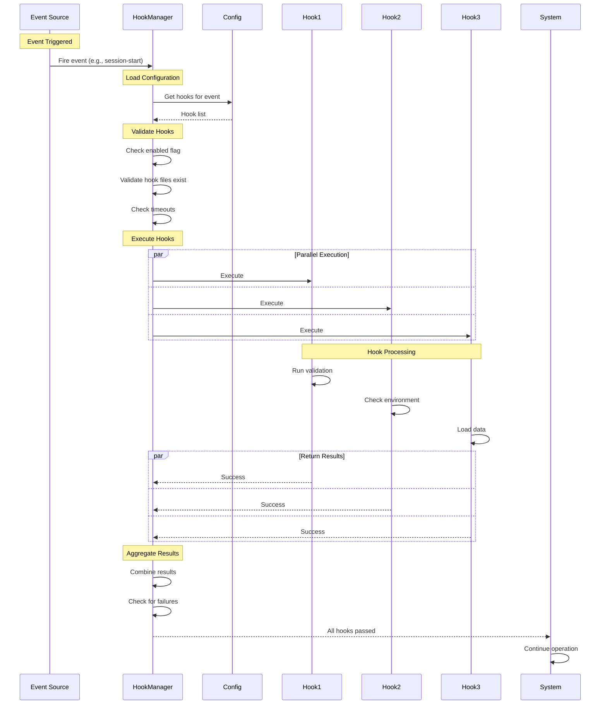
```mermaid
sequenceDiagram
    participant Event as Event Source
    participant HookManager
    participant Config
    participant Hook1
    participant Hook2
    participant Hook3
    participant System

    Note over Event: Event Triggered
    Event->>HookManager: Fire event (e.g., session-start)

    Note over HookManager: Load Configuration
    HookManager->>Config: Get hooks for event
    Config-->>HookManager: Hook list

    Note over HookManager: Validate Hooks
    HookManager->>HookManager: Check enabled flag
    HookManager->>HookManager: Validate hook files exist
    HookManager->>HookManager: Check timeouts

    Note over HookManager: Execute Hooks
    par Parallel Execution
        HookManager->>Hook1: Execute
        and
        HookManager->>Hook2: Execute
        and
        HookManager->>Hook3: Execute
    end

    Note over Hook1,Hook3: Hook Processing
    Hook1->>Hook1: Run validation
    Hook2->>Hook2: Check environment
    Hook3->>Hook3: Load data

    par Return Results
        Hook1-->>HookManager: Success
        and
        Hook2-->>HookManager: Success
        and
        Hook3-->>HookManager: Success
    end

    Note over HookManager: Aggregate Results
    HookManager->>HookManager: Combine results
    HookManager->>HookManager: Check for failures
    HookManager-->>System: All hooks passed

    System->>System: Continue operation
```

### Blocking Hook Flow

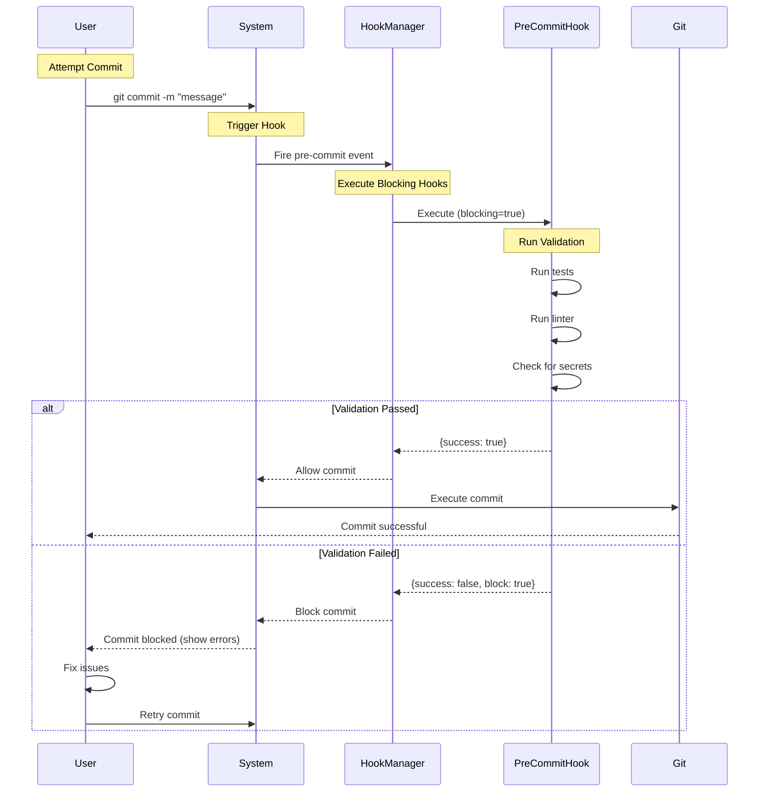
```mermaid
sequenceDiagram
    participant User
    participant System
    participant HookManager
    participant PreCommitHook
    participant Git

    Note over User: Attempt Commit
    User->>System: git commit -m "message"

    Note over System: Trigger Hook
    System->>HookManager: Fire pre-commit event

    Note over HookManager: Execute Blocking Hooks
    HookManager->>PreCommitHook: Execute (blocking=true)

    Note over PreCommitHook: Run Validation
    PreCommitHook->>PreCommitHook: Run tests
    PreCommitHook->>PreCommitHook: Run linter
    PreCommitHook->>PreCommitHook: Check for secrets

    alt Validation Passed
        PreCommitHook-->>HookManager: {success: true}
        HookManager-->>System: Allow commit
        System->>Git: Execute commit
        Git-->>User: Commit successful

    else Validation Failed
        PreCommitHook-->>HookManager: {success: false, block: true}
        HookManager-->>System: Block commit
        System-->>User: Commit blocked (show errors)
        User->>User: Fix issues
        User->>System: Retry commit
    end
```

### Hook Event Flow

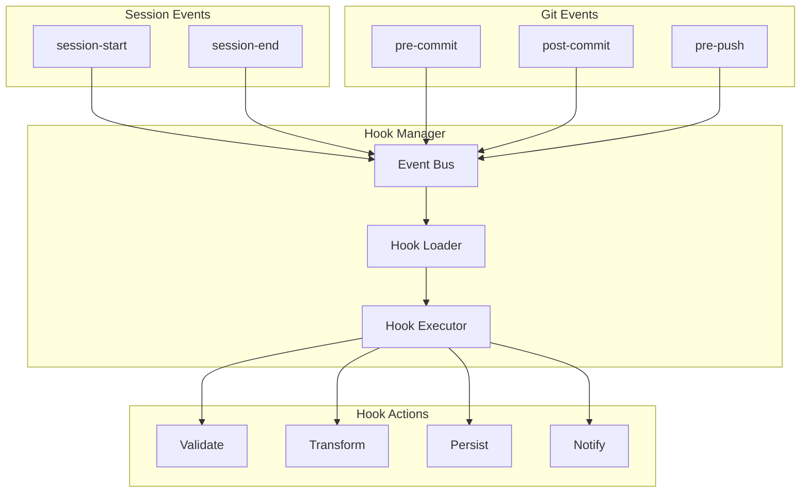
```mermaid
graph TB
    subgraph "Session Events"
        SESSION_START[session-start]
        SESSION_END[session-end]
    end

    subgraph "Git Events"
        PRE_COMMIT[pre-commit]
        POST_COMMIT[post-commit]
        PRE_PUSH[pre-push]
    end

    subgraph "Hook Manager"
        EVENT_BUS[Event Bus]
        HOOK_LOADER[Hook Loader]
        EXECUTOR[Hook Executor]
    end

    subgraph "Hook Actions"
        VALIDATE[Validate]
        TRANSFORM[Transform]
        PERSIST[Persist]
        NOTIFY[Notify]
    end

    SESSION_START --> EVENT_BUS
    SESSION_END --> EVENT_BUS
    PRE_COMMIT --> EVENT_BUS
    POST_COMMIT --> EVENT_BUS
    PRE_PUSH --> EVENT_BUS

    EVENT_BUS --> HOOK_LOADER
    HOOK_LOADER --> EXECUTOR

    EXECUTOR --> VALIDATE
    EXECUTOR --> TRANSFORM
    EXECUTOR --> PERSIST
    EXECUTOR --> NOTIFY
```

### Hook Data Flow

```typescript
// Hook event
interface HookEvent {
  type: 'session-start' | 'session-end' | 'pre-commit' | 'post-commit' | 'pre-push';
  timestamp: number;
  context: HookContext;
}

// Hook context
interface HookContext {
  session_id: string;
  working_directory: string;
  files_changed?: string[];
  environment: Record<string, string>;
  user_data?: Record<string, any>;
}

// Hook configuration
interface HookConfig {
  name: string;
  file: string;
  enabled: boolean;
  blocking: boolean;
  timeout: number;
  parallel: boolean;
}

// Hook execution
interface HookExecution {
  hook_name: string;
  start_time: number;
  end_time: number;
  duration_ms: number;
  success: boolean;
  blocked: boolean;
  output: any;
  error?: Error;
}

// Hook result
interface HookResult {
  success: boolean;
  message: string;
  block?: boolean;
  data?: any;
  errors?: Error[];
}
```

---

## 🌐 MCP Server Communication

### MCP Protocol Flow

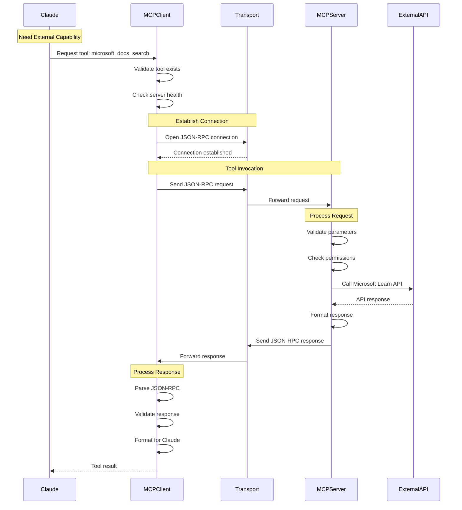
```mermaid
sequenceDiagram
    participant Claude
    participant MCPClient
    participant Transport
    participant MCPServer
    participant ExternalAPI

    Note over Claude: Need External Capability
    Claude->>MCPClient: Request tool: microsoft_docs_search
    MCPClient->>MCPClient: Validate tool exists
    MCPClient->>MCPClient: Check server health

    Note over MCPClient,Transport: Establish Connection
    MCPClient->>Transport: Open JSON-RPC connection
    Transport-->>MCPClient: Connection established

    Note over MCPClient,MCPServer: Tool Invocation
    MCPClient->>Transport: Send JSON-RPC request
    Transport->>MCPServer: Forward request

    Note over MCPServer: Process Request
    MCPServer->>MCPServer: Validate parameters
    MCPServer->>MCPServer: Check permissions
    MCPServer->>ExternalAPI: Call Microsoft Learn API
    ExternalAPI-->>MCPServer: API response

    MCPServer->>MCPServer: Format response
    MCPServer->>Transport: Send JSON-RPC response
    Transport->>MCPClient: Forward response

    Note over MCPClient: Process Response
    MCPClient->>MCPClient: Parse JSON-RPC
    MCPClient->>MCPClient: Validate response
    MCPClient->>MCPClient: Format for Claude
    MCPClient-->>Claude: Tool result
```

### MCP Request/Response Format

```typescript
// MCP Request
interface MCPRequest {
  jsonrpc: "2.0";
  method: string;
  params: {
    tool: string;
    arguments: Record<string, any>;
  };
  id: string | number;
}

// MCP Response
interface MCPResponse {
  jsonrpc: "2.0";
  result?: {
    content: any;
    metadata?: Record<string, any>;
  };
  error?: {
    code: number;
    message: string;
    data?: any;
  };
  id: string | number;
}
```

### MCP Tool Call Flow

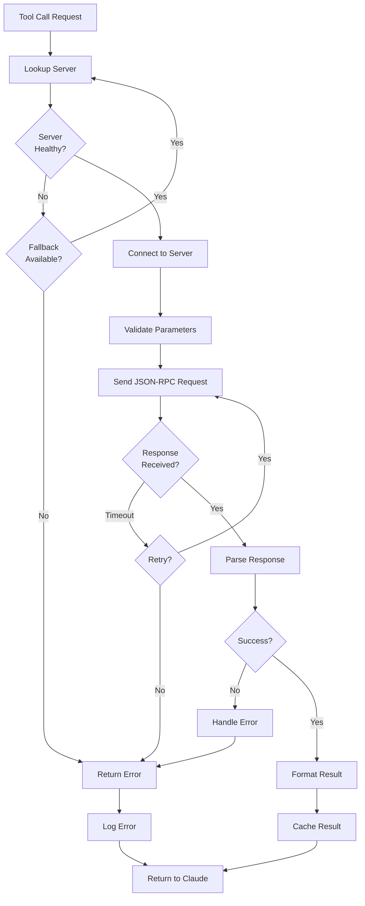
```mermaid
graph TB
    START[Tool Call Request] --> LOOKUP[Lookup Server]
    LOOKUP --> CHECK{Server<br/>Healthy?}

    CHECK -->|No| FALLBACK{Fallback<br/>Available?}
    FALLBACK -->|Yes| LOOKUP
    FALLBACK -->|No| ERROR[Return Error]

    CHECK -->|Yes| CONNECT[Connect to Server]
    CONNECT --> VALIDATE[Validate Parameters]
    VALIDATE --> SEND[Send JSON-RPC Request]

    SEND --> WAIT{Response<br/>Received?}

    WAIT -->|Timeout| RETRY{Retry?}
    RETRY -->|Yes| SEND
    RETRY -->|No| ERROR

    WAIT -->|Yes| PARSE[Parse Response]
    PARSE --> SUCCESS{Success?}

    SUCCESS -->|No| HANDLE[Handle Error]
    HANDLE --> ERROR

    SUCCESS -->|Yes| FORMAT[Format Result]
    FORMAT --> CACHE[Cache Result]
    CACHE --> RETURN[Return to Claude]

    ERROR --> LOG[Log Error]
    LOG --> RETURN
```

### MCP Server Health Check

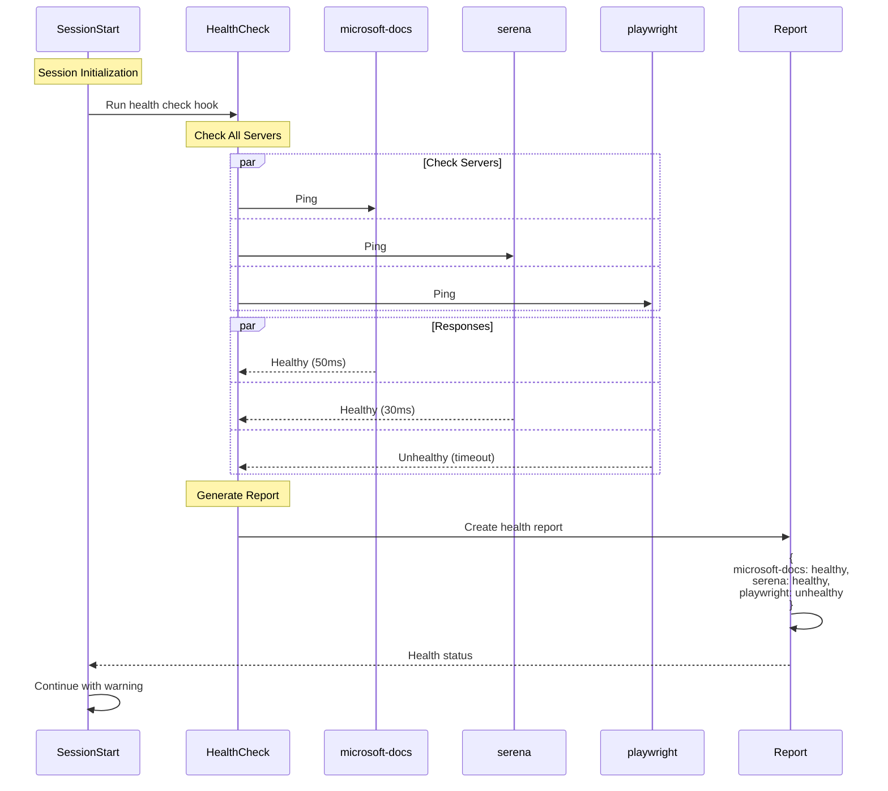
```mermaid
sequenceDiagram
    participant SessionStart
    participant HealthCheck
    participant MCP1 as microsoft-docs
    participant MCP2 as serena
    participant MCP3 as playwright
    participant Report

    Note over SessionStart: Session Initialization
    SessionStart->>HealthCheck: Run health check hook

    Note over HealthCheck: Check All Servers
    par Check Servers
        HealthCheck->>MCP1: Ping
        and
        HealthCheck->>MCP2: Ping
        and
        HealthCheck->>MCP3: Ping
    end

    par Responses
        MCP1-->>HealthCheck: Healthy (50ms)
        and
        MCP2-->>HealthCheck: Healthy (30ms)
        and
        MCP3-->>HealthCheck: Unhealthy (timeout)
    end

    Note over HealthCheck: Generate Report
    HealthCheck->>Report: Create health report
    Report->>Report: {<br/>  microsoft-docs: healthy,<br/>  serena: healthy,<br/>  playwright: unhealthy<br/>}

    Report-->>SessionStart: Health status
    SessionStart->>SessionStart: Continue with warning
```

### MCP Data Structures

```typescript
// MCP Server Configuration
interface MCPServerConfig {
  name: string;
  command: string;
  args: string[];
  env: Record<string, string>;
  disabled: boolean;
  timeout?: number;
  retries?: number;
}

// MCP Tool Definition
interface MCPTool {
  name: string;
  description: string;
  parameters: {
    type: "object";
    properties: Record<string, any>;
    required: string[];
  };
}

// MCP Resource
interface MCPResource {
  uri: string;
  name: string;
  description: string;
  mimeType: string;
}

// MCP Server Status
interface MCPServerStatus {
  name: string;
  healthy: boolean;
  latency_ms?: number;
  last_check: number;
  error?: string;
}
```

---

## 🗄️ Knowledge Base Data Flow

### Knowledge Storage Flow

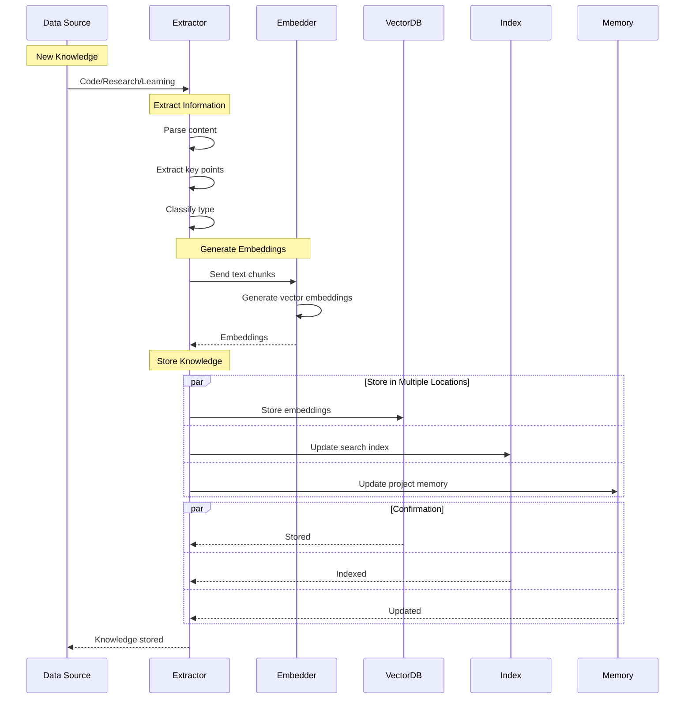
```mermaid
sequenceDiagram
    participant Source as Data Source
    participant Extractor
    participant Embedder
    participant VectorDB
    participant Index
    participant Memory

    Note over Source: New Knowledge
    Source->>Extractor: Code/Research/Learning

    Note over Extractor: Extract Information
    Extractor->>Extractor: Parse content
    Extractor->>Extractor: Extract key points
    Extractor->>Extractor: Classify type

    Note over Extractor,Embedder: Generate Embeddings
    Extractor->>Embedder: Send text chunks
    Embedder->>Embedder: Generate vector embeddings
    Embedder-->>Extractor: Embeddings

    Note over Extractor: Store Knowledge
    par Store in Multiple Locations
        Extractor->>VectorDB: Store embeddings
        and
        Extractor->>Index: Update search index
        and
        Extractor->>Memory: Update project memory
    end

    par Confirmation
        VectorDB-->>Extractor: Stored
        and
        Index-->>Extractor: Indexed
        and
        Memory-->>Extractor: Updated
    end

    Extractor-->>Source: Knowledge stored
```

### Knowledge Retrieval Flow

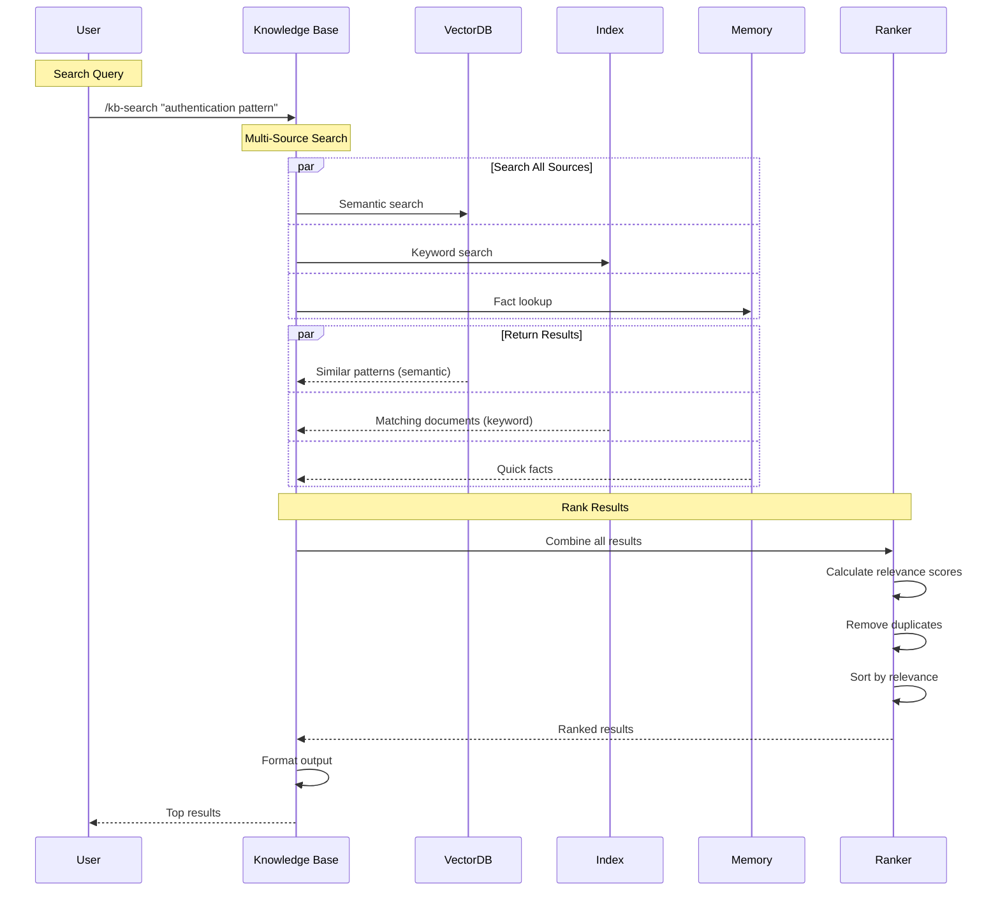
```mermaid
sequenceDiagram
    participant User
    participant KB as Knowledge Base
    participant VectorDB
    participant Index
    participant Memory
    participant Ranker

    Note over User: Search Query
    User->>KB: /kb-search "authentication pattern"

    Note over KB: Multi-Source Search
    par Search All Sources
        KB->>VectorDB: Semantic search
        and
        KB->>Index: Keyword search
        and
        KB->>Memory: Fact lookup
    end

    par Return Results
        VectorDB-->>KB: Similar patterns (semantic)
        and
        Index-->>KB: Matching documents (keyword)
        and
        Memory-->>KB: Quick facts
    end

    Note over KB,Ranker: Rank Results
    KB->>Ranker: Combine all results
    Ranker->>Ranker: Calculate relevance scores
    Ranker->>Ranker: Remove duplicates
    Ranker->>Ranker: Sort by relevance
    Ranker-->>KB: Ranked results

    KB->>KB: Format output
    KB-->>User: Top results
```

### Knowledge Update Flow

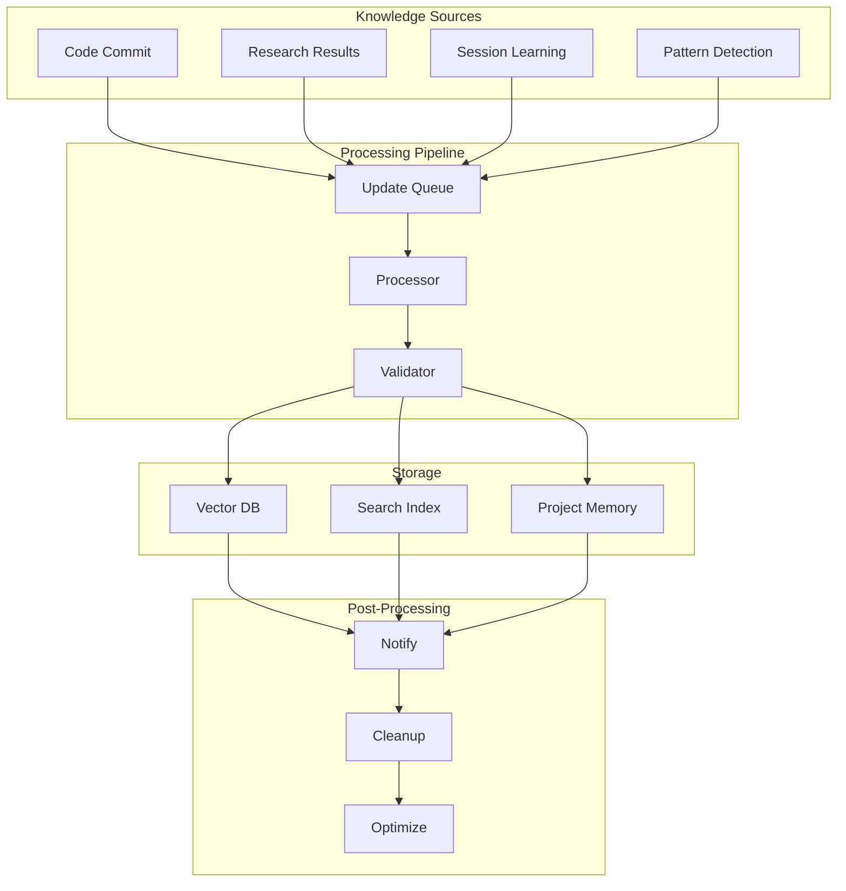
```mermaid
graph TB
    subgraph "Knowledge Sources"
        CODE_COMMIT[Code Commit]
        RESEARCH[Research Results]
        LEARNING[Session Learning]
        PATTERN[Pattern Detection]
    end

    subgraph "Processing Pipeline"
        QUEUE[Update Queue]
        PROCESSOR[Processor]
        VALIDATOR[Validator]
    end

    subgraph "Storage"
        VECTOR[Vector DB]
        INDEX[Search Index]
        MEMORY[Project Memory]
    end

    subgraph "Post-Processing"
        NOTIFY[Notify]
        CLEANUP[Cleanup]
        OPTIMIZE[Optimize]
    end

    CODE_COMMIT --> QUEUE
    RESEARCH --> QUEUE
    LEARNING --> QUEUE
    PATTERN --> QUEUE

    QUEUE --> PROCESSOR
    PROCESSOR --> VALIDATOR

    VALIDATOR --> VECTOR
    VALIDATOR --> INDEX
    VALIDATOR --> MEMORY

    VECTOR --> NOTIFY
    INDEX --> NOTIFY
    MEMORY --> NOTIFY

    NOTIFY --> CLEANUP
    CLEANUP --> OPTIMIZE
```

### Knowledge Data Structures

```typescript
// Knowledge entry
interface KnowledgeEntry {
  id: string;
  type: 'pattern' | 'learning' | 'research' | 'decision';
  content: string;
  embedding: number[];
  metadata: {
    source: string;
    timestamp: number;
    tags: string[];
    relevance_score?: number;
  };
}

// Project memory
interface ProjectMemory {
  project_name: string;
  last_updated: number;
  facts: Record<string, any>;
  patterns: Pattern[];
  decisions: Decision[];
  team_knowledge: TeamKnowledge[];
}

// Search query
interface SearchQuery {
  query: string;
  type?: 'semantic' | 'keyword' | 'hybrid';
  filters?: {
    type?: string[];
    tags?: string[];
    date_range?: [number, number];
  };
  limit?: number;
}

// Search result
interface SearchResult {
  entry: KnowledgeEntry;
  score: number;
  relevance: 'high' | 'medium' | 'low';
  snippet: string;
}
```

---

## 🔄 Session Lifecycle

### Session Initialization

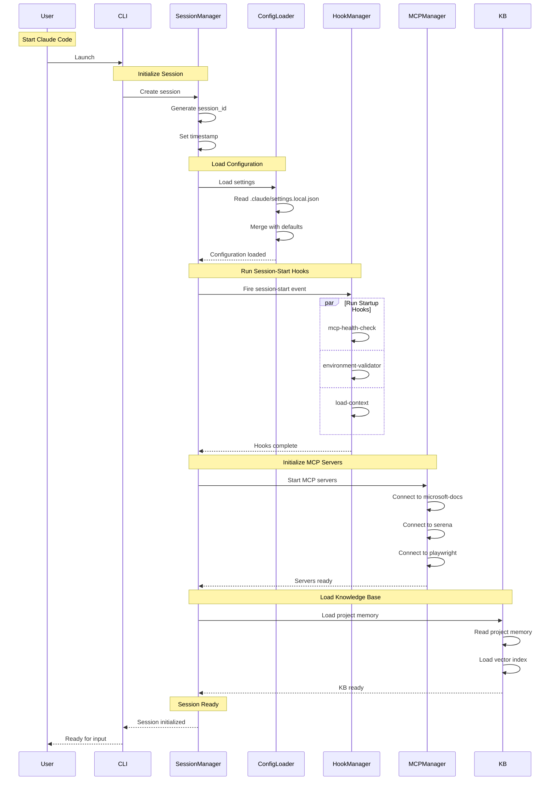
```mermaid
sequenceDiagram
    participant User
    participant CLI
    participant SessionManager
    participant ConfigLoader
    participant HookManager
    participant MCPManager
    participant KB

    Note over User: Start Claude Code
    User->>CLI: Launch

    Note over CLI,SessionManager: Initialize Session
    CLI->>SessionManager: Create session
    SessionManager->>SessionManager: Generate session_id
    SessionManager->>SessionManager: Set timestamp

    Note over SessionManager,ConfigLoader: Load Configuration
    SessionManager->>ConfigLoader: Load settings
    ConfigLoader->>ConfigLoader: Read .claude/settings.local.json
    ConfigLoader->>ConfigLoader: Merge with defaults
    ConfigLoader-->>SessionManager: Configuration loaded

    Note over SessionManager,HookManager: Run Session-Start Hooks
    SessionManager->>HookManager: Fire session-start event

    par Run Startup Hooks
        HookManager->>HookManager: mcp-health-check
        and
        HookManager->>HookManager: environment-validator
        and
        HookManager->>HookManager: load-context
    end

    HookManager-->>SessionManager: Hooks complete

    Note over SessionManager,MCPManager: Initialize MCP Servers
    SessionManager->>MCPManager: Start MCP servers
    MCPManager->>MCPManager: Connect to microsoft-docs
    MCPManager->>MCPManager: Connect to serena
    MCPManager->>MCPManager: Connect to playwright
    MCPManager-->>SessionManager: Servers ready

    Note over SessionManager,KB: Load Knowledge Base
    SessionManager->>KB: Load project memory
    KB->>KB: Read project memory
    KB->>KB: Load vector index
    KB-->>SessionManager: KB ready

    Note over SessionManager: Session Ready
    SessionManager-->>CLI: Session initialized
    CLI-->>User: Ready for input
```

### Session Execution

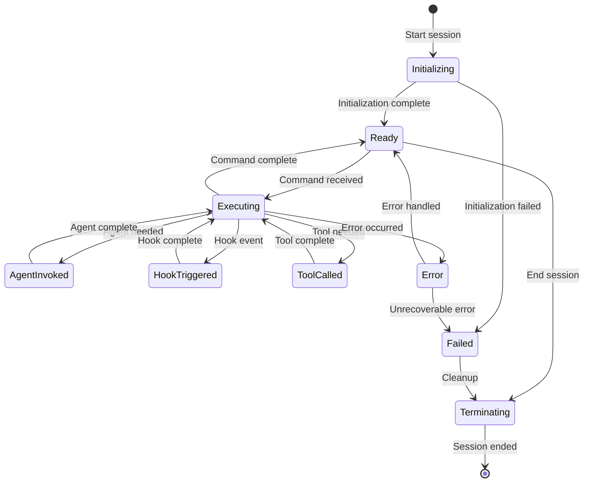
```mermaid
stateDiagram-v2
    [*] --> Initializing: Start session
    Initializing --> Ready: Initialization complete
    Initializing --> Failed: Initialization failed

    Ready --> Executing: Command received
    Executing --> AgentInvoked: Agent needed
    Executing --> HookTriggered: Hook event
    Executing --> ToolCalled: Tool needed

    AgentInvoked --> Executing: Agent complete
    HookTriggered --> Executing: Hook complete
    ToolCalled --> Executing: Tool complete

    Executing --> Ready: Command complete
    Executing --> Error: Error occurred

    Error --> Ready: Error handled
    Error --> Failed: Unrecoverable error

    Ready --> Terminating: End session
    Failed --> Terminating: Cleanup

    Terminating --> [*]: Session ended
```

### Session Termination

```mermaid
sequenceDiagram
    participant User
    participant CLI
    participant SessionManager
    participant HookManager
    participant MCPManager
    participant KB
    participant Storage

    Note over User: End Session
    User->>CLI: Exit command

    Note over CLI,SessionManager: Begin Termination
    CLI->>SessionManager: Terminate session

    Note over SessionManager,HookManager: Run Session-End Hooks
    SessionManager->>HookManager: Fire session-end event

    par Run Shutdown Hooks
        HookManager->>HookManager: Store learnings
        and
        HookManager->>HookManager: Generate summary
        and
        HookManager->>HookManager: Backup data
    end

    HookManager->>KB: Save session learnings
    KB-->>HookManager: Saved

    HookManager-->>SessionManager: Hooks complete

    Note over SessionManager,KB: Persist Knowledge
    SessionManager->>KB: Update project memory
    KB->>Storage: Write project memory
    KB->>Storage: Write vector index
    Storage-->>KB: Saved
    KB-->>SessionManager: KB persisted

    Note over SessionManager,MCPManager: Shutdown MCP Servers
    SessionManager->>MCPManager: Disconnect servers
    MCPManager->>MCPManager: Close microsoft-docs
    MCPManager->>MCPManager: Close serena
    MCPManager->>MCPManager: Close playwright
    MCPManager-->>SessionManager: Servers closed

    Note over SessionManager: Cleanup
    SessionManager->>SessionManager: Clear session data
    SessionManager->>SessionManager: Release resources
    SessionManager-->>CLI: Session terminated

    CLI-->>User: Goodbye
```

### Session Data Flow

```typescript
// Session
interface Session {
  id: string;
  user_id: string;
  start_time: number;
  end_time?: number;
  state: SessionState;
  context: SessionContext;
  statistics: SessionStatistics;
}

// Session state
enum SessionState {
  INITIALIZING = 'initializing',
  READY = 'ready',
  EXECUTING = 'executing',
  TERMINATING = 'terminating',
  TERMINATED = 'terminated',
  FAILED = 'failed'
}

// Session context
interface SessionContext {
  working_directory: string;
  environment: Record<string, string>;
  configuration: Configuration;
  user_preferences: UserPreferences;
  project_memory: ProjectMemory;
}

// Session statistics
interface SessionStatistics {
  commands_executed: number;
  agents_invoked: number;
  tools_used: Record<string, number>;
  mcp_calls: Record<string, number>;
  files_modified: number;
  duration_ms: number;
  knowledge_updates: number;
}
```

---

## 📦 State Management

### Stateless vs Stateful Components

```mermaid
graph TB
    subgraph "Stateless Components"
        COMMANDS[Commands]
        AGENTS[Agents]
        HOOKS[Hooks]
        TOOLS[Tools]
    end

    subgraph "Stateful Components"
        SESSION[Session Manager]
        KB[Knowledge Base]
        CONFIG[Configuration]
        MCP[MCP Connection Pool]
    end

    subgraph "State Storage"
        MEMORY[In-Memory State]
        DISK[Disk Storage]
        VECTOR[Vector Database]
    end

    COMMANDS -.reads state.-> SESSION
    AGENTS -.reads state.-> SESSION
    HOOKS -.reads state.-> SESSION

    SESSION --> MEMORY
    KB --> VECTOR
    KB --> DISK
    CONFIG --> DISK
    MCP --> MEMORY
```

### State Transitions

```mermaid
stateDiagram-v2
    direction LR

    [*] --> NoSession: Application start
    NoSession --> SessionInit: User starts session
    SessionInit --> SessionReady: Initialization success
    SessionInit --> NoSession: Initialization failed

    SessionReady --> CommandExecuting: Command received
    CommandExecuting --> AgentRunning: Agent invoked
    CommandExecuting --> HookRunning: Hook triggered
    CommandExecuting --> SessionReady: Command complete

    AgentRunning --> CommandExecuting: Agent complete
    HookRunning --> CommandExecuting: Hook complete

    SessionReady --> SessionEnd: User ends session
    CommandExecuting --> SessionEnd: Forced termination

    SessionEnd --> NoSession: Cleanup complete
```

### State Persistence

```mermaid
graph LR
    subgraph "Transient State"
        SESSION_STATE[Session State]
        CONTEXT[Context Window]
        CACHE[Cache]
    end

    subgraph "Persistent State"
        KB_STATE[Knowledge Base]
        CONFIG_STATE[Configuration]
        MEMORY_STATE[Project Memory]
    end

    subgraph "Storage"
        RAM[RAM]
        DISK[Disk]
        VECTOR_DB[Vector DB]
    end

    SESSION_STATE --> RAM
    CONTEXT --> RAM
    CACHE --> RAM

    KB_STATE --> VECTOR_DB
    CONFIG_STATE --> DISK
    MEMORY_STATE --> DISK
```

---

## ❌ Error Flow

### Error Handling Pipeline

```mermaid
sequenceDiagram
    participant Component
    participant ErrorHandler
    participant Logger
    participant Recovery
    participant User

    Note over Component: Error Occurs
    Component->>ErrorHandler: Throw error

    Note over ErrorHandler: Classify Error
    ErrorHandler->>ErrorHandler: Determine error type
    ErrorHandler->>ErrorHandler: Check severity
    ErrorHandler->>ErrorHandler: Determine retry strategy

    Note over ErrorHandler,Logger: Log Error
    ErrorHandler->>Logger: Log error details
    Logger->>Logger: Write to log file
    Logger->>Logger: Send to monitoring (if critical)

    Note over ErrorHandler,Recovery: Attempt Recovery
    ErrorHandler->>Recovery: Try recovery

    alt Recoverable Error
        Recovery->>Recovery: Apply recovery strategy
        Recovery-->>ErrorHandler: Recovery successful
        ErrorHandler-->>Component: Continue execution

    else Unrecoverable Error
        Recovery-->>ErrorHandler: Cannot recover
        ErrorHandler->>ErrorHandler: Format error message
        ErrorHandler->>User: Display error
        User->>User: Take corrective action
    end
```

### Error Types and Responses

```mermaid
graph TB
    ERROR[Error Occurs] --> CLASSIFY{Error Type}

    CLASSIFY -->|Validation Error| VALIDATION[Format validation message]
    CLASSIFY -->|Permission Error| PERMISSION[Check permissions]
    CLASSIFY -->|Tool Error| TOOL[Retry tool]
    CLASSIFY -->|MCP Error| MCP[Check MCP health]
    CLASSIFY -->|Network Error| NETWORK[Retry with backoff]
    CLASSIFY -->|System Error| SYSTEM[Log and alert]

    VALIDATION --> USER_FIX[User fixes input]
    PERMISSION --> PERMISSION_CHECK{Has Permission?}
    TOOL --> TOOL_RETRY{Retry Successful?}
    MCP --> MCP_HEALTH{Server Healthy?}
    NETWORK --> NETWORK_RETRY{Retry Successful?}
    SYSTEM --> FAIL[Fail operation]

    PERMISSION_CHECK -->|Yes| ALLOW[Allow operation]
    PERMISSION_CHECK -->|No| DENY[Deny operation]

    TOOL_RETRY -->|Yes| SUCCESS[Continue]
    TOOL_RETRY -->|No| FAIL

    MCP_HEALTH -->|Yes| RETRY_MCP[Retry MCP call]
    MCP_HEALTH -->|No| FALLBACK{Fallback Available?}

    FALLBACK -->|Yes| USE_FALLBACK[Use fallback]
    FALLBACK -->|No| FAIL

    NETWORK_RETRY -->|Yes| SUCCESS
    NETWORK_RETRY -->|No| FAIL
```

### Error Data Structures

```typescript
// Error types
enum ErrorType {
  VALIDATION = 'validation',
  PERMISSION = 'permission',
  TOOL = 'tool',
  MCP = 'mcp',
  NETWORK = 'network',
  SYSTEM = 'system'
}

// Error severity
enum ErrorSeverity {
  INFO = 'info',
  WARNING = 'warning',
  ERROR = 'error',
  CRITICAL = 'critical'
}

// Error object
interface ErrorObject {
  type: ErrorType;
  severity: ErrorSeverity;
  message: string;
  code: string;
  details: Record<string, any>;
  stack?: string;
  timestamp: number;
  recovery_strategy?: RecoveryStrategy;
}

// Recovery strategy
interface RecoveryStrategy {
  type: 'retry' | 'fallback' | 'skip' | 'fail';
  max_retries?: number;
  backoff_ms?: number;
  fallback_action?: string;
}

// Error response
interface ErrorResponse {
  error: ErrorObject;
  recoverable: boolean;
  user_action_required: boolean;
  suggested_action?: string;
  documentation_link?: string;
}
```

---

## 📊 Data Structures

### Core Data Structures

```typescript
// Command structure
interface Command {
  name: string;
  description: string;
  category: string;
  parameters: Parameter[];
  execution: CommandExecution;
  metadata: CommandMetadata;
}

interface Parameter {
  name: string;
  type: 'string' | 'number' | 'boolean' | 'array' | 'object';
  required: boolean;
  default?: any;
  description: string;
}

interface CommandExecution {
  phases: ExecutionPhase[];
  agents: AgentInvocation[];
  tools: ToolUsage[];
  hooks: HookTrigger[];
}

interface CommandMetadata {
  version: string;
  author: string;
  created: number;
  updated: number;
  tags: string[];
}

// Agent structure
interface Agent {
  name: string;
  type: string;
  system_prompt: string;
  tools: string[];
  mcp_servers: string[];
  constraints: string[];
  metadata: AgentMetadata;
}

interface AgentMetadata {
  version: string;
  description: string;
  use_cases: string[];
}

// Hook structure
interface Hook {
  name: string;
  type: HookType;
  script: string;
  language: 'javascript' | 'python' | 'shell';
  config: HookConfig;
}

enum HookType {
  SESSION_START = 'session-start',
  SESSION_END = 'session-end',
  PRE_COMMIT = 'pre-commit',
  POST_COMMIT = 'post-commit',
  PRE_PUSH = 'pre-push'
}

// Tool structure
interface Tool {
  name: string;
  description: string;
  parameters: ToolParameters;
  permissions: ToolPermissions;
}

interface ToolParameters {
  type: 'object';
  properties: Record<string, any>;
  required: string[];
}

interface ToolPermissions {
  allow: string[];
  deny: string[];
  ask: string[];
}

// MCP structure
interface MCPServer {
  name: string;
  command: string;
  args: string[];
  env: Record<string, string>;
  tools: MCPTool[];
  resources: MCPResource[];
  status: MCPServerStatus;
}

// Knowledge Base structure
interface KnowledgeBase {
  entries: KnowledgeEntry[];
  project_memory: ProjectMemory;
  index: SearchIndex;
  statistics: KBStatistics;
}

interface KBStatistics {
  total_entries: number;
  by_type: Record<string, number>;
  last_updated: number;
  size_bytes: number;
}

// Configuration structure
interface Configuration {
  permissions: PermissionConfig;
  mcp_servers: Record<string, MCPServerConfig>;
  hooks: Record<string, HookConfig[]>;
  knowledge: KnowledgeConfig;
  output: OutputConfig;
  quality: QualityConfig;
}
```

### Data Flow Patterns

```typescript
// Request/Response Pattern
interface Request<T> {
  id: string;
  type: string;
  payload: T;
  metadata: RequestMetadata;
}

interface Response<T> {
  id: string;
  success: boolean;
  payload?: T;
  error?: ErrorObject;
  metadata: ResponseMetadata;
}

// Event Pattern
interface Event {
  type: string;
  timestamp: number;
  source: string;
  data: any;
  metadata: EventMetadata;
}

// Pipeline Pattern
interface Pipeline<T> {
  stages: PipelineStage<T>[];
  current_stage: number;
  state: PipelineState;
}

interface PipelineStage<T> {
  name: string;
  process: (input: T) => Promise<T>;
  error_handler: (error: Error) => void;
}

// Observer Pattern
interface Observer {
  id: string;
  observe: string[];
  callback: (event: Event) => void;
}

// Repository Pattern
interface Repository<T> {
  create(item: T): Promise<T>;
  read(id: string): Promise<T>;
  update(id: string, item: Partial<T>): Promise<T>;
  delete(id: string): Promise<void>;
  search(query: any): Promise<T[]>;
}
```

---

## 📚 Related Documentation

### Architecture Documents
- [Architecture README](./README.md) - Architecture hub
- [System Design](./system-design.md) - System architecture
- [MCP Integration](./mcp-integration.md) - MCP server integration

### Component Documentation
- [Commands](../commands/README.md) - Command system
- [Agents](../agents/README.md) - Agent system
- [Hooks](../hooks/README.md) - Hook system

### Best Practices
- [Context Management](../best-practices/context-management.md)
- [Workflow Patterns](../best-practices/workflow-patterns.md)
- [Performance Optimization](../troubleshooting/performance.md)

---

## 📝 Document Information

**Version**: 1.0
**Last Updated**: 2025-01-15
**Maintainer**: Architecture Team
**Status**: Active

---

**Navigate**: [← Architecture Hub](./README.md) | [← System Design](./system-design.md) | [MCP Integration →](./mcp-integration.md)

---

*Every request flows through a carefully orchestrated pipeline, ensuring reliability, maintainability, and developer experience*
