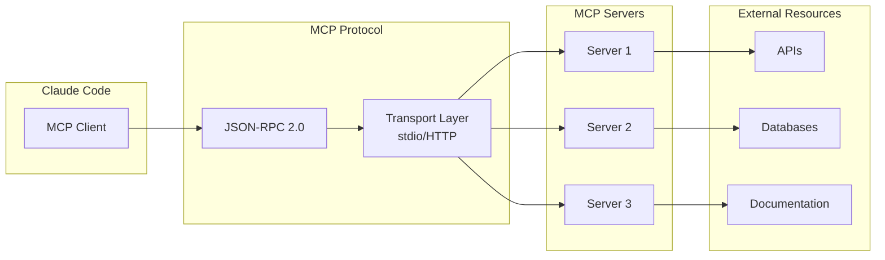

# 🌐 MCP Integration Documentation

> **Complete guide to Model Context Protocol (MCP) server integration in Claude Code**

This document provides comprehensive coverage of MCP server integration, including protocol overview, server catalog, integration patterns, error handling, performance optimization, and custom server development.

---

## 📑 Table of Contents

- [MCP Protocol Overview](#-mcp-protocol-overview)
- [MCP Server Catalog](#-mcp-server-catalog)
- [Integration Patterns](#-integration-patterns)
- [Configuration Guide](#-configuration-guide)
- [Error Handling](#-error-handling)
- [Performance Optimization](#-performance-optimization)
- [Health Monitoring](#-health-monitoring)
- [Custom MCP Server Development](#-custom-mcp-server-development)
- [Troubleshooting](#-troubleshooting)
- [Best Practices](#-best-practices)

---

## 🎯 MCP Protocol Overview

### What is MCP?

**Model Context Protocol (MCP)** is a standardized protocol that enables Large Language Models (LLMs) to securely connect to external data sources and tools. It provides a uniform interface for integrating specialized capabilities without bloating the core system.

### Key Concepts



### MCP Components

| Component | Description | Example |
|-----------|-------------|---------|
| **Tools** | Functions Claude can invoke | `microsoft_docs_search` |
| **Resources** | Data sources Claude can access | Documentation URIs |
| **Prompts** | Predefined prompt templates | Query templates |
| **Sampling** | LLM completions via server | Text generation |

### Protocol Specification

#### JSON-RPC 2.0 Format

**Request**:
```json
{
  "jsonrpc": "2.0",
  "method": "tools/call",
  "params": {
    "name": "microsoft_docs_search",
    "arguments": {
      "query": "Azure Functions deployment"
    }
  },
  "id": 1
}
```

**Response**:
```json
{
  "jsonrpc": "2.0",
  "result": {
    "content": [
      {
        "type": "text",
        "text": "Documentation results..."
      }
    ]
  },
  "id": 1
}
```

**Error Response**:
```json
{
  "jsonrpc": "2.0",
  "error": {
    "code": -32600,
    "message": "Invalid Request",
    "data": {
      "details": "Missing required parameter"
    }
  },
  "id": 1
}
```

### Transport Mechanisms

#### stdio Transport

```json
{
  "mcpServers": {
    "server-name": {
      "command": "node",
      "args": ["server.js"],
      "env": {}
    }
  }
}
```

Process communication via stdin/stdout.

#### HTTP Transport

```json
{
  "mcpServers": {
    "server-name": {
      "url": "http://localhost:3000/mcp",
      "headers": {
        "Authorization": "Bearer token"
      }
    }
  }
}
```

HTTP-based communication for remote servers.

---

## 📚 MCP Server Catalog

### 1. microsoft-docs-mcp

**Purpose**: Search and retrieve Microsoft Learn documentation

**Installation**:
```bash
npm install -g @lenaxia/microsoft-docs-mcp
# or
npx -y @lenaxia/microsoft-docs-mcp
```

**Configuration**:
```json
{
  "mcpServers": {
    "microsoft-docs-mcp": {
      "command": "npx",
      "args": ["-y", "@lenaxia/microsoft-docs-mcp"],
      "env": {},
      "disabled": false
    }
  }
}
```

**Available Tools**:

#### microsoft_docs_search
Search Microsoft Learn documentation.

**Parameters**:
```typescript
{
  query: string;          // Search query
  locale?: string;        // Default: 'en-us'
  top?: number;          // Results count (default: 10)
  filter?: string;       // Filter expression
}
```

**Example**:
```typescript
const result = await mcp.call('microsoft_docs_search', {
  query: 'Azure Functions deployment',
  top: 5
});
```

**Response**:
```json
{
  "results": [
    {
      "title": "Deploy Azure Functions",
      "url": "https://learn.microsoft.com/azure/functions/...",
      "excerpt": "Learn how to deploy Azure Functions...",
      "score": 0.95
    }
  ]
}
```

#### microsoft_code_sample_search
Search for code samples in Microsoft documentation.

**Parameters**:
```typescript
{
  query: string;
  language?: string;     // Filter by language (e.g., 'python', 'csharp')
  top?: number;
}
```

**Example**:
```typescript
const samples = await mcp.call('microsoft_code_sample_search', {
  query: 'Azure Functions HTTP trigger',
  language: 'python',
  top: 10
});
```

#### microsoft_docs_fetch
Fetch full content of Microsoft documentation page.

**Parameters**:
```typescript
{
  url: string;           // Microsoft Learn URL
}
```

**Example**:
```typescript
const content = await mcp.call('microsoft_docs_fetch', {
  url: 'https://learn.microsoft.com/azure/functions/functions-overview'
});
```

**Use Cases**:
- Azure documentation research
- .NET framework reference
- Microsoft 365 development
- Power Platform guides

**Best Practices**:
1. Use `search` first for overview
2. Use `code_sample_search` for practical examples
3. Use `fetch` for complete documentation
4. Cache frequent queries

---

### 2. serena

**Purpose**: Advanced code search and analysis

**Installation**:
```bash
pip install mcp-server-serena
# or
uvx mcp-server-serena
```

**Configuration**:
```json
{
  "mcpServers": {
    "serena": {
      "command": "uvx",
      "args": ["mcp-server-serena"],
      "env": {
        "SERENA_REPO_PATH": "E:\\Repos\\01 - Base Claude Project Setup"
      },
      "disabled": false
    }
  }
}
```

**Available Tools**:

#### find_symbol
Find symbol definitions in codebase.

**Parameters**:
```typescript
{
  symbol: string;        // Symbol name (class, function, variable)
  type?: 'class' | 'function' | 'variable' | 'interface';
}
```

**Example**:
```typescript
const result = await mcp.call('find_symbol', {
  symbol: 'UserRepository',
  type: 'class'
});
```

**Response**:
```json
{
  "matches": [
    {
      "file": "src/repositories/UserRepository.ts",
      "line": 10,
      "column": 14,
      "context": "export class UserRepository implements IRepository {...}"
    }
  ]
}
```

#### search_for_pattern
Search code using regex patterns.

**Parameters**:
```typescript
{
  pattern: string;       // Regex pattern
  file_pattern?: string; // File glob pattern
  case_sensitive?: boolean;
}
```

**Example**:
```typescript
const results = await mcp.call('search_for_pattern', {
  pattern: 'async.*function.*fetchData',
  file_pattern: '**/*.ts'
});
```

#### get_symbols_overview
Get overview of symbols in a file or directory.

**Parameters**:
```typescript
{
  path: string;          // File or directory path
}
```

**Example**:
```typescript
const overview = await mcp.call('get_symbols_overview', {
  path: 'src/services/'
});
```

**Response**:
```json
{
  "classes": ["UserService", "AuthService"],
  "functions": ["validateUser", "hashPassword"],
  "interfaces": ["IUserService", "IAuthProvider"],
  "exports": ["default", "UserService"]
}
```

#### find_file
Find files by name pattern.

**Parameters**:
```typescript
{
  filename: string;      // File name or pattern
  path?: string;         // Search path
}
```

**Example**:
```typescript
const files = await mcp.call('find_file', {
  filename: '*Repository.ts',
  path: 'src/'
});
```

**Use Cases**:
- Code navigation
- Refactoring
- Dependency analysis
- Code review

**Best Practices**:
1. Use specific patterns for better performance
2. Limit search scope when possible
3. Cache symbol overview for large codebases
4. Use find_symbol for quick lookups

---

### 3. playwright

**Purpose**: Browser automation and web scraping

**Installation**:
```bash
npm install -g @executeautomation/playwright-mcp-server
# or
npx -y @executeautomation/playwright-mcp-server
```

**Configuration**:
```json
{
  "mcpServers": {
    "playwright": {
      "command": "npx",
      "args": ["-y", "@executeautomation/playwright-mcp-server"],
      "env": {},
      "disabled": false
    }
  }
}
```

**Available Tools**:

#### browser_navigate
Navigate to a URL.

**Parameters**:
```typescript
{
  url: string;
}
```

**Example**:
```typescript
await mcp.call('browser_navigate', {
  url: 'https://example.com'
});
```

#### browser_click
Click an element on the page.

**Parameters**:
```typescript
{
  element: string;       // Human-readable description
  ref: string;           // Element reference from snapshot
  button?: 'left' | 'right' | 'middle';
  doubleClick?: boolean;
}
```

**Example**:
```typescript
await mcp.call('browser_click', {
  element: 'Submit button',
  ref: 'button#submit',
  button: 'left'
});
```

#### browser_type
Type text into an element.

**Parameters**:
```typescript
{
  element: string;
  ref: string;
  text: string;
  slowly?: boolean;      // Type one character at a time
  submit?: boolean;      // Press Enter after typing
}
```

**Example**:
```typescript
await mcp.call('browser_type', {
  element: 'Search input',
  ref: 'input[name="search"]',
  text: 'Azure Functions',
  submit: true
});
```

#### browser_snapshot
Capture accessibility snapshot of the page.

**Response**:
```json
{
  "snapshot": {
    "title": "Page Title",
    "elements": [
      {
        "role": "button",
        "name": "Submit",
        "ref": "button#submit"
      }
    ]
  }
}
```

#### browser_take_screenshot
Take a screenshot of the page.

**Parameters**:
```typescript
{
  filename?: string;
  fullPage?: boolean;
  type?: 'png' | 'jpeg';
}
```

**Example**:
```typescript
await mcp.call('browser_take_screenshot', {
  filename: 'page-screenshot.png',
  fullPage: true,
  type: 'png'
});
```

#### browser_evaluate
Execute JavaScript in browser context.

**Parameters**:
```typescript
{
  function: string;      // JavaScript function
  element?: string;      // Optional element context
  ref?: string;
}
```

**Example**:
```typescript
const result = await mcp.call('browser_evaluate', {
  function: '() => document.title'
});
```

**Use Cases**:
- Web scraping
- Automated testing
- Form submission
- Data extraction

**Best Practices**:
1. Use `browser_snapshot` to understand page structure
2. Use descriptive element names
3. Handle dynamic content with `browser_wait_for`
4. Close browser when done with `browser_close`

---

### 4. azure-mcp

**Purpose**: Azure resource management and operations

**Installation**:
```bash
npm install -g @azure/mcp-server
```

**Configuration**:
```json
{
  "mcpServers": {
    "azure-mcp": {
      "command": "npx",
      "args": ["-y", "@azure/mcp-server"],
      "env": {
        "AZURE_TENANT_ID": "${AZURE_TENANT_ID}",
        "AZURE_CLIENT_ID": "${AZURE_CLIENT_ID}",
        "AZURE_CLIENT_SECRET": "${AZURE_CLIENT_SECRET}"
      },
      "disabled": false
    }
  }
}
```

**Available Tools**:

#### run-azure-code
Execute JavaScript code using Azure SDK.

**Parameters**:
```typescript
{
  code: string;          // JavaScript code
  reasoning: string;     // Explanation of what code does
  tenantId?: string;
  subscriptionId?: string;
}
```

**Example**:
```typescript
const result = await mcp.call('run-azure-code', {
  reasoning: 'List all resource groups',
  code: `
    const groups = [];
    for await (const group of resourceClient.resourceGroups.list()) {
      groups.push({
        name: group.name,
        location: group.location
      });
    }
    return groups;
  `
});
```

#### list-tenants
List all available Azure tenants.

**Example**:
```typescript
const tenants = await mcp.call('list-tenants');
```

#### select-tenant
Select Azure tenant and subscription.

**Parameters**:
```typescript
{
  tenantId: string;
  subscriptionId: string;
}
```

#### list-resource-groups
List resource groups in subscription.

**Response**:
```json
{
  "resourceGroups": [
    {
      "name": "rg-production",
      "location": "eastus",
      "tags": {"environment": "production"}
    }
  ]
}
```

#### get-resource-details
Get detailed information about a resource.

**Parameters**:
```typescript
{
  resourceId: string;    // Full resource ID
}
```

#### create-resource-group
Create a new resource group.

**Parameters**:
```typescript
{
  name: string;
  location: string;
  tags?: Record<string, string>;
}
```

#### list-role-assignments
List role assignments for a scope.

**Parameters**:
```typescript
{
  scope?: string;        // Subscription, RG, or resource ID
}
```

#### get-role-definitions
Get available role definitions.

#### get-user-permissions
Get detailed user permissions.

**Use Cases**:
- Azure resource management
- IAM operations
- Resource discovery
- Automated deployments

**Best Practices**:
1. Store credentials in environment variables
2. Use `select-tenant` to set context
3. Handle Azure throttling limits
4. Test with read-only operations first

---

### 5. azure-resource-graph

**Purpose**: Query Azure resources using KQL

**Installation**:
```bash
npm install -g @azure/resource-graph-mcp
```

**Configuration**:
```json
{
  "mcpServers": {
    "azure-resource-graph": {
      "command": "npx",
      "args": ["-y", "@azure/resource-graph-mcp"],
      "env": {
        "AZURE_SUBSCRIPTION_ID": "${AZURE_SUBSCRIPTION_ID}"
      },
      "disabled": false
    }
  }
}
```

**Available Tools**:

#### query-resources
Query Azure resources using Kusto Query Language (KQL).

**Parameters**:
```typescript
{
  query?: string;        // KQL query (defaults to list all resources)
  subscriptionId?: string;
}
```

**Example**:
```typescript
const result = await mcp.call('query-resources', {
  query: `
    Resources
    | where type =~ 'Microsoft.Web/sites'
    | where location == 'eastus'
    | project name, resourceGroup, location, properties.state
  `
});
```

**Response**:
```json
{
  "resources": [
    {
      "name": "my-function-app",
      "resourceGroup": "rg-production",
      "location": "eastus",
      "properties_state": "Running"
    }
  ],
  "count": 1
}
```

**Common KQL Queries**:

**List all resources**:
```kql
Resources
| project name, type, location, resourceGroup
```

**Find resources by type**:
```kql
Resources
| where type =~ 'Microsoft.Storage/storageAccounts'
| project name, location, sku.name
```

**Resources by tag**:
```kql
Resources
| where tags.environment == 'production'
| project name, type, resourceGroup
```

**Cost analysis**:
```kql
Resources
| where type =~ 'Microsoft.Compute/virtualMachines'
| project name, properties.hardwareProfile.vmSize
```

**Use Cases**:
- Resource inventory
- Compliance checking
- Cost analysis
- Infrastructure auditing

**Best Practices**:
1. Use specific filters to reduce query time
2. Project only needed columns
3. Cache frequently used queries
4. Use KQL best practices (case-insensitive comparisons with `=~`)

---

### 6. context7

**Purpose**: Advanced documentation search and retrieval

**Installation**:
```bash
npm install -g context7-mcp
```

**Configuration**:
```json
{
  "mcpServers": {
    "context7": {
      "command": "npx",
      "args": ["-y", "context7-mcp"],
      "env": {},
      "disabled": false
    }
  }
}
```

**Available Tools**:
- Advanced documentation search
- Multi-source documentation aggregation
- Context-aware retrieval

**Use Cases**:
- Cross-platform documentation search
- Framework documentation
- API reference lookup

---

### 7. crawl4ai-rag

**Purpose**: Web crawling with RAG (Retrieval Augmented Generation)

**Installation**:
```bash
pip install crawl4ai-mcp
```

**Configuration**:
```json
{
  "mcpServers": {
    "crawl4ai-rag": {
      "command": "python",
      "args": ["-m", "crawl4ai_mcp"],
      "env": {},
      "disabled": false
    }
  }
}
```

**Available Tools**:
- Web crawling
- Content extraction
- RAG pipeline integration

**Use Cases**:
- Knowledge base building
- Documentation aggregation
- Content analysis

---

### 8. ai-server-sequential-thinking

**Purpose**: Chain-of-thought reasoning and planning

**Installation**:
```bash
npm install -g @anthropic/ai-server-sequential-thinking
```

**Configuration**:
```json
{
  "mcpServers": {
    "ai-server-sequential-thinking": {
      "command": "npx",
      "args": ["-y", "@anthropic/ai-server-sequential-thinking"],
      "env": {},
      "disabled": false
    }
  }
}
```

**Available Tools**:

#### sequentialthinking
Perform step-by-step reasoning.

**Parameters**:
```typescript
{
  thought: string;
  nextThoughtNeeded: boolean;
  thoughtNumber: number;
  totalThoughts: number;
  isRevision?: boolean;
  revisesThought?: number;
  branchFromThought?: number;
  branchId?: string;
  needsMoreThoughts?: boolean;
}
```

**Example**:
```typescript
// Thought 1
await mcp.call('sequentialthinking', {
  thought: 'First, analyze the problem constraints',
  nextThoughtNeeded: true,
  thoughtNumber: 1,
  totalThoughts: 5
});

// Thought 2
await mcp.call('sequentialthinking', {
  thought: 'Consider possible approaches',
  nextThoughtNeeded: true,
  thoughtNumber: 2,
  totalThoughts: 5
});
```

**Use Cases**:
- Complex problem solving
- Multi-step planning
- Decision analysis
- Hypothesis generation and testing

---

### 9. analysis-tool

**Purpose**: Code and data analysis

**Installation**:
```bash
pip install analysis-tool-mcp
```

**Configuration**:
```json
{
  "mcpServers": {
    "analysis-tool": {
      "command": "python",
      "args": ["-m", "analysis_tool_mcp"],
      "env": {},
      "disabled": false
    }
  }
}
```

**Available Tools**:
- Code metrics
- Data analysis
- Quality assessment

**Use Cases**:
- Code quality analysis
- Technical debt assessment
- Complexity metrics

---

## 🔗 Integration Patterns

### Pattern 1: Sequential Integration

Execute MCP calls in sequence:

```typescript
// Step 1: Search documentation
const docs = await mcp.call('microsoft_docs_search', {
  query: 'Azure Functions'
});

// Step 2: Analyze relevant code
const code = await mcp.call('search_for_pattern', {
  pattern: 'function.*azure'
});

// Step 3: Generate implementation
const result = processResults(docs, code);
```

**Use When**:
- Operations depend on previous results
- Need to process data between steps
- Building complex workflows

### Pattern 2: Parallel Integration

Execute multiple MCP calls concurrently:

```typescript
// Launch all in parallel
const [docs, code, resources] = await Promise.all([
  mcp.call('microsoft_docs_search', {query: 'Functions'}),
  mcp.call('find_symbol', {symbol: 'FunctionApp'}),
  mcp.call('query-resources', {query: 'Resources | where type contains "Function"'})
]);
```

**Use When**:
- Operations are independent
- Need to minimize total execution time
- Gathering data from multiple sources

### Pattern 3: Fallback Integration

Try primary server, fall back to secondary:

```typescript
async function searchDocs(query: string) {
  try {
    return await mcp.call('microsoft_docs_search', {query});
  } catch (error) {
    console.warn('Primary search failed, trying fallback');
    return await mcp.call('context7_search', {query});
  }
}
```

**Use When**:
- High availability required
- Multiple servers provide similar functionality
- Handling server failures gracefully

### Pattern 4: Cached Integration

Cache results to reduce MCP calls:

```typescript
const cache = new Map();

async function cachedSearch(query: string) {
  if (cache.has(query)) {
    return cache.get(query);
  }

  const result = await mcp.call('microsoft_docs_search', {query});
  cache.set(query, result);

  return result;
}
```

**Use When**:
- Frequent repeated queries
- Expensive operations
- Results don't change often

### Pattern 5: Aggregation Integration

Combine results from multiple servers:

```typescript
async function comprehensiveSearch(topic: string) {
  const results = await Promise.all([
    mcp.call('microsoft_docs_search', {query: topic}),
    mcp.call('context7_search', {query: topic}),
    mcp.call('search_for_pattern', {pattern: topic})
  ]);

  return {
    documentation: results[0],
    references: results[1],
    code_examples: results[2]
  };
}
```

**Use When**:
- Need comprehensive results
- Multiple perspectives valuable
- Building knowledge bases

---

## ⚙️ Configuration Guide

### Basic Configuration

```json
{
  "mcpServers": {
    "server-name": {
      "command": "npx",
      "args": ["-y", "package-name"],
      "env": {},
      "disabled": false
    }
  }
}
```

### Advanced Configuration

```json
{
  "mcpServers": {
    "server-name": {
      "command": "npx",
      "args": ["-y", "package-name"],
      "env": {
        "API_KEY": "${API_KEY}",
        "LOG_LEVEL": "debug"
      },
      "disabled": false,
      "timeout": 30000,
      "retries": 3,
      "backoff": "exponential",
      "health_check": {
        "enabled": true,
        "interval": 60000,
        "timeout": 5000
      },
      "connection": {
        "poolSize": 5,
        "keepAlive": true,
        "idleTimeout": 300000
      }
    }
  }
}
```

### Environment Variables

**Recommended approach**:

```bash
# .env file (DO NOT commit)
AZURE_TENANT_ID=your-tenant-id
AZURE_CLIENT_ID=your-client-id
AZURE_CLIENT_SECRET=your-secret
AZURE_SUBSCRIPTION_ID=your-sub-id
```

**Reference in configuration**:
```json
{
  "env": {
    "AZURE_TENANT_ID": "${AZURE_TENANT_ID}",
    "AZURE_CLIENT_ID": "${AZURE_CLIENT_ID}",
    "AZURE_CLIENT_SECRET": "${AZURE_CLIENT_SECRET}"
  }
}
```

### Permission Configuration

```json
{
  "permissions": {
    "mcp": {
      "allow": [
        "microsoft-docs:*",
        "serena:find_symbol",
        "serena:search_for_pattern"
      ],
      "deny": [
        "playwright:browser_evaluate"
      ],
      "ask": [
        "azure-mcp:*",
        "playwright:browser_navigate"
      ]
    }
  }
}
```

---

## ❌ Error Handling

### Error Types

```typescript
enum MCPErrorType {
  CONNECTION_ERROR = 'connection_error',
  TIMEOUT_ERROR = 'timeout_error',
  VALIDATION_ERROR = 'validation_error',
  SERVER_ERROR = 'server_error',
  PERMISSION_ERROR = 'permission_error'
}
```

### Error Handling Strategy

```typescript
async function handleMCPCall(server: string, tool: string, params: any) {
  try {
    return await mcp.call(tool, params);
  } catch (error) {
    if (error.type === MCPErrorType.TIMEOUT_ERROR) {
      // Retry with exponential backoff
      return await retryWithBackoff(server, tool, params);
    } else if (error.type === MCPErrorType.CONNECTION_ERROR) {
      // Try fallback server
      return await tryFallback(server, tool, params);
    } else if (error.type === MCPErrorType.SERVER_ERROR) {
      // Log and alert
      logger.error(`MCP server error: ${error.message}`);
      return null;
    } else {
      // Unknown error, propagate
      throw error;
    }
  }
}
```

### Retry Logic

```typescript
async function retryWithBackoff(
  server: string,
  tool: string,
  params: any,
  maxRetries: number = 3
) {
  for (let i = 0; i < maxRetries; i++) {
    try {
      return await mcp.call(tool, params);
    } catch (error) {
      if (i === maxRetries - 1) throw error;

      const delay = Math.pow(2, i) * 1000; // Exponential backoff
      await new Promise(resolve => setTimeout(resolve, delay));
    }
  }
}
```

### Circuit Breaker

```typescript
class CircuitBreaker {
  private failureCount = 0;
  private lastFailureTime = 0;
  private state: 'CLOSED' | 'OPEN' | 'HALF_OPEN' = 'CLOSED';

  async execute(fn: () => Promise<any>) {
    if (this.state === 'OPEN') {
      if (Date.now() - this.lastFailureTime > 60000) {
        this.state = 'HALF_OPEN';
      } else {
        throw new Error('Circuit breaker is OPEN');
      }
    }

    try {
      const result = await fn();
      this.onSuccess();
      return result;
    } catch (error) {
      this.onFailure();
      throw error;
    }
  }

  private onSuccess() {
    this.failureCount = 0;
    this.state = 'CLOSED';
  }

  private onFailure() {
    this.failureCount++;
    this.lastFailureTime = Date.now();

    if (this.failureCount >= 5) {
      this.state = 'OPEN';
    }
  }
}
```

---

## ⚡ Performance Optimization

### Connection Pooling

```typescript
class MCPConnectionPool {
  private connections: Map<string, Connection[]> = new Map();
  private maxPoolSize = 5;

  async getConnection(server: string): Promise<Connection> {
    const pool = this.connections.get(server) || [];

    // Find idle connection
    const idle = pool.find(conn => !conn.inUse);
    if (idle) {
      idle.inUse = true;
      return idle;
    }

    // Create new if under limit
    if (pool.length < this.maxPoolSize) {
      const conn = await this.createConnection(server);
      pool.push(conn);
      this.connections.set(server, pool);
      return conn;
    }

    // Wait for available connection
    return await this.waitForConnection(server);
  }

  async releaseConnection(server: string, conn: Connection) {
    conn.inUse = false;
    conn.lastUsed = Date.now();
  }
}
```

### Request Batching

```typescript
class MCPBatcher {
  private queue: MCPRequest[] = [];
  private batchSize = 10;
  private batchTimeout = 100; // ms

  async add(request: MCPRequest): Promise<any> {
    return new Promise((resolve, reject) => {
      this.queue.push({...request, resolve, reject});

      if (this.queue.length >= this.batchSize) {
        this.flush();
      } else {
        setTimeout(() => this.flush(), this.batchTimeout);
      }
    });
  }

  private async flush() {
    if (this.queue.length === 0) return;

    const batch = this.queue.splice(0, this.batchSize);

    try {
      const results = await this.executeBatch(batch);

      batch.forEach((req, i) => {
        req.resolve(results[i]);
      });
    } catch (error) {
      batch.forEach(req => req.reject(error));
    }
  }
}
```

### Caching Strategy

```typescript
class MCPCache {
  private cache: Map<string, CacheEntry> = new Map();
  private ttl = 300000; // 5 minutes

  async get(key: string, fetcher: () => Promise<any>): Promise<any> {
    const cached = this.cache.get(key);

    if (cached && Date.now() - cached.timestamp < this.ttl) {
      return cached.value;
    }

    const value = await fetcher();

    this.cache.set(key, {
      value,
      timestamp: Date.now()
    });

    return value;
  }

  clear() {
    this.cache.clear();
  }

  clearExpired() {
    const now = Date.now();
    for (const [key, entry] of this.cache.entries()) {
      if (now - entry.timestamp >= this.ttl) {
        this.cache.delete(key);
      }
    }
  }
}
```

---

## 🏥 Health Monitoring

### Health Check Implementation

```javascript
// .claude/hooks/session-start/mcp-health-check.js
module.exports = {
  name: 'mcp-health-check',
  description: 'Check MCP server health',

  async execute(context) {
    const servers = [
      'microsoft-docs-mcp',
      'serena',
      'playwright',
      'azure-mcp',
      'azure-resource-graph'
    ];

    const results = await Promise.all(
      servers.map(server => this.checkServer(server))
    );

    const unhealthy = results.filter(r => !r.healthy);

    if (unhealthy.length > 0) {
      return {
        success: false,
        message: `${unhealthy.length} MCP servers are unhealthy`,
        data: { results },
        severity: 'warning'
      };
    }

    return {
      success: true,
      message: 'All MCP servers are healthy',
      data: { results }
    };
  },

  async checkServer(server) {
    const start = Date.now();

    try {
      // Attempt a simple call
      await mcp.ping(server);

      return {
        server,
        healthy: true,
        latency_ms: Date.now() - start
      };
    } catch (error) {
      return {
        server,
        healthy: false,
        error: error.message
      };
    }
  }
};
```

### Health Monitoring Dashboard

```typescript
interface HealthStatus {
  server: string;
  healthy: boolean;
  latency_ms?: number;
  last_check: number;
  error?: string;
  uptime_percentage: number;
}

class HealthMonitor {
  private status: Map<string, HealthStatus[]> = new Map();

  recordCheck(server: string, result: HealthCheckResult) {
    const history = this.status.get(server) || [];
    history.push({
      ...result,
      last_check: Date.now()
    });

    // Keep last 100 checks
    if (history.length > 100) {
      history.shift();
    }

    this.status.set(server, history);
  }

  getServerHealth(server: string): HealthStatus {
    const history = this.status.get(server) || [];
    const healthy = history.filter(h => h.healthy).length;

    return {
      server,
      healthy: history[history.length - 1]?.healthy || false,
      latency_ms: this.calculateAverageLatency(history),
      last_check: history[history.length - 1]?.last_check || 0,
      uptime_percentage: (healthy / history.length) * 100
    };
  }

  private calculateAverageLatency(history: HealthCheckResult[]): number {
    const latencies = history
      .filter(h => h.latency_ms !== undefined)
      .map(h => h.latency_ms!);

    return latencies.reduce((a, b) => a + b, 0) / latencies.length;
  }
}
```

---

## 🛠️ Custom MCP Server Development

### Server Template

```typescript
import { MCPServer } from '@modelcontextprotocol/sdk';

// Initialize server
const server = new MCPServer({
  name: 'my-custom-server',
  version: '1.0.0',
  description: 'Custom MCP server'
});

// Define a tool
server.tool(
  'my_tool',
  {
    description: 'My custom tool',
    parameters: {
      type: 'object',
      properties: {
        param1: { type: 'string', description: 'First parameter' },
        param2: { type: 'number', description: 'Second parameter' }
      },
      required: ['param1']
    }
  },
  async (params) => {
    // Tool implementation
    const result = await processData(params.param1, params.param2);

    return {
      content: [
        {
          type: 'text',
          text: JSON.stringify(result)
        }
      ]
    };
  }
);

// Define a resource
server.resource(
  'my-resource://{id}',
  async (uri) => {
    const id = extractId(uri);
    const data = await fetchData(id);

    return {
      contents: [
        {
          uri,
          mimeType: 'application/json',
          text: JSON.stringify(data)
        }
      ]
    };
  }
);

// Start server
server.listen();
```

### Best Practices for Custom Servers

1. **Error Handling**
```typescript
server.tool('my_tool', schema, async (params) => {
  try {
    return await processRequest(params);
  } catch (error) {
    throw {
      code: -32603,
      message: 'Internal error',
      data: { details: error.message }
    };
  }
});
```

2. **Parameter Validation**
```typescript
function validateParams(params: any): asserts params is ValidParams {
  if (!params.required_field) {
    throw {
      code: -32602,
      message: 'Missing required parameter: required_field'
    };
  }
}
```

3. **Logging**
```typescript
import { logger } from './logger';

server.tool('my_tool', schema, async (params) => {
  logger.info('Tool called', { tool: 'my_tool', params });

  try {
    const result = await processRequest(params);
    logger.info('Tool completed', { tool: 'my_tool', result });
    return result;
  } catch (error) {
    logger.error('Tool failed', { tool: 'my_tool', error });
    throw error;
  }
});
```

4. **Timeouts**
```typescript
async function withTimeout<T>(
  promise: Promise<T>,
  timeout: number
): Promise<T> {
  return Promise.race([
    promise,
    new Promise<T>((_, reject) =>
      setTimeout(() => reject(new Error('Timeout')), timeout)
    )
  ]);
}
```

---

## 🔍 Troubleshooting

### Common Issues

#### Issue 1: Server Not Responding

**Symptoms**:
```
Error: MCP server 'microsoft-docs' not responding
```

**Diagnosis**:
```bash
# Check if server process is running
ps aux | grep microsoft-docs

# Test server connection
/mcp-health-check
```

**Solutions**:
1. Restart the server
2. Check network connectivity
3. Verify credentials
4. Check server logs

#### Issue 2: Timeout Errors

**Symptoms**:
```
Error: Request timeout after 30000ms
```

**Solutions**:
1. Increase timeout in configuration
2. Optimize query/request
3. Check server load
4. Use caching

#### Issue 3: Permission Denied

**Symptoms**:
```
Error: Permission denied for tool 'microsoft_docs_search'
```

**Solution**:
```json
{
  "permissions": {
    "mcp": {
      "allow": ["microsoft-docs:microsoft_docs_search"]
    }
  }
}
```

#### Issue 4: Rate Limiting

**Symptoms**:
```
Error: Rate limit exceeded (429)
```

**Solutions**:
1. Implement request throttling
2. Use caching
3. Batch requests
4. Request rate limit increase

---

## ✅ Best Practices

### 1. Security

- **Never commit credentials**
- **Use environment variables**
- **Implement least privilege permissions**
- **Rotate credentials regularly**

### 2. Performance

- **Cache frequent queries**
- **Use connection pooling**
- **Batch requests when possible**
- **Monitor server health**

### 3. Reliability

- **Implement fallback strategies**
- **Use circuit breakers**
- **Handle errors gracefully**
- **Monitor and alert**

### 4. Maintainability

- **Document custom servers**
- **Version APIs**
- **Test thoroughly**
- **Keep dependencies updated**

---

## 📚 Related Documentation

- [Architecture README](./README.md)
- [System Design](./system-design.md)
- [Data Flow](./data-flow.md)
- [MCP Server Setup](../settings/mcp-servers.md)

---

## 📝 Document Information

**Version**: 1.0
**Last Updated**: 2025-01-15
**Maintainer**: Architecture Team
**Status**: Active

---

**Navigate**: [← Architecture Hub](./README.md) | [← Data Flow](./data-flow.md)

---

*MCP servers extend Claude Code with specialized capabilities while maintaining security and performance*
