# 🏗️ System Design Documentation

> **Complete architectural reference for Claude Code base project system design**

This document provides comprehensive coverage of the system architecture, including component design, interaction patterns, scalability considerations, security architecture, and performance characteristics.

---

## 📑 Table of Contents

- [Overall System Architecture](#-overall-system-architecture)
- [Component Breakdown](#-component-breakdown)
- [Component Interactions](#-component-interactions)
- [Dependency Graph](#-dependency-graph)
- [Scalability Considerations](#-scalability-considerations)
- [Security Architecture](#-security-architecture)
- [Performance Characteristics](#-performance-characteristics)
- [Design Patterns](#-design-patterns)
- [Extension Points](#-extension-points)
- [Technical Stack](#-technical-stack)

---

## 🎨 Overall System Architecture

### High-Level Overview

Claude Code base project implements a layered, event-driven architecture with the following core layers:

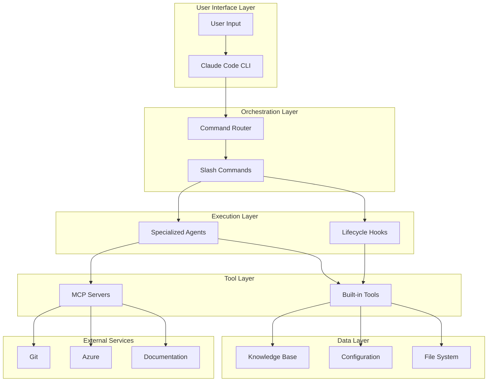
```mermaid
graph TB
    subgraph "User Interface Layer"
        CLI[Claude Code CLI]
        USER[User Input]
    end

    subgraph "Orchestration Layer"
        COMMANDS[Slash Commands]
        ROUTER[Command Router]
    end

    subgraph "Execution Layer"
        AGENTS[Specialized Agents]
        HOOKS[Lifecycle Hooks]
    end

    subgraph "Tool Layer"
        TOOLS[Built-in Tools]
        MCP[MCP Servers]
    end

    subgraph "Data Layer"
        KB[Knowledge Base]
        CONFIG[Configuration]
        FS[File System]
    end

    subgraph "External Services"
        GIT[Git]
        AZURE[Azure]
        DOCS[Documentation]
    end

    USER --> CLI
    CLI --> ROUTER
    ROUTER --> COMMANDS
    COMMANDS --> AGENTS
    COMMANDS --> HOOKS
    AGENTS --> TOOLS
    AGENTS --> MCP
    HOOKS --> TOOLS
    TOOLS --> KB
    TOOLS --> CONFIG
    TOOLS --> FS
    MCP --> AZURE
    MCP --> DOCS
    MCP --> GIT
```

### Architecture Layers

#### 1. User Interface Layer

**Purpose**: Accept user input and present results

**Components**:
- Claude Code CLI interface
- User input parsing
- Output formatting
- Session management

**Responsibilities**:
- Parse user commands
- Route to appropriate handler
- Format and display results
- Manage conversation context

#### 2. Orchestration Layer

**Purpose**: Route commands and coordinate execution

**Components**:
- Command router
- Slash command definitions
- Parameter validation
- Workflow orchestration

**Responsibilities**:
- Match user input to commands
- Validate parameters
- Orchestrate multi-step workflows
- Coordinate agents and tools

#### 3. Execution Layer

**Purpose**: Execute complex tasks and automate workflows

**Components**:
- Specialized agents
- Lifecycle hooks
- Task delegation
- Event processing

**Responsibilities**:
- Execute specialized tasks
- React to lifecycle events
- Maintain isolated contexts
- Report results

#### 4. Tool Layer

**Purpose**: Provide capabilities for file operations, code execution, and external integrations

**Components**:
- Built-in tools (Read, Write, Edit, Bash, etc.)
- MCP servers (microsoft-docs, serena, playwright, azure-mcp, etc.)
- Tool permission system
- Resource management

**Responsibilities**:
- Execute file operations
- Run system commands
- Connect to external services
- Enforce permissions

#### 5. Data Layer

**Purpose**: Persist and retrieve data

**Components**:
- Knowledge base (vector storage)
- Configuration files
- File system
- Project memory

**Responsibilities**:
- Store learnings
- Manage configuration
- Persist state
- Enable search

#### 6. External Services

**Purpose**: Integrate with external systems

**Components**:
- Git (version control)
- Azure (cloud services)
- Documentation systems
- APIs and databases

**Responsibilities**:
- Version control
- Cloud operations
- Documentation access
- External data access

---

## 🧩 Component Breakdown

### 1. Command System

#### Architecture

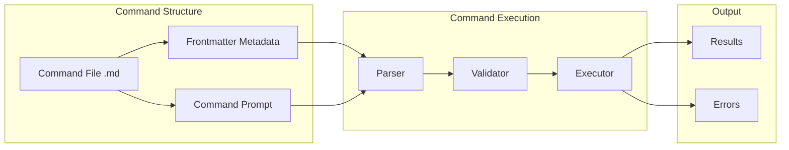
```mermaid
graph LR
    subgraph "Command Structure"
        FILE[Command File .md]
        META[Frontmatter Metadata]
        PROMPT[Command Prompt]
    end

    subgraph "Command Execution"
        PARSE[Parser]
        VALIDATE[Validator]
        EXEC[Executor]
    end

    subgraph "Output"
        RESULT[Results]
        ERROR[Errors]
    end

    FILE --> META
    FILE --> PROMPT
    META --> PARSE
    PROMPT --> PARSE
    PARSE --> VALIDATE
    VALIDATE --> EXEC
    EXEC --> RESULT
    EXEC --> ERROR
```

#### Command Structure

Commands are defined in Markdown files with the following structure:

```markdown
---
name: command-name
description: Brief description
category: core-essentials
tags: [research, validation]
version: 1.0.0
author: Team Name
---

# Command Implementation

[Markdown content with instructions for Claude]

## Parameters

- param1: Description
- param2: Description

## Output Format

Expected output structure

## Examples

Usage examples
```

#### Command Categories

| Category | Purpose | Examples |
|----------|---------|----------|
| **Core Essentials** | Primary workflows | `/primer`, `/task-next` |
| **Knowledge Management** | KB operations | `/memory-store`, `/kb-search` |
| **Azure Development** | Azure operations | `/azure-validate`, `/azure-setup` |
| **Development Support** | Code assistance | `/code-analyze`, `/doc-check` |
| **Testing & QA** | Quality assurance | `/test-full-stack`, `/security-scan` |
| **Git Operations** | Version control | `/smart-commit`, `/create-pr` |
| **Advanced Workflows** | Complex flows | `/research-validate-implement` |

#### Command Execution Flow

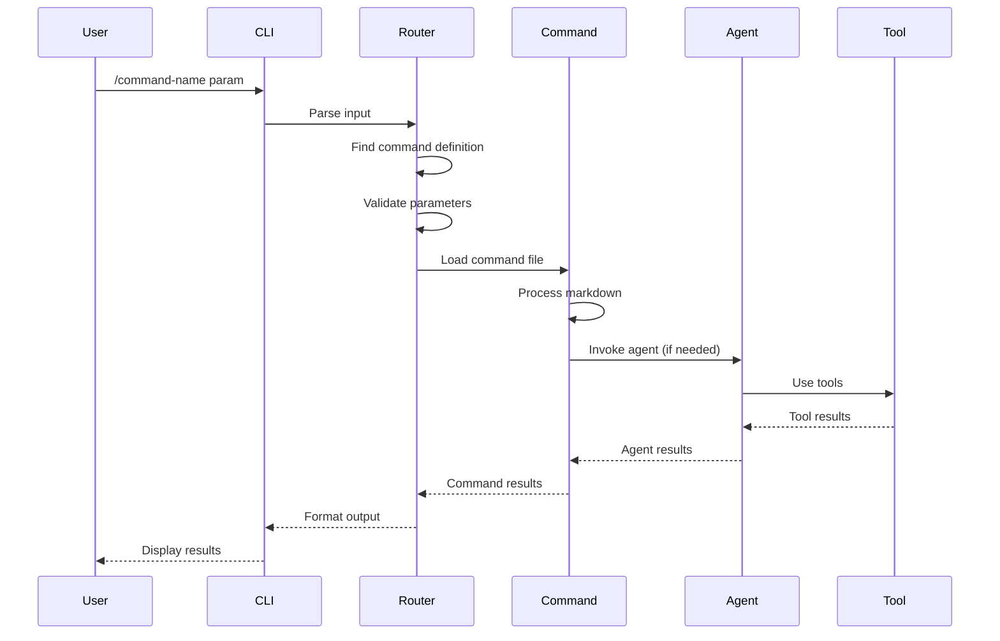
```mermaid
sequenceDiagram
    participant User
    participant CLI
    participant Router
    participant Command
    participant Agent
    participant Tool

    User->>CLI: /command-name param
    CLI->>Router: Parse input
    Router->>Router: Find command definition
    Router->>Router: Validate parameters
    Router->>Command: Load command file
    Command->>Command: Process markdown
    Command->>Agent: Invoke agent (if needed)
    Agent->>Tool: Use tools
    Tool-->>Agent: Tool results
    Agent-->>Command: Agent results
    Command-->>Router: Command results
    Router-->>CLI: Format output
    CLI-->>User: Display results
```

#### Command Permissions

Commands inherit tool permissions from configuration:

```json
{
  "commands": {
    "my-command": {
      "file": ".claude/commands/my-command.md",
      "permissions": {
        "agents": ["general-purpose", "validation-gates"],
        "tools": ["Read", "Write", "Grep"],
        "mcp_servers": ["serena", "microsoft-docs"]
      }
    }
  }
}
```

#### Command Composition

Commands can compose other commands and agents:

```markdown
# Multi-Phase Command

## Phase 1: Research
Invoke `/task-research` to gather information

## Phase 2: Validation
Use `validation-gates` agent to verify approach

## Phase 3: Implementation
Use `general-purpose` agent to implement

## Phase 4: Testing
Invoke `/test-full-stack` to validate
```

### 2. Agent System

#### Architecture

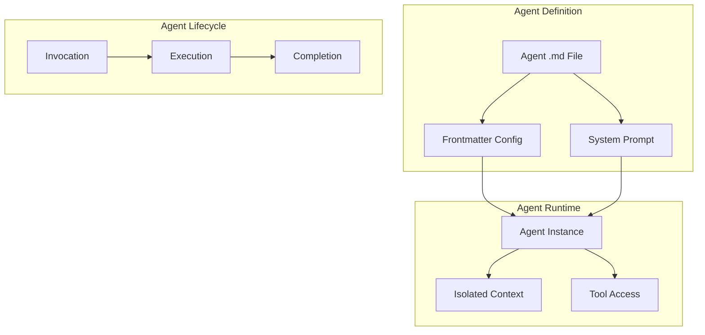
```mermaid
graph TB
    subgraph "Agent Definition"
        AGENT_FILE[Agent .md File]
        FRONT[Frontmatter Config]
        SYSTEM[System Prompt]
    end

    subgraph "Agent Runtime"
        INSTANCE[Agent Instance]
        CONTEXT[Isolated Context]
        TOOLS[Tool Access]
    end

    subgraph "Agent Lifecycle"
        INVOKE[Invocation]
        EXECUTE[Execution]
        COMPLETE[Completion]
    end

    AGENT_FILE --> FRONT
    AGENT_FILE --> SYSTEM
    FRONT --> INSTANCE
    SYSTEM --> INSTANCE
    INSTANCE --> CONTEXT
    INSTANCE --> TOOLS
    INVOKE --> EXECUTE
    EXECUTE --> COMPLETE
```

#### Agent Structure

Agents are defined in Markdown files:

```markdown
---
name: agent-name
type: specialized
tools: [Read, Write, Bash, Grep]
mcp_servers: [serena, microsoft-docs]
description: Agent purpose
version: 1.0.0
---

# System Prompt

You are a specialized agent that...

## Capabilities

- Capability 1
- Capability 2

## Constraints

- Constraint 1
- Constraint 2

## Output Format

Expected output format
```

#### Agent Categories

| Type | Purpose | Tools | Context Size |
|------|---------|-------|--------------|
| **General Purpose** | Broad tasks | All | Large |
| **Specialized** | Specific domain | Limited | Medium |
| **Validation** | Testing/QA | Test tools | Small |
| **Documentation** | Docs generation | Read/Write | Medium |
| **Code Analysis** | Code review | Read/Search | Large |

#### Agent Catalog

**Core Agents**:

1. **general-purpose**
   - Purpose: Handle diverse tasks
   - Tools: All available tools
   - Use case: Default agent for complex work

2. **validation-gates**
   - Purpose: Run tests and validate quality
   - Tools: Bash, Read, Edit, Grep
   - Use case: Testing and QA workflows

3. **documentation-manager**
   - Purpose: Update and maintain docs
   - Tools: Read, Write, Edit, MultiEdit, Grep, Glob
   - Use case: Automatic documentation updates

**Specialized Agents**:

4. **python-pro**
   - Purpose: Python-specific development
   - Tools: All tools
   - Use case: Python projects, advanced features

5. **ai-engineer**
   - Purpose: Build LLM applications
   - Tools: All tools
   - Use case: RAG, agent orchestration, AI features

6. **data-engineer**
   - Purpose: Data pipelines and ETL
   - Tools: All tools
   - Use case: Spark, Airflow, Kafka implementations

7. **api-documenter**
   - Purpose: API documentation
   - Tools: All tools
   - Use case: OpenAPI specs, SDK generation

**Review and Analysis**:

8. **architect-reviewer**
   - Purpose: Architecture review
   - Tools: All tools
   - Use case: Structural changes, pattern validation

9. **search-specialist**
   - Purpose: Deep research
   - Tools: All tools
   - Use case: Competitive analysis, fact-checking

**Documentation Specialists**:

10. **tutorial-engineer**
    - Purpose: Create tutorials
    - Tools: All tools
    - Use case: Onboarding, educational content

11. **reference-builder**
    - Purpose: Technical references
    - Tools: All tools
    - Use case: API docs, configuration guides

12. **docs-architect**
    - Purpose: Comprehensive documentation
    - Tools: All tools
    - Use case: System documentation, technical manuals

**Visual and Diagram**:

13. **mermaid-expert**
    - Purpose: Create diagrams
    - Tools: All tools
    - Use case: Flowcharts, architecture diagrams

**Quality Assurance**:

14. **prp-quality-agent**
    - Purpose: Validate PRPs
    - Tools: Read, Grep, WebFetch, Bash
    - Use case: PRP quality validation

15. **prp-validation-gate-agent**
    - Purpose: Run PRP validation
    - Tools: Bash, Read, Grep, Glob
    - Use case: Final PRP validation

#### Agent Invocation

Agents are invoked using the Task tool:

```python
# In a command or by Claude
Task(
    description="Validate code changes",
    prompt="Run all tests and verify quality gates pass...",
    subagent_type="validation-gates"
)
```

#### Agent Context Isolation

Each agent has isolated context:

```
Main Session Context: 200K tokens
├── Agent 1 Context: 200K tokens (independent)
├── Agent 2 Context: 200K tokens (independent)
└── Agent 3 Context: 200K tokens (independent)
```

**Benefits**:
- Prevents context pollution
- Enables parallel execution
- Reduces token usage in main session
- Allows specialized contexts

#### Agent Communication

Agents communicate through return values:

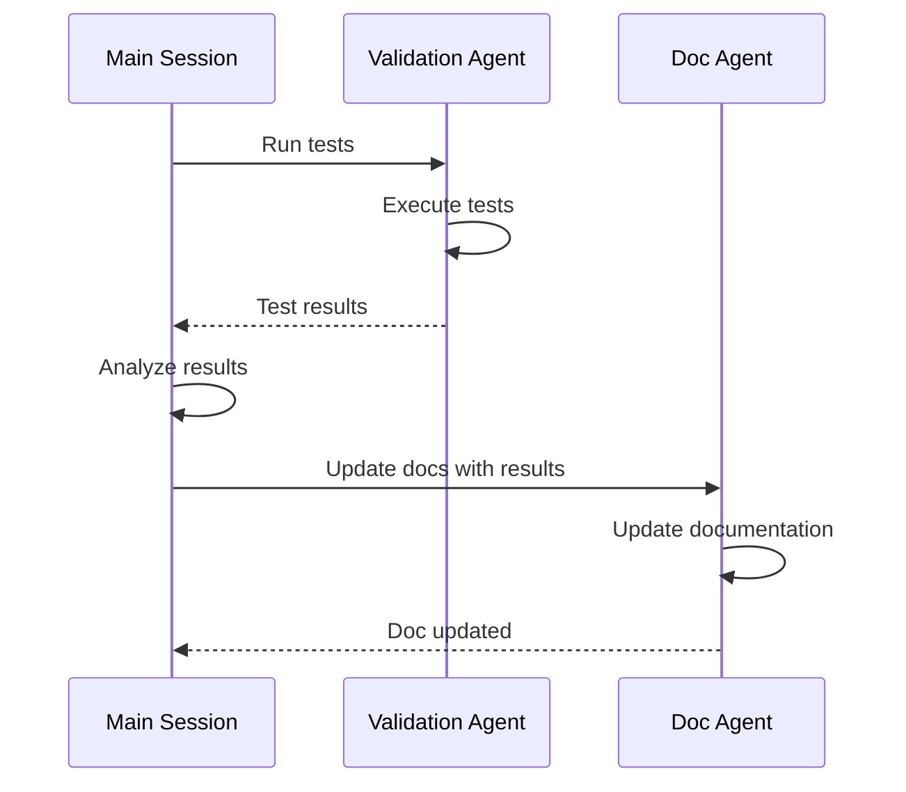
```mermaid
sequenceDiagram
    participant Main as Main Session
    participant Agent1 as Validation Agent
    participant Agent2 as Doc Agent

    Main->>Agent1: Run tests
    Agent1->>Agent1: Execute tests
    Agent1-->>Main: Test results
    Main->>Main: Analyze results
    Main->>Agent2: Update docs with results
    Agent2->>Agent2: Update documentation
    Agent2-->>Main: Doc updated
```

### 3. Hook System

#### Architecture

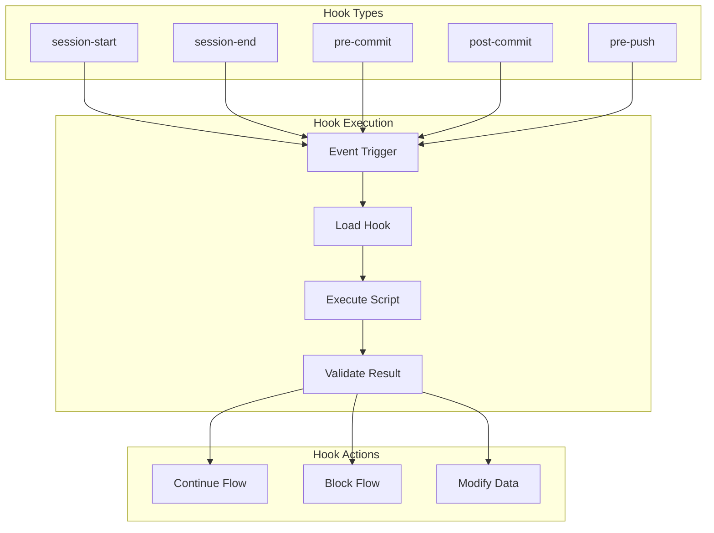
```mermaid
graph TB
    subgraph "Hook Types"
        SESSION_START[session-start]
        SESSION_END[session-end]
        PRE_COMMIT[pre-commit]
        POST_COMMIT[post-commit]
        PRE_PUSH[pre-push]
    end

    subgraph "Hook Execution"
        TRIGGER[Event Trigger]
        LOAD[Load Hook]
        EXECUTE[Execute Script]
        VALIDATE[Validate Result]
    end

    subgraph "Hook Actions"
        CONTINUE[Continue Flow]
        BLOCK[Block Flow]
        MODIFY[Modify Data]
    end

    SESSION_START --> TRIGGER
    SESSION_END --> TRIGGER
    PRE_COMMIT --> TRIGGER
    POST_COMMIT --> TRIGGER
    PRE_PUSH --> TRIGGER

    TRIGGER --> LOAD
    LOAD --> EXECUTE
    EXECUTE --> VALIDATE
    VALIDATE --> CONTINUE
    VALIDATE --> BLOCK
    VALIDATE --> MODIFY
```

#### Hook Categories

**Session Lifecycle Hooks**:

1. **session-start**
   - Trigger: Claude Code session begins
   - Purpose: Initialize environment
   - Examples:
     - MCP health check
     - Environment validation
     - Load session context
     - Load project memory

2. **session-end**
   - Trigger: Claude Code session ends
   - Purpose: Cleanup and persist data
   - Examples:
     - Store session learnings
     - Update knowledge base
     - Generate work summary
     - Backup important data

**Git Workflow Hooks**:

3. **pre-commit**
   - Trigger: Before git commit
   - Purpose: Validate changes
   - Can block: Yes
   - Examples:
     - Run linters
     - Run tests
     - Check code quality
     - Validate security

4. **post-commit**
   - Trigger: After git commit
   - Purpose: Extract learnings
   - Can block: No
   - Examples:
     - Extract patterns
     - Update knowledge base
     - Generate commit summary
     - Update documentation

5. **pre-push**
   - Trigger: Before git push
   - Purpose: Final validation
   - Can block: Yes
   - Examples:
     - Run full test suite
     - Security scan
     - Build validation
     - Dependency check

#### Hook Implementation

Hooks can be implemented in multiple languages:

**JavaScript Hook**:
```javascript
// .claude/hooks/session-start/mcp-health-check.js
module.exports = {
  name: 'mcp-health-check',
  description: 'Check MCP server health',

  async execute(context) {
    // Hook logic
    const servers = ['microsoft-docs', 'serena', 'playwright'];
    const results = await checkServers(servers);

    if (results.some(r => !r.healthy)) {
      return {
        success: false,
        message: 'Some MCP servers are unhealthy',
        data: results
      };
    }

    return {
      success: true,
      message: 'All MCP servers healthy',
      data: results
    };
  }
};
```

**Python Hook**:
```python
# .claude/hooks/pre-commit/run-tests.py
def execute(context):
    """Run tests before commit"""
    import subprocess

    result = subprocess.run(['pytest', 'tests/'], capture_output=True)

    if result.returncode != 0:
        return {
            'success': False,
            'message': 'Tests failed',
            'block': True,
            'output': result.stdout.decode()
        }

    return {
        'success': True,
        'message': 'All tests passed'
    }
```

**Shell Hook**:
```bash
# .claude/hooks/pre-push/security-scan.sh
#!/bin/bash

# Security scan before push
npm audit --audit-level=moderate

if [ $? -ne 0 ]; then
    echo "Security vulnerabilities found"
    exit 1
fi

echo "Security scan passed"
exit 0
```

#### Hook Configuration

Hooks are configured in settings:

```json
{
  "hooks": {
    "session-start": {
      "enabled": true,
      "hooks": [
        {
          "name": "mcp-health-check",
          "file": ".claude/hooks/session-start/mcp-health-check.js",
          "timeout": 5000
        },
        {
          "name": "load-context",
          "file": ".claude/hooks/session-start/load-context.py",
          "timeout": 3000
        }
      ]
    },
    "pre-commit": {
      "enabled": true,
      "hooks": [
        {
          "name": "run-tests",
          "file": ".claude/hooks/pre-commit/run-tests.py",
          "blocking": true,
          "timeout": 60000
        }
      ]
    }
  }
}
```

#### Hook Execution Flow

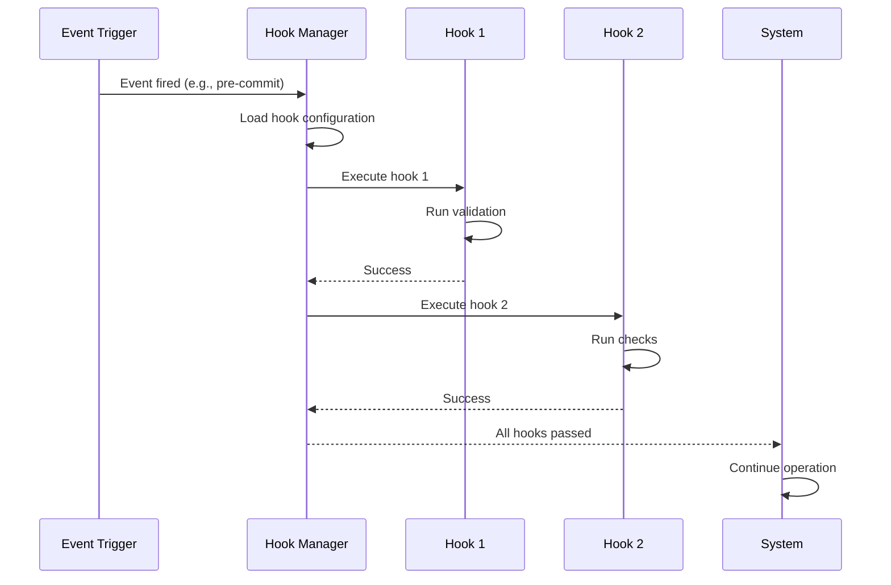
```mermaid
sequenceDiagram
    participant Event as Event Trigger
    participant HookManager as Hook Manager
    participant Hook1 as Hook 1
    participant Hook2 as Hook 2
    participant System as System

    Event->>HookManager: Event fired (e.g., pre-commit)
    HookManager->>HookManager: Load hook configuration
    HookManager->>Hook1: Execute hook 1
    Hook1->>Hook1: Run validation
    Hook1-->>HookManager: Success
    HookManager->>Hook2: Execute hook 2
    Hook2->>Hook2: Run checks
    Hook2-->>HookManager: Success
    HookManager-->>System: All hooks passed
    System->>System: Continue operation
```

If hook fails and is blocking:

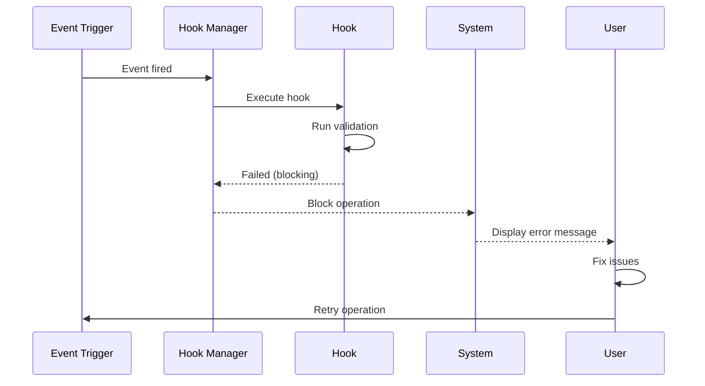
```mermaid
sequenceDiagram
    participant Event as Event Trigger
    participant HookManager as Hook Manager
    participant Hook as Hook
    participant System as System
    participant User as User

    Event->>HookManager: Event fired
    HookManager->>Hook: Execute hook
    Hook->>Hook: Run validation
    Hook-->>HookManager: Failed (blocking)
    HookManager-->>System: Block operation
    System-->>User: Display error message
    User->>User: Fix issues
    User->>Event: Retry operation
```

### 4. MCP Server Layer

#### Architecture

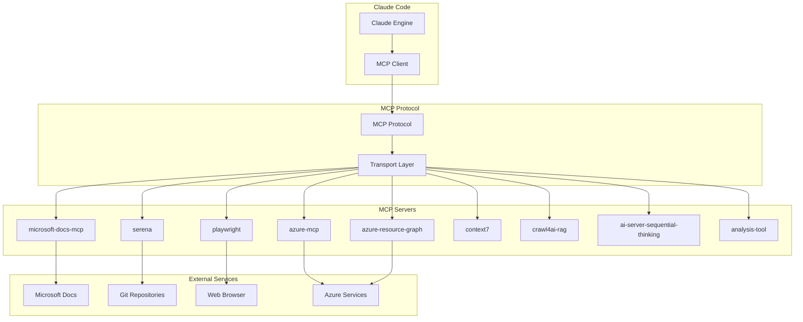
```mermaid
graph TB
    subgraph "Claude Code"
        CLAUDE[Claude Engine]
        MCP_CLIENT[MCP Client]
    end

    subgraph "MCP Protocol"
        PROTOCOL[MCP Protocol]
        TRANSPORT[Transport Layer]
    end

    subgraph "MCP Servers"
        MS_DOCS[microsoft-docs-mcp]
        SERENA[serena]
        PLAYWRIGHT[playwright]
        AZURE_MCP[azure-mcp]
        AZURE_RG[azure-resource-graph]
        CONTEXT7[context7]
        CRAWL4AI[crawl4ai-rag]
        AI_SEQ[ai-server-sequential-thinking]
        ANALYSIS[analysis-tool]
    end

    subgraph "External Services"
        DOCS[Microsoft Docs]
        GIT[Git Repositories]
        BROWSER[Web Browser]
        AZURE[Azure Services]
    end

    CLAUDE --> MCP_CLIENT
    MCP_CLIENT --> PROTOCOL
    PROTOCOL --> TRANSPORT

    TRANSPORT --> MS_DOCS
    TRANSPORT --> SERENA
    TRANSPORT --> PLAYWRIGHT
    TRANSPORT --> AZURE_MCP
    TRANSPORT --> AZURE_RG
    TRANSPORT --> CONTEXT7
    TRANSPORT --> CRAWL4AI
    TRANSPORT --> AI_SEQ
    TRANSPORT --> ANALYSIS

    MS_DOCS --> DOCS
    SERENA --> GIT
    PLAYWRIGHT --> BROWSER
    AZURE_MCP --> AZURE
    AZURE_RG --> AZURE
```

#### MCP Server Catalog

**Documentation and Research**:

1. **microsoft-docs-mcp**
   - Purpose: Search Microsoft Learn documentation
   - Tools: `microsoft_docs_search`, `microsoft_code_sample_search`, `microsoft_docs_fetch`
   - Use case: Azure, .NET, Microsoft technologies

2. **context7**
   - Purpose: Advanced documentation search
   - Tools: Documentation search and retrieval
   - Use case: Multi-source documentation

**Code Analysis**:

3. **serena**
   - Purpose: Code search and analysis
   - Tools: `find_symbol`, `search_for_pattern`, `get_symbols_overview`, `find_file`
   - Use case: Codebase navigation, symbol search

**Automation and Testing**:

4. **playwright**
   - Purpose: Browser automation
   - Tools: Navigation, clicking, forms, screenshots, evaluation
   - Use case: Web scraping, testing, automation

5. **analysis-tool**
   - Purpose: Code and data analysis
   - Tools: Analysis and reporting
   - Use case: Code metrics, quality analysis

**Azure Integration**:

6. **azure-mcp**
   - Purpose: Azure resource management
   - Tools: `run-azure-code`, `list-tenants`, `select-tenant`, `list-resource-groups`, `get-resource-details`, `create-resource-group`, `list-role-assignments`, `get-role-definitions`, `get-user-permissions`
   - Use case: Azure operations, IAM management

7. **azure-resource-graph**
   - Purpose: Query Azure resources
   - Tools: `query-resources`
   - Use case: Resource discovery, inventory, compliance

**AI and Advanced Processing**:

8. **ai-server-sequential-thinking**
   - Purpose: Chain-of-thought reasoning
   - Tools: `sequentialthinking`
   - Use case: Complex problem solving, planning

9. **crawl4ai-rag**
   - Purpose: Web crawling with RAG
   - Tools: Web crawling, content extraction
   - Use case: Knowledge gathering, RAG pipelines

#### MCP Server Configuration

Servers are configured in `.claude/settings.local.json`:

```json
{
  "mcpServers": {
    "microsoft-docs-mcp": {
      "command": "npx",
      "args": [
        "-y",
        "@lenaxia/microsoft-docs-mcp"
      ],
      "env": {},
      "disabled": false
    },
    "serena": {
      "command": "uvx",
      "args": [
        "mcp-server-serena"
      ],
      "env": {
        "SERENA_REPO_PATH": "E:\\Repos\\01 - Base Claude Project Setup"
      },
      "disabled": false
    },
    "playwright": {
      "command": "npx",
      "args": [
        "-y",
        "@executeautomation/playwright-mcp-server"
      ],
      "env": {},
      "disabled": false
    }
  }
}
```

#### MCP Communication Flow

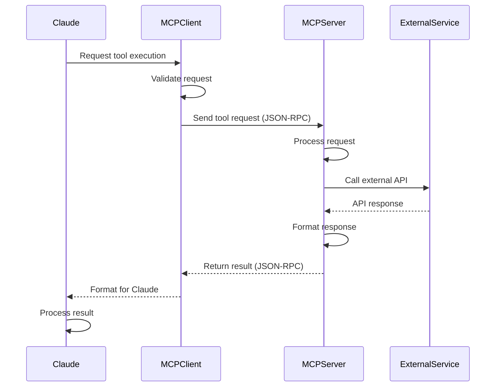
```mermaid
sequenceDiagram
    participant Claude
    participant MCPClient
    participant MCPServer
    participant ExternalService

    Claude->>MCPClient: Request tool execution
    MCPClient->>MCPClient: Validate request
    MCPClient->>MCPServer: Send tool request (JSON-RPC)
    MCPServer->>MCPServer: Process request
    MCPServer->>ExternalService: Call external API
    ExternalService-->>MCPServer: API response
    MCPServer->>MCPServer: Format response
    MCPServer-->>MCPClient: Return result (JSON-RPC)
    MCPClient-->>Claude: Format for Claude
    Claude->>Claude: Process result
```

#### MCP Health Monitoring

Health check flow:

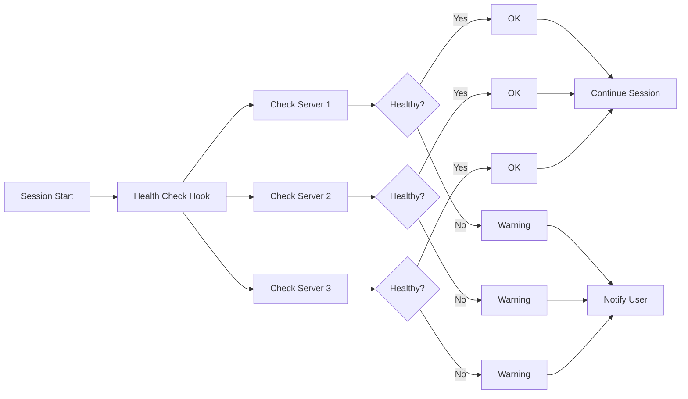
```mermaid
graph LR
    START[Session Start] --> HEALTH[Health Check Hook]
    HEALTH --> CHECK1[Check Server 1]
    HEALTH --> CHECK2[Check Server 2]
    HEALTH --> CHECK3[Check Server 3]

    CHECK1 --> RESULT1{Healthy?}
    CHECK2 --> RESULT2{Healthy?}
    CHECK3 --> RESULT3{Healthy?}

    RESULT1 -->|Yes| OK1[OK]
    RESULT1 -->|No| WARN1[Warning]
    RESULT2 -->|Yes| OK2[OK]
    RESULT2 -->|No| WARN2[Warning]
    RESULT3 -->|Yes| OK3[OK]
    RESULT3 -->|No| WARN3[Warning]

    OK1 --> CONTINUE[Continue Session]
    OK2 --> CONTINUE
    OK3 --> CONTINUE
    WARN1 --> NOTIFY[Notify User]
    WARN2 --> NOTIFY
    WARN3 --> NOTIFY
```

### 5. Knowledge Base System

#### Architecture

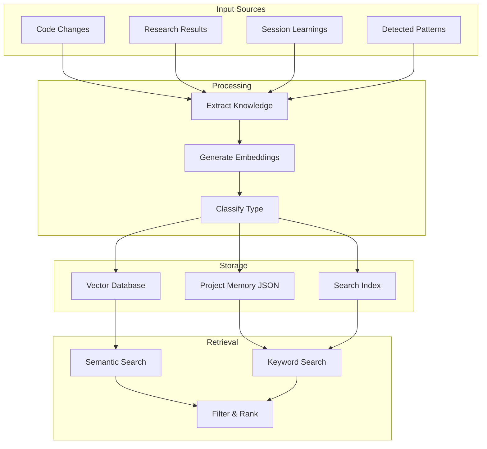
```mermaid
graph TB
    subgraph "Input Sources"
        CODE[Code Changes]
        RESEARCH[Research Results]
        LEARNINGS[Session Learnings]
        PATTERNS[Detected Patterns]
    end

    subgraph "Processing"
        EXTRACT[Extract Knowledge]
        EMBED[Generate Embeddings]
        CLASSIFY[Classify Type]
    end

    subgraph "Storage"
        VECTOR[Vector Database]
        MEMORY[Project Memory JSON]
        INDEX[Search Index]
    end

    subgraph "Retrieval"
        SEMANTIC[Semantic Search]
        KEYWORD[Keyword Search]
        FILTER[Filter & Rank]
    end

    CODE --> EXTRACT
    RESEARCH --> EXTRACT
    LEARNINGS --> EXTRACT
    PATTERNS --> EXTRACT

    EXTRACT --> EMBED
    EMBED --> CLASSIFY
    CLASSIFY --> VECTOR
    CLASSIFY --> MEMORY
    CLASSIFY --> INDEX

    VECTOR --> SEMANTIC
    MEMORY --> KEYWORD
    INDEX --> KEYWORD

    SEMANTIC --> FILTER
    KEYWORD --> FILTER
```

#### Knowledge Types

| Type | Storage | Searchable | Use Case |
|------|---------|------------|----------|
| **Code Patterns** | Vector DB | Semantic | Find similar implementations |
| **Learnings** | Vector DB | Semantic | Recall solutions |
| **Project Memory** | JSON | Keyword | Quick facts |
| **Research** | Vector DB | Both | Documentation references |
| **Decisions** | JSON | Keyword | Architecture decisions |

#### Knowledge Storage Structure

```
.claude/knowledge/
├── vector-db/                # Vector embeddings
│   ├── code-patterns/
│   ├── learnings/
│   └── research/
├── memory/
│   ├── project-memory.json   # Quick facts
│   ├── decisions.json        # Key decisions
│   └── team-knowledge.json   # Team learnings
└── index/
    ├── search-index.json     # Search metadata
    └── tags.json             # Tag index
```

#### Knowledge Operations

**Store Knowledge**:
```bash
/memory-store "key insight about authentication"
```

**Search Knowledge**:
```bash
/kb-search "how did we implement auth?"
```

**Update Memory**:
```bash
/kb-update-memory "Add new pattern: rate limiting"
```

**Add Research**:
```bash
/kb-add-research "Azure AD B2C implementation guide"
```

### 6. Configuration System

#### Configuration Hierarchy

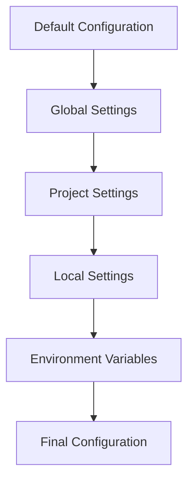
```mermaid
graph TB
    DEFAULT[Default Configuration]
    GLOBAL[Global Settings]
    PROJECT[Project Settings]
    LOCAL[Local Settings]
    ENV[Environment Variables]

    DEFAULT --> GLOBAL
    GLOBAL --> PROJECT
    PROJECT --> LOCAL
    LOCAL --> ENV

    ENV --> FINAL[Final Configuration]
```

**Priority (highest to lowest)**:
1. Environment variables
2. Local settings (`.claude/settings.local.json`)
3. Project settings (`.claude/settings.json`)
4. Global settings (`~/.claude/settings.json`)
5. Default configuration

#### Configuration Structure

```json
{
  "permissions": {
    "bash": {
      "allow": ["npm:*", "git:*"],
      "deny": ["rm -rf", "sudo:*"],
      "ask": ["git push", "docker:*"]
    },
    "tools": {
      "Read": "allow",
      "Write": "ask",
      "Edit": "allow",
      "Bash": "allow"
    },
    "mcp": {
      "allow": ["microsoft-docs:*", "serena:*"],
      "ask": ["playwright:*"]
    }
  },

  "mcpServers": {
    // MCP server configurations
  },

  "hooks": {
    // Hook configurations
  },

  "knowledge": {
    "enabled": true,
    "vectorDb": ".claude/knowledge/vector-db",
    "projectMemory": ".claude/knowledge/memory/project-memory.json"
  },

  "output": {
    "style": "explanatory",
    "verbosity": "detailed"
  },

  "quality": {
    "testCoverageThreshold": 80,
    "codeQualityThreshold": 8.0,
    "securityScanRequired": true
  }
}
```

---

## 🔄 Component Interactions

### Command → Agent → Tool Flow

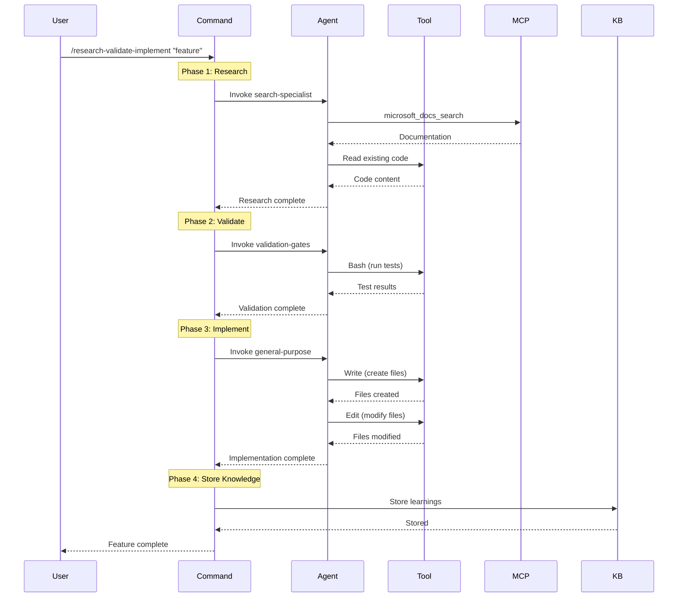
```mermaid
sequenceDiagram
    participant User
    participant Command
    participant Agent
    participant Tool
    participant MCP
    participant KB

    User->>Command: /research-validate-implement "feature"

    Note over Command: Phase 1: Research
    Command->>Agent: Invoke search-specialist
    Agent->>MCP: microsoft_docs_search
    MCP-->>Agent: Documentation
    Agent->>Tool: Read existing code
    Tool-->>Agent: Code content
    Agent-->>Command: Research complete

    Note over Command: Phase 2: Validate
    Command->>Agent: Invoke validation-gates
    Agent->>Tool: Bash (run tests)
    Tool-->>Agent: Test results
    Agent-->>Command: Validation complete

    Note over Command: Phase 3: Implement
    Command->>Agent: Invoke general-purpose
    Agent->>Tool: Write (create files)
    Tool-->>Agent: Files created
    Agent->>Tool: Edit (modify files)
    Tool-->>Agent: Files modified
    Agent-->>Command: Implementation complete

    Note over Command: Phase 4: Store Knowledge
    Command->>KB: Store learnings
    KB-->>Command: Stored

    Command-->>User: Feature complete
```

### Hook Execution Flow

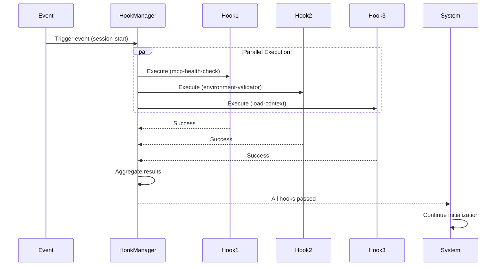
```mermaid
sequenceDiagram
    participant Event
    participant HookManager
    participant Hook1
    participant Hook2
    participant Hook3
    participant System

    Event->>HookManager: Trigger event (session-start)

    par Parallel Execution
        HookManager->>Hook1: Execute (mcp-health-check)
        HookManager->>Hook2: Execute (environment-validator)
        HookManager->>Hook3: Execute (load-context)
    end

    Hook1-->>HookManager: Success
    Hook2-->>HookManager: Success
    Hook3-->>HookManager: Success

    HookManager->>HookManager: Aggregate results
    HookManager-->>System: All hooks passed
    System->>System: Continue initialization
```

### MCP Server Integration Flow

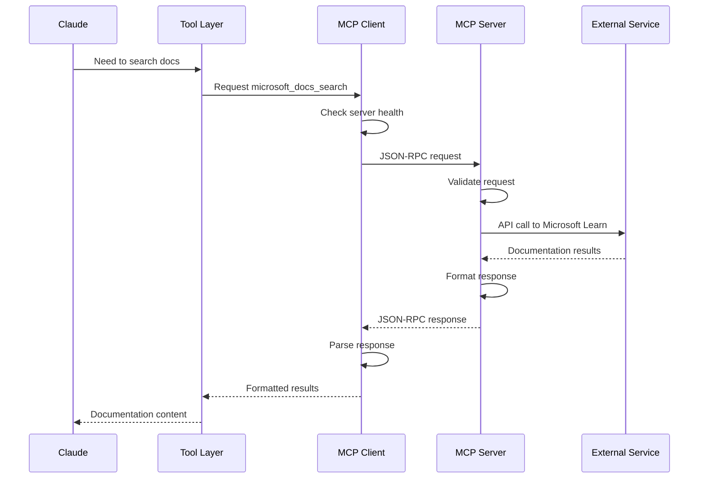
```mermaid
sequenceDiagram
    participant Claude
    participant Tool as Tool Layer
    participant MCP as MCP Client
    participant Server as MCP Server
    participant Service as External Service

    Claude->>Tool: Need to search docs
    Tool->>MCP: Request microsoft_docs_search
    MCP->>MCP: Check server health
    MCP->>Server: JSON-RPC request
    Server->>Server: Validate request
    Server->>Service: API call to Microsoft Learn
    Service-->>Server: Documentation results
    Server->>Server: Format response
    Server-->>MCP: JSON-RPC response
    MCP->>MCP: Parse response
    MCP-->>Tool: Formatted results
    Tool-->>Claude: Documentation content
```

### Knowledge Base Interaction Flow

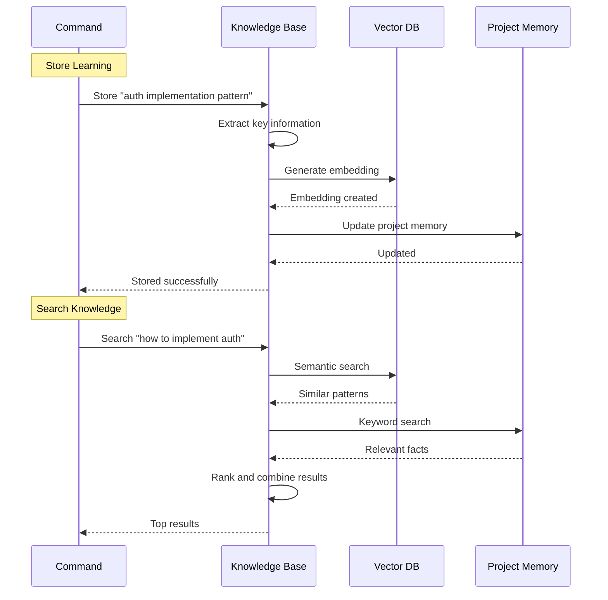
```mermaid
sequenceDiagram
    participant Command
    participant KB as Knowledge Base
    participant Vector as Vector DB
    participant Memory as Project Memory

    Note over Command: Store Learning
    Command->>KB: Store "auth implementation pattern"
    KB->>KB: Extract key information
    KB->>Vector: Generate embedding
    Vector-->>KB: Embedding created
    KB->>Memory: Update project memory
    Memory-->>KB: Updated
    KB-->>Command: Stored successfully

    Note over Command: Search Knowledge
    Command->>KB: Search "how to implement auth"
    KB->>Vector: Semantic search
    Vector-->>KB: Similar patterns
    KB->>Memory: Keyword search
    Memory-->>KB: Relevant facts
    KB->>KB: Rank and combine results
    KB-->>Command: Top results
```

---

## 📊 Dependency Graph

### Component Dependencies

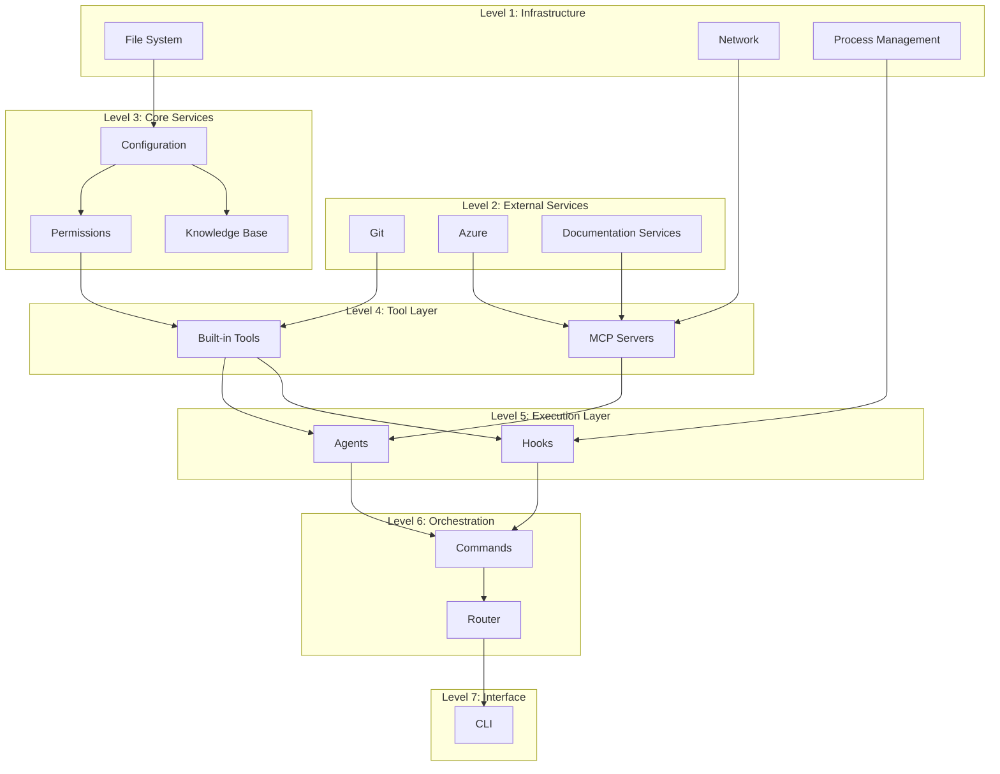
```mermaid
graph TB
    subgraph "Level 1: Infrastructure"
        FS[File System]
        NETWORK[Network]
        PROCESS[Process Management]
    end

    subgraph "Level 2: External Services"
        GIT[Git]
        AZURE[Azure]
        DOCS_SVC[Documentation Services]
    end

    subgraph "Level 3: Core Services"
        CONFIG[Configuration]
        PERMS[Permissions]
        KB[Knowledge Base]
    end

    subgraph "Level 4: Tool Layer"
        TOOLS[Built-in Tools]
        MCP[MCP Servers]
    end

    subgraph "Level 5: Execution Layer"
        HOOKS[Hooks]
        AGENTS[Agents]
    end

    subgraph "Level 6: Orchestration"
        COMMANDS[Commands]
        ROUTER[Router]
    end

    subgraph "Level 7: Interface"
        CLI[CLI]
    end

    FS --> CONFIG
    NETWORK --> MCP
    PROCESS --> HOOKS

    GIT --> TOOLS
    AZURE --> MCP
    DOCS_SVC --> MCP

    CONFIG --> PERMS
    CONFIG --> KB
    PERMS --> TOOLS

    TOOLS --> AGENTS
    TOOLS --> HOOKS
    MCP --> AGENTS

    AGENTS --> COMMANDS
    HOOKS --> COMMANDS

    COMMANDS --> ROUTER
    ROUTER --> CLI
```

### Circular Dependency Prevention

**Problem**: Commands can invoke agents, agents can use tools, but tools shouldn't directly invoke commands.

**Solution**: Dependency Inversion Principle

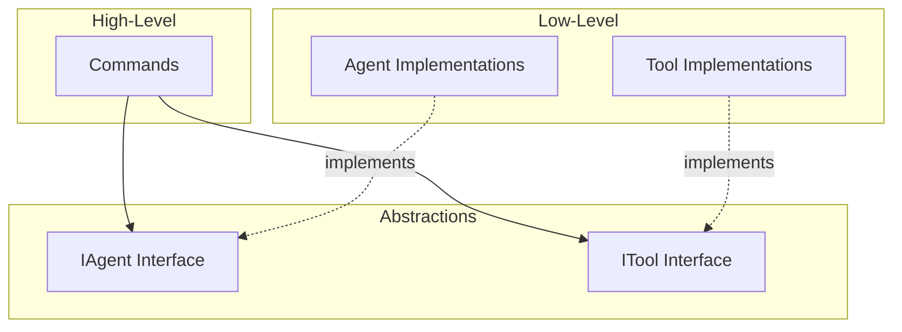
```mermaid
graph TB
    subgraph "High-Level"
        COMMANDS[Commands]
    end

    subgraph "Abstractions"
        IAGENT[IAgent Interface]
        ITOOL[ITool Interface]
    end

    subgraph "Low-Level"
        AGENTS[Agent Implementations]
        TOOLS[Tool Implementations]
    end

    COMMANDS --> IAGENT
    COMMANDS --> ITOOL
    AGENTS -.implements.-> IAGENT
    TOOLS -.implements.-> ITOOL
```

**Benefits**:
- No circular dependencies
- Easy to test
- Clear dependency direction
- Pluggable implementations

---

## ⚡ Scalability Considerations

### Horizontal Scalability

#### Agent Parallelization

Multiple agents can run in parallel:

```python
# Launch multiple agents in parallel
Task(description="Agent 1", prompt="...", subagent_type="agent1")
Task(description="Agent 2", prompt="...", subagent_type="agent2")
Task(description="Agent 3", prompt="...", subagent_type="agent3")
```

**Benefits**:
- Faster execution
- Better resource utilization
- Independent contexts

**Limitations**:
- API rate limits
- Memory per agent
- Context window limits

#### MCP Server Scaling

MCP servers can be:
- **Replicated**: Multiple instances of same server
- **Load Balanced**: Distribute requests
- **Geographically Distributed**: Reduce latency

```json
{
  "mcpServers": {
    "microsoft-docs-1": {
      "command": "npx",
      "args": ["-y", "@lenaxia/microsoft-docs-mcp"],
      "priority": 1
    },
    "microsoft-docs-2": {
      "command": "npx",
      "args": ["-y", "@lenaxia/microsoft-docs-mcp"],
      "priority": 2
    }
  }
}
```

### Vertical Scalability

#### Context Window Management

**Strategies**:

1. **Context Compaction**
```bash
/compact  # Compress context while preserving key information
```

2. **Agent Delegation**
```bash
# Offload complex tasks to agents with fresh context
Task(description="...", subagent_type="specialized-agent")
```

3. **Knowledge Base Usage**
```bash
# Store and retrieve instead of keeping in context
/memory-store "key information"
/kb-search "retrieve when needed"
```

4. **Selective Context Loading**
```bash
# Only load what's needed
/context path/to/specific/files
```

#### Memory Optimization

**Techniques**:

1. **Lazy Loading**: Load resources only when needed
2. **Caching**: Cache frequently accessed data
3. **Streaming**: Process large files in chunks
4. **Garbage Collection**: Clean up unused resources

### Performance Patterns

#### Command Optimization

```markdown
# Inefficient
1. Read file 1
2. Process file 1
3. Read file 2
4. Process file 2

# Efficient
1. Read file 1 and file 2 in parallel
2. Process both
```

#### MCP Server Batching

```javascript
// Inefficient: Multiple calls
const doc1 = await mcp.call('fetch', {url: url1});
const doc2 = await mcp.call('fetch', {url: url2});
const doc3 = await mcp.call('fetch', {url: url3});

// Efficient: Batch call
const docs = await mcp.call('batch_fetch', {urls: [url1, url2, url3]});
```

#### Hook Optimization

```json
{
  "hooks": {
    "session-start": {
      "parallel": true,  // Run hooks in parallel
      "timeout": 5000,   // Fail fast
      "cache": true      // Cache results
    }
  }
}
```

---

## 🔒 Security Architecture

### Defense in Depth

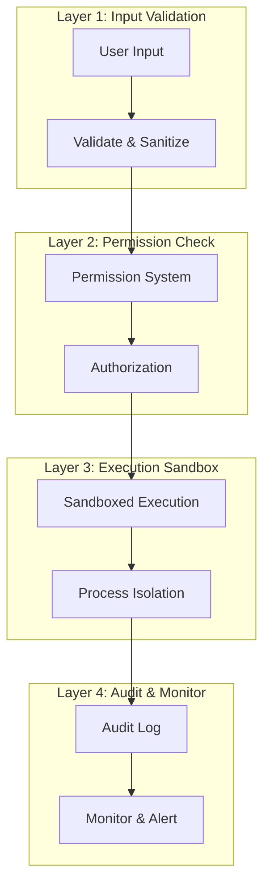
```mermaid
graph TB
    subgraph "Layer 1: Input Validation"
        INPUT[User Input]
        VALIDATE[Validate & Sanitize]
    end

    subgraph "Layer 2: Permission Check"
        PERMS[Permission System]
        AUTH[Authorization]
    end

    subgraph "Layer 3: Execution Sandbox"
        SANDBOX[Sandboxed Execution]
        ISOLATION[Process Isolation]
    end

    subgraph "Layer 4: Audit & Monitor"
        AUDIT[Audit Log]
        MONITOR[Monitor & Alert]
    end

    INPUT --> VALIDATE
    VALIDATE --> PERMS
    PERMS --> AUTH
    AUTH --> SANDBOX
    SANDBOX --> ISOLATION
    ISOLATION --> AUDIT
    AUDIT --> MONITOR
```

### Permission System

#### Three-Tier Model

```json
{
  "permissions": {
    "bash": {
      "allow": [
        "npm:*",
        "git status",
        "ls",
        "cat:*"
      ],
      "deny": [
        "rm -rf",
        "sudo:*",
        "chmod 777"
      ],
      "ask": [
        "git push",
        "docker:*",
        "kubectl:*"
      ]
    }
  }
}
```

**Permission Resolution**:
1. Check `deny` list first → Block immediately
2. Check `allow` list → Execute without asking
3. Check `ask` list → Prompt user
4. Default → Ask user (fail-safe)

#### Permission Wildcards

```json
{
  "allow": [
    "npm:*",           // All npm commands
    "git:*",           // All git commands
    "docker ps:*"      // Docker ps with any flags
  ],
  "deny": [
    "rm *",            // Any rm command
    "*:--force"        // Any command with --force flag
  ]
}
```

### Secrets Management

#### Secret Detection

Hooks can prevent secret commits:

```python
# .claude/hooks/pre-commit/secret-scan.py
import re

SECRET_PATTERNS = [
    r'(?i)api[-_]?key\s*=\s*["\']?[a-z0-9]{20,}',
    r'(?i)password\s*=\s*["\']?.+["\']?',
    r'(?i)token\s*=\s*["\']?[a-z0-9]{20,}',
]

def execute(context):
    for file in context['files']:
        content = read_file(file)
        for pattern in SECRET_PATTERNS:
            if re.search(pattern, content):
                return {
                    'success': False,
                    'message': f'Potential secret found in {file}',
                    'block': True
                }
    return {'success': True}
```

#### Environment Variables

Store secrets in environment:

```json
{
  "mcpServers": {
    "azure-mcp": {
      "command": "node",
      "args": ["server.js"],
      "env": {
        "AZURE_CLIENT_ID": "${AZURE_CLIENT_ID}",
        "AZURE_CLIENT_SECRET": "${AZURE_CLIENT_SECRET}"
      }
    }
  }
}
```

#### Secret Storage Locations

```
✅ Environment variables
✅ Azure Key Vault
✅ .env file (gitignored)
✅ Secure credential manager

❌ Configuration files
❌ Code files
❌ Git repository
❌ Documentation
```

### Audit Trail

#### Audit Log Structure

```json
{
  "timestamp": "2025-01-15T10:30:00Z",
  "session_id": "abc123",
  "event_type": "command_execution",
  "command": "/azure-validate",
  "user": "developer@example.com",
  "outcome": "success",
  "duration_ms": 1234,
  "resources_accessed": [
    ".claude/settings.local.json",
    "azure-config.json"
  ],
  "permissions_used": [
    "Read",
    "Bash"
  ]
}
```

#### Audit Events

| Event Type | Logged | Retention |
|------------|--------|-----------|
| Command execution | Yes | 90 days |
| Agent invocation | Yes | 90 days |
| Permission denial | Yes | 180 days |
| Configuration change | Yes | 1 year |
| MCP server call | Yes | 30 days |
| Hook execution | Yes | 30 days |
| Knowledge base update | Yes | 1 year |

---

## ⚡ Performance Characteristics

### Latency Metrics

| Operation | P50 | P95 | P99 |
|-----------|-----|-----|-----|
| Command parsing | 5ms | 10ms | 20ms |
| Permission check | 1ms | 2ms | 5ms |
| Agent invocation | 100ms | 200ms | 500ms |
| MCP server call | 50ms | 150ms | 300ms |
| Hook execution | 100ms | 500ms | 2s |
| KB search | 20ms | 50ms | 100ms |
| File read | 5ms | 20ms | 50ms |

### Throughput Considerations

#### Command Throughput

```
Single command: 1 command/session
Parallel agents: 5+ agents/session
MCP server calls: 100+ calls/second
```

#### Optimization Strategies

**1. Parallel Execution**
```bash
# Launch multiple agents in parallel
Task(..., subagent_type="agent1")
Task(..., subagent_type="agent2")
Task(..., subagent_type="agent3")
```

**2. Caching**
```json
{
  "cache": {
    "enabled": true,
    "ttl": 300,
    "maxSize": "100MB"
  }
}
```

**3. Connection Pooling**
```json
{
  "mcpServers": {
    "microsoft-docs": {
      "poolSize": 5,
      "keepAlive": true
    }
  }
}
```

### Resource Usage

| Component | CPU | Memory | Disk I/O | Network |
|-----------|-----|--------|----------|---------|
| Command Router | Low | Low | None | None |
| Agent | Medium | High | Low | Low |
| MCP Server | Low | Medium | Low | High |
| Hook | Variable | Low | Variable | Low |
| Knowledge Base | Low | Medium | Medium | None |

### Performance Monitoring

#### Built-in Monitoring

```bash
# Check MCP server health
/mcp-health-check

# Monitor command performance
/performance-test

# Profile specific command
time /my-command
```

#### Custom Monitoring

```python
# .claude/hooks/session-end/performance-report.py
def execute(context):
    report = {
        'commands_executed': context['stats']['commands'],
        'agents_invoked': context['stats']['agents'],
        'mcp_calls': context['stats']['mcp_calls'],
        'total_duration': context['stats']['duration'],
        'average_command_time': calculate_average(context['stats'])
    }

    save_report(report)
    return {'success': True, 'data': report}
```

---

## 🎨 Design Patterns

### 1. Command Pattern

Commands encapsulate requests as objects:

```markdown
# Command Definition
---
name: deploy-app
---

# Deployment Command

1. Validate environment
2. Build application
3. Run tests
4. Deploy to Azure
5. Verify deployment
```

**Benefits**:
- Encapsulation
- Composability
- Reusability
- Auditability

### 2. Strategy Pattern

Agents provide interchangeable strategies:

```python
# Choose strategy based on context
if task_type == "python":
    agent = "python-pro"
elif task_type == "api":
    agent = "api-documenter"
else:
    agent = "general-purpose"

Task(prompt="...", subagent_type=agent)
```

### 3. Observer Pattern

Hooks observe lifecycle events:

```javascript
// Hook observes pre-commit event
module.exports = {
  observe: 'pre-commit',
  execute: async (event) => {
    // React to event
  }
};
```

### 4. Facade Pattern

Commands provide simplified interface:

```bash
# Simple facade
/research-validate-implement "feature"

# Hides complexity of:
# - Research agent invocation
# - Validation gates execution
# - Implementation agent delegation
# - Knowledge base updates
```

### 5. Decorator Pattern

Hooks decorate operations:

```python
# Original operation: git commit
# Decorated with hooks:
pre_commit_hooks()  # Decorator 1
git_commit()        # Core operation
post_commit_hooks() # Decorator 2
```

### 6. Repository Pattern

Knowledge Base abstracts data access:

```python
# Abstract interface
class KnowledgeRepository:
    def search(query): pass
    def store(data): pass
    def retrieve(id): pass

# Implementations
class VectorKB(KnowledgeRepository): ...
class SQLiteKB(KnowledgeRepository): ...
```

### 7. Factory Pattern

Agent creation based on type:

```python
class AgentFactory:
    def create_agent(agent_type):
        if agent_type == "validation-gates":
            return ValidationAgent()
        elif agent_type == "documentation-manager":
            return DocAgent()
        else:
            return GeneralPurposeAgent()
```

---

## 🔌 Extension Points

### 1. Custom Commands

```markdown
# .claude/commands/my-command.md
---
name: my-command
description: Custom workflow
---

# My Custom Command

[Implementation instructions]
```

### 2. Custom Agents

```markdown
# .claude/agents/my-agent.md
---
name: my-agent
tools: [Read, Write]
---

# My Custom Agent

You are a specialized agent for...
```

### 3. Custom Hooks

```javascript
// .claude/hooks/session-start/my-hook.js
module.exports = {
  name: 'my-hook',
  execute: async (context) => {
    // Custom logic
  }
};
```

### 4. Custom MCP Servers

```typescript
// my-mcp-server/index.ts
import { MCPServer } from '@modelcontextprotocol/sdk';

const server = new MCPServer({
  name: 'my-server',
  version: '1.0.0'
});

server.tool('my_tool', async (params) => {
  // Tool implementation
});

server.listen();
```

### 5. Custom Knowledge Stores

```python
# Implement KnowledgeStore interface
class CustomKB:
    def search(self, query):
        # Custom search logic
        pass

    def store(self, data):
        # Custom storage logic
        pass
```

---

## 🛠️ Technical Stack

### Core Technologies

| Layer | Technology | Purpose |
|-------|------------|---------|
| **CLI** | Claude Code | User interface |
| **Runtime** | Claude AI | AI engine |
| **Commands** | Markdown | Command definitions |
| **Agents** | Markdown + YAML | Agent definitions |
| **Hooks** | JS/Python/Shell | Automation scripts |
| **MCP** | JSON-RPC | Protocol |
| **Knowledge** | Vector DB | Semantic search |
| **Config** | JSON | Configuration |

### MCP Server Technologies

| Server | Language | Framework |
|--------|----------|-----------|
| microsoft-docs-mcp | TypeScript | Node.js |
| serena | Python | FastAPI |
| playwright | TypeScript | Playwright |
| azure-mcp | TypeScript | Azure SDK |
| azure-resource-graph | TypeScript | Azure SDK |
| context7 | Python | FastAPI |
| crawl4ai-rag | Python | FastAPI |
| ai-server-sequential-thinking | TypeScript | Node.js |
| analysis-tool | Python | FastAPI |

### Development Tools

```json
{
  "languages": ["JavaScript", "Python", "Shell", "TypeScript"],
  "frameworks": ["Node.js", "FastAPI"],
  "protocols": ["JSON-RPC", "MCP"],
  "formats": ["Markdown", "JSON", "YAML"],
  "version_control": "Git",
  "cloud": "Azure",
  "ai": "Claude AI"
}
```

---

## 📚 Related Documentation

### Architecture Documents
- [Architecture README](./README.md) - Architecture hub
- [Data Flow](./data-flow.md) - Data flow patterns
- [MCP Integration](./mcp-integration.md) - MCP server integration

### Component Documentation
- [Commands](../commands/README.md) - Command system
- [Agents](../agents/README.md) - Agent system
- [Hooks](../hooks/README.md) - Hook system
- [Settings](../settings/README.md) - Configuration

### Implementation Guides
- [Creating Commands](../commands/creating-custom-commands.md)
- [Creating Agents](../agents/creating-agents.md)
- [Creating Hooks](../hooks/creating-hooks.md)
- [Best Practices](../best-practices/README.md)

---

## 📝 Document Information

**Version**: 1.0
**Last Updated**: 2025-01-15
**Maintainer**: Architecture Team
**Status**: Active

---

**Navigate**: [← Architecture Hub](./README.md) | [Data Flow →](./data-flow.md) | [MCP Integration →](./mcp-integration.md)

---

*Designed for extensibility, built for reliability, optimized for developer experience*
