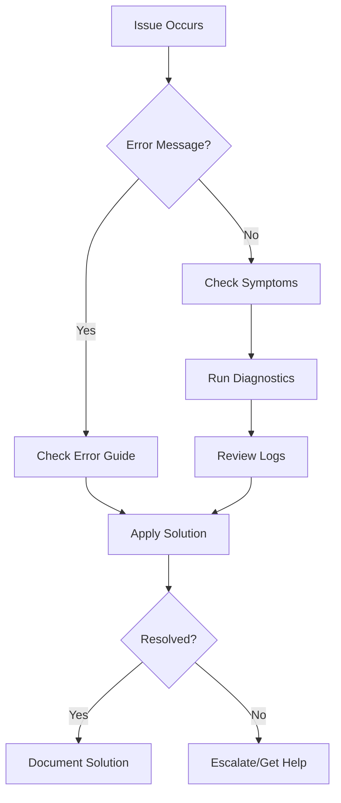

# Troubleshooting Guide

## Overview

This comprehensive troubleshooting guide helps you resolve common issues with the Claude Code Context Engineering system. The guide is organized by issue type for quick problem resolution.

## Quick Troubleshooting Checklist

Before diving into specific issues, run through this quick checklist:

### System Health Check

```bash
# Run system diagnostics
/system-check

# Check all services
/health-check --all

# Verify configuration
/validate-config

# Test connectivity
/test-connections
```

### Common Quick Fixes

1. **Restart Claude Code**
   ```bash
   # Close and reopen Claude Code
   # Or use the restart command
   /restart
   ```

2. **Clear Cache**
   ```bash
   /clear-cache
   /reset-context
   ```

3. **Update Configuration**
   ```bash
   /reload-config
   /refresh-mcps
   ```

4. **Check Permissions**
   ```bash
   # Verify file permissions
   ls -la .claude/

   # Fix permissions
   chmod 755 .claude/commands/
   chmod 644 .claude/settings.json
   ```

## Navigation to Specific Issues

### By Category

#### **Installation & Setup**
- [Installation Issues](./common-issues.md#installation-issues)
- [Initial Configuration](./common-issues.md#configuration-problems)
- [Environment Setup](./common-issues.md#environment-setup)

#### **Command Issues**
- [Command Not Found](./common-issues.md#command-not-found)
- [Command Execution Errors](./common-issues.md#command-execution)
- [Custom Command Problems](./common-issues.md#custom-commands)

#### **MCP Server Issues**
- [Connection Failures](./mcp-issues.md#connection-failures)
- [Authentication Errors](./mcp-issues.md#authentication-errors)
- [Server Timeouts](./mcp-issues.md#timeout-issues)
- [Performance Issues](./mcp-issues.md#performance-problems)

#### **Hook Problems**
- [Hook Not Triggering](./hook-issues.md#hook-not-triggering)
- [Hook Execution Failures](./hook-issues.md#execution-failures)
- [Hook Configuration](./hook-issues.md#configuration-errors)

#### **Context Management**
- [Context Overflow](./context-issues.md#context-overflow)
- [Context Loss](./context-issues.md#context-loss)
- [Compaction Issues](./context-issues.md#compaction-issues)

#### **Performance**
- [Slow Response Times](./performance.md#slow-response)
- [High Memory Usage](./performance.md#memory-issues)
- [CPU Bottlenecks](./performance.md#cpu-issues)

### By Symptom

#### **Error Messages**

| Error Message | Likely Cause | Solution |
|--------------|--------------|----------|
| `Command not found` | Missing or misconfigured command | [View Solution](./common-issues.md#command-not-found) |
| `Permission denied` | Insufficient permissions | [View Solution](./common-issues.md#permission-denied) |
| `Connection refused` | MCP server not running | [View Solution](./mcp-issues.md#connection-refused) |
| `Context overflow` | Too much context data | [View Solution](./context-issues.md#context-overflow) |
| `Timeout error` | Slow operations or network issues | [View Solution](./mcp-issues.md#timeout-issues) |
| `Authentication failed` | Invalid credentials | [View Solution](./mcp-issues.md#authentication-errors) |
| `Hook execution failed` | Script errors or permissions | [View Solution](./hook-issues.md#execution-failures) |
| `Out of memory` | Memory leak or large operations | [View Solution](./performance.md#memory-issues) |

#### **Unexpected Behavior**

- **Commands not working** → [Common Issues](./common-issues.md)
- **Slow performance** → [Performance Guide](./performance.md)
- **Lost work** → [Context Recovery](./context-issues.md#recovery-strategies)
- **Hooks not firing** → [Hook Troubleshooting](./hook-issues.md)
- **MCP servers offline** → [MCP Issues](./mcp-issues.md)

## Getting Help Resources

### Self-Help Resources

1. **Documentation**
   - [Main Documentation](../README.md)
   - [Command Reference](../commands/README.md)
   - [MCP Setup Guide](../mcp-servers/README.md)
   - [Examples](../examples/README.md)

2. **Diagnostic Tools**
   ```bash
   # Run comprehensive diagnostics
   /diagnose --verbose

   # Generate diagnostic report
   /generate-report --output diagnostic.log

   # Check specific component
   /check-component mcp-servers
   ```

3. **Log Files**
   ```bash
   # View recent logs
   /show-logs --tail 50

   # Search logs for errors
   /search-logs "error" --last-hour

   # Export logs for analysis
   /export-logs --format json
   ```

### Community Support

1. **GitHub Issues**
   - Search existing issues
   - Create detailed bug reports
   - Include diagnostic information

2. **Discord/Slack Community**
   - Real-time help
   - Share experiences
   - Learn from others

3. **Stack Overflow**
   - Tag: `claude-code`
   - Search existing questions
   - Ask with proper context

### Reporting Issues

When reporting an issue, include:

1. **Environment Information**
   ```bash
   /system-info
   ```

2. **Steps to Reproduce**
   - Exact commands used
   - Expected behavior
   - Actual behavior

3. **Error Messages**
   - Complete error text
   - Stack traces if available
   - Related log entries

4. **Configuration**
   - Sanitized config files
   - MCP server settings
   - Custom commands

## Troubleshooting Workflow

### Step 1: Identify the Problem



### Step 2: Gather Information

```bash
# Collect diagnostic information
/diagnose > diagnosis.txt

# Check system status
/status --detailed

# Review recent operations
/history --last 10

# Check resource usage
/resources
```

### Step 3: Apply Solutions

1. **Try Quick Fixes First**
   - Restart the system
   - Clear cache
   - Update configuration

2. **Check Specific Guides**
   - Navigate to relevant documentation
   - Follow step-by-step solutions
   - Verify each step

3. **Test the Solution**
   ```bash
   # Verify the fix
   /test-fix

   # Run validation
   /validate-all
   ```

### Step 4: Prevent Future Issues

1. **Update Documentation**
   ```bash
   /kb-add "Issue Resolution" "Description of issue and solution"
   ```

2. **Add Monitoring**
   ```bash
   /add-monitor --component affected-component
   ```

3. **Create Preventive Hooks**
   ```bash
   /create-hook --trigger pre-operation --action validate
   ```

## Common Solutions

### Quick Recovery Commands

```bash
# Reset to known good state
/reset-state

# Restore from backup
/restore-backup --latest

# Reinitialize components
/reinit --component all

# Clear all caches
/clear-all-caches

# Restart all services
/restart-services
```

### Performance Optimization

```bash
# Optimize context
/optimize-context

# Clean up resources
/cleanup-resources

# Defragment knowledge base
/defrag-kb

# Update indices
/rebuild-indices
```

### Connection Recovery

```bash
# Reset all connections
/reset-connections

# Reconnect MCP servers
/reconnect-mcps

# Test network
/test-network

# Refresh credentials
/refresh-auth
```

## Troubleshooting Matrix

### Issue Severity and Response

| Severity | Examples | Response Time | Action |
|----------|----------|---------------|--------|
| **Critical** | System crash, Data loss | Immediate | Emergency recovery |
| **High** | Features not working | < 1 hour | Priority fix |
| **Medium** | Performance issues | < 4 hours | Scheduled fix |
| **Low** | Minor inconveniences | < 24 hours | Batch with updates |

### Component Health Status

| Component | Health Check | Troubleshooting |
|-----------|-------------|-----------------|
| Commands | `/check-commands` | [Command Issues](./common-issues.md) |
| MCP Servers | `/check-mcps` | [MCP Issues](./mcp-issues.md) |
| Hooks | `/check-hooks` | [Hook Issues](./hook-issues.md) |
| Context | `/check-context` | [Context Issues](./context-issues.md) |
| Performance | `/check-performance` | [Performance Guide](./performance.md) |

## Emergency Recovery

### System Won't Start

```bash
# Safe mode start
claude-code --safe-mode

# Reset configuration
rm .claude/settings.json
claude-code --init

# Clean start
claude-code --clean
```

### Data Recovery

```bash
# List available backups
/list-backups

# Restore specific backup
/restore-backup --date 2024-01-15

# Export current state
/export-state --emergency

# Import from export
/import-state backup.json
```

### Complete Reset

```bash
# WARNING: This will reset everything
/factory-reset --confirm

# Reinstall
/reinstall --preserve-data

# Rebuild from scratch
/rebuild-all
```

## Prevention Best Practices

### Regular Maintenance

1. **Daily**
   - Check system health
   - Review error logs
   - Clear temporary files

2. **Weekly**
   - Update dependencies
   - Optimize context
   - Run diagnostics

3. **Monthly**
   - Full system backup
   - Performance analysis
   - Security audit

### Monitoring Setup

```yaml
# monitoring-config.yaml
monitors:
  - name: system-health
    interval: 5m
    checks:
      - memory-usage
      - cpu-usage
      - disk-space

  - name: mcp-servers
    interval: 1m
    checks:
      - connection-status
      - response-time
      - error-rate

  - name: performance
    interval: 10m
    checks:
      - command-execution-time
      - context-size
      - cache-hit-rate
```

### Automated Recovery

```bash
# Setup auto-recovery
/setup-recovery --automatic

# Configure recovery actions
/config-recovery --action restart --trigger "error-rate > 10%"
/config-recovery --action clear-cache --trigger "memory > 80%"
/config-recovery --action reconnect --trigger "mcp-offline"
```

## Advanced Troubleshooting

### Debug Mode

```bash
# Enable debug mode
/debug-mode on

# Set debug level
/debug-level verbose

# Trace specific operations
/trace --component mcp-server --operation connect

# Profile performance
/profile --duration 60s
```

### System Analysis

```bash
# Analyze system bottlenecks
/analyze-bottlenecks

# Check dependencies
/check-dependencies

# Verify integrity
/verify-integrity --deep

# Generate performance report
/perf-report --detailed
```

## Troubleshooting Decision Tree

```
Problem Occurs
├── Is it a command issue?
│   ├── Yes → Check command configuration
│   │   ├── Command exists? → Check permissions
│   │   └── Command missing? → Reinstall/reconfigure
│   └── No → Continue
├── Is it an MCP issue?
│   ├── Yes → Check MCP server status
│   │   ├── Server running? → Check authentication
│   │   └── Server down? → Restart server
│   └── No → Continue
├── Is it a performance issue?
│   ├── Yes → Check resource usage
│   │   ├── High memory? → Clear cache/optimize
│   │   └── High CPU? → Check running processes
│   └── No → Continue
└── Is it a context issue?
    ├── Yes → Check context size
    │   ├── Overflow? → Compact context
    │   └── Corrupted? → Reset context
    └── No → Check general issues
```

## Summary

This troubleshooting guide provides:

1. **Quick Reference** - Fast access to common solutions
2. **Detailed Guides** - Step-by-step issue resolution
3. **Diagnostic Tools** - Commands for system analysis
4. **Prevention Strategies** - Avoid future issues
5. **Recovery Procedures** - Emergency response plans

Remember:
- Always backup before major changes
- Document successful solutions
- Share findings with the community
- Keep your system updated

For issues not covered here, consult the specific troubleshooting guides or reach out to the community for support.
