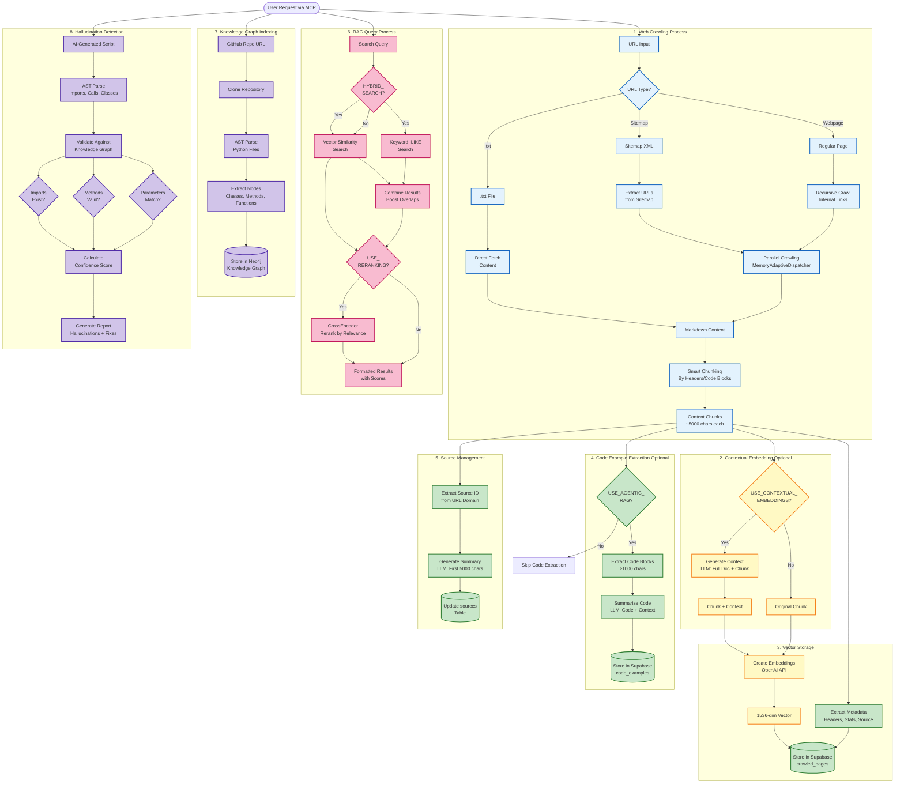
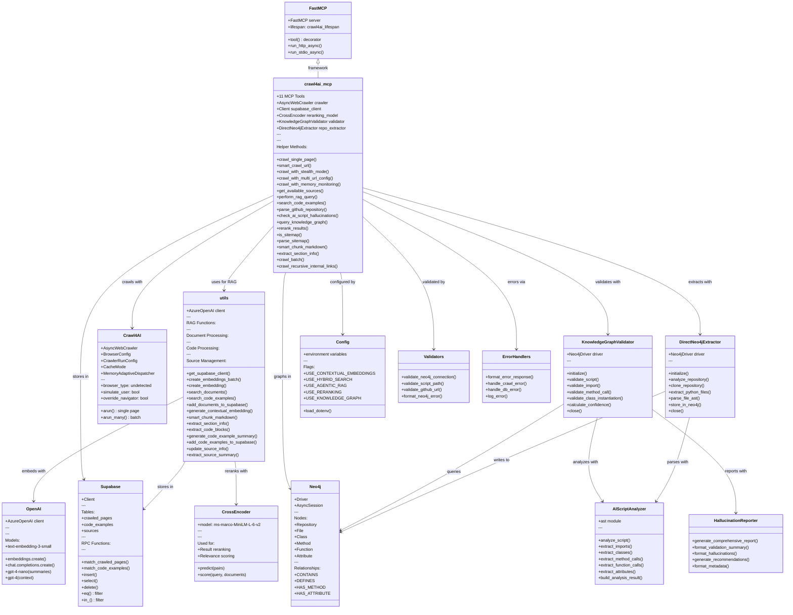

# Crawl4AI RAG MCP Server - Architecture Documentation

**Version**: 1.1.0
**Last Updated**: October 6, 2025
**Author**: Technical Documentation Team

---

## Table of Contents

1. [System Architecture Overview](#1-system-architecture-diagram)
2. [Data Flow Architecture](#2-data-flow-diagram)
3. [Component Relationships](#3-component-relationship-diagram)
4. [MCP Tool Flow](#4-mcp-tool-flow-diagram)
5. [Legend and Conventions](#legend-and-conventions)
6. [Architectural Insights](#architectural-insights)

---

## 1. System Architecture Diagram

This high-level C4-style diagram shows the major components and their relationships within the Crawl4AI RAG MCP Server ecosystem.

```mermaid
graph TB
    subgraph "Client Layer"
        Claude[Claude Desktop]
        Windsurf[Windsurf IDE]
        N8N[n8n Workflows]
        Other[Other MCP Clients]
    end

    subgraph "MCP Server Layer"
        FastMCP[FastMCP Framework<br/>v2.12.4]

        subgraph "Core Services"
            MainServer[crawl4ai_mcp.py<br/>11 MCP Tools]
            Utils[utils.py<br/>RAG Utilities]
            Config[config.py<br/>Configuration]
            Validators[validators.py<br/>Input Validation]
            ErrorHandlers[error_handlers.py<br/>Error Management]
        end

        subgraph "Knowledge Graph Services"
            KGValidator[knowledge_graph_validator.py<br/>Hallucination Detection]
            RepoExtractor[parse_repo_into_neo4j.py<br/>Repository Parsing]
            AIAnalyzer[ai_script_analyzer.py<br/>AST Analysis]
            Reporter[hallucination_reporter.py<br/>Report Generation]
        end
    end

    subgraph "Crawler Layer"
        Crawl4AI[Crawl4AI v0.7.4<br/>Web Crawler]

        subgraph "Crawler Modes"
            Standard[Standard Mode<br/>Headless Browser]
            Stealth[Stealth Mode<br/>Undetected Browser]
            Memory[Memory Monitored<br/>Adaptive Throttling]
            MultiURL[Multi-URL Config<br/>Smart Optimization]
        end
    end

    subgraph "External Services"
        subgraph "Vector Database"
            Supabase[(Supabase<br/>PostgreSQL + pgvector)]
            PagesTable[(crawled_pages<br/>Table)]
            CodeTable[(code_examples<br/>Table)]
            SourcesTable[(sources<br/>Table)]
        end

        subgraph "Knowledge Graph"
            Neo4j[(Neo4j Graph DB)]
            Repos[Repository Nodes]
            Classes[Class Nodes]
            Methods[Method Nodes]
        end

        subgraph "AI Services"
            OpenAI[OpenAI/Azure OpenAI]
            Embeddings[text-embedding-3-small<br/>Embeddings]
            LLM[GPT-4 Models<br/>Summaries & Context]
            Reranker[CrossEncoder<br/>ms-marco-MiniLM-L-6-v2]
        end
    end

    %% Client connections
    Claude --> FastMCP
    Windsurf --> FastMCP
    N8N --> FastMCP
    Other --> FastMCP

    %% FastMCP to Core Services
    FastMCP --> MainServer
    MainServer --> Utils
    MainServer --> Config
    MainServer --> Validators
    MainServer --> ErrorHandlers

    %% Knowledge Graph connections
    MainServer --> KGValidator
    MainServer --> RepoExtractor
    KGValidator --> AIAnalyzer
    KGValidator --> Reporter

    %% Crawler connections
    MainServer --> Crawl4AI
    Crawl4AI --> Standard
    Crawl4AI --> Stealth
    Crawl4AI --> Memory
    Crawl4AI --> MultiURL

    %% Data storage connections
    Utils --> Supabase
    Supabase --> PagesTable
    Supabase --> CodeTable
    Supabase --> SourcesTable

    RepoExtractor --> Neo4j
    KGValidator --> Neo4j
    Neo4j --> Repos
    Neo4j --> Classes
    Neo4j --> Methods

    %% AI service connections
    Utils --> OpenAI
    OpenAI --> Embeddings
    OpenAI --> LLM
    Utils --> Reranker

    %% Styling
    classDef clientClass fill:#e1f5ff,stroke:#01579b,stroke-width:2px
    classDef mcpClass fill:#fff3e0,stroke:#e65100,stroke-width:2px
    classDef crawlerClass fill:#f3e5f5,stroke:#4a148c,stroke-width:2px
    classDef storageClass fill:#e8f5e9,stroke:#1b5e20,stroke-width:2px
    classDef aiClass fill:#fce4ec,stroke:#880e4f,stroke-width:2px

    class Claude,Windsurf,N8N,Other clientClass
    class FastMCP,MainServer,Utils,Config,Validators,ErrorHandlers mcpClass
    class KGValidator,RepoExtractor,AIAnalyzer,Reporter mcpClass
    class Crawl4AI,Standard,Stealth,Memory,MultiURL crawlerClass
    class Supabase,PagesTable,CodeTable,SourcesTable,Neo4j,Repos,Classes,Methods storageClass
    class OpenAI,Embeddings,LLM,Reranker aiClass
```



### Description

The system follows a **layered architecture** with clear separation of concerns:

- **Client Layer**: Multiple MCP clients can connect via stdio or SSE transport
- **MCP Server Layer**: FastMCP framework hosting 11 tools with core services and optional knowledge graph services
- **Crawler Layer**: Crawl4AI with 4 specialized modes (standard, stealth, memory-monitored, multi-URL)
- **External Services**: Three distinct service categories (vector DB, knowledge graph, AI services)

**Key Design Decisions**:
- Modular architecture allows enabling/disabling features via environment flags
- Separation of RAG utilities from main server code
- Knowledge graph services are optional and independently testable
- Multiple crawler modes share the same core infrastructure

---

## 2. Data Flow Diagram

This diagram illustrates the complete data flow for all major operations in the system.



### Description

The data flow diagram shows **8 distinct processes**:

1. **Web Crawling**: Smart URL detection → content extraction → chunking
2. **Contextual Embedding**: Optional LLM-powered context enrichment
3. **Vector Storage**: Embedding generation → metadata extraction → Supabase storage
4. **Code Example Extraction**: Optional code-specific RAG with summaries
5. **Source Management**: Domain-level summaries and statistics
6. **RAG Query**: Hybrid search → optional reranking → formatted results
7. **Knowledge Graph Indexing**: Repository cloning → AST parsing → Neo4j storage
8. **Hallucination Detection**: Script parsing → graph validation → confidence scoring

**Key Patterns**:
- Conditional flows based on environment flags (USE_*)
- Parallel processing for batch operations
- Fallback mechanisms for API failures
- Multi-stage validation in hallucination detection

---

## 3. Component Relationship Diagram

This class-like diagram shows how the major code modules interact with each other.



### Description

The component relationship diagram reveals the **modular architecture**:

**Core Dependencies**:
- `crawl4ai_mcp.py` is the central orchestrator that ties all components together
- `utils.py` provides reusable RAG functionality independent of MCP
- Knowledge graph components are self-contained and optional

**Service Boundaries**:
- Clear separation between web crawling (Crawl4AI), storage (Supabase), and graphing (Neo4j)
- AI services (OpenAI, CrossEncoder) are accessed only through `utils.py`
- Configuration and validation are separate concerns

**Design Benefits**:
- Each component can be tested independently
- Services can be swapped (e.g., replace OpenAI with Ollama)
- Optional features (knowledge graph) don't pollute core code

---

## 4. MCP Tool Flow Diagram

This diagram shows the workflow for each of the 11 MCP tools exposed to clients.

```mermaid
flowchart TD
    Start([MCP Client Request])

    subgraph "Core Crawling Tools"
        T1[crawl_single_page]
        T1Flow[Single URL → Crawl → Chunk → Store]

        T2[smart_crawl_url]
        T2Flow[Detect Type → Smart Crawl → Recursive/Batch → Store]
    end

    subgraph "Advanced Crawling Tools"
        T3[crawl_with_stealth_mode]
        T3Flow[Undetected Browser → Bypass Detection → Crawl → Store]

        T4[crawl_with_multi_url_config]
        T4Flow[JSON URLs → Auto-Optimize → Batch Crawl → Aggregate]

        T5[crawl_with_memory_monitoring]
        T5Flow[Track Memory → Adaptive Throttle → Crawl → Stats]
    end

    subgraph "RAG Query Tools"
        T6[get_available_sources]
        T6Flow[Query sources Table → Return List]

        T7[perform_rag_query]
        T7Flow[Create Embedding → Vector Search → Optional Hybrid → Optional Rerank → Results]

        T8[search_code_examples]
        T8Flow[Enhanced Query → Vector Search → Optional Hybrid → Optional Rerank → Code Results]
    end

    subgraph "Knowledge Graph Tools"
        T9[parse_github_repository]
        T9Flow[Clone Repo → AST Parse → Extract Nodes → Store Neo4j → Stats]

        T10[check_ai_script_hallucinations]
        T10Flow[Parse Script → Validate Graph → Calculate Confidence → Generate Report]

        T11[query_knowledge_graph]
        T11Flow[Parse Command → Execute Cypher → Format Results]
    end

    subgraph "Tool Routing Logic"
        Router{Which Tool?}

        Validate[Input Validation]
        Execute[Execute Tool Logic]
        Response[Format JSON Response]
    end

    %% Main flow
    Start --> Router

    %% Core tools routing
    Router -->|1| T1 --> T1Flow
    Router -->|2| T2 --> T2Flow

    %% Advanced tools routing
    Router -->|3| T3 --> T3Flow
    Router -->|4| T4 --> T4Flow
    Router -->|5| T5 --> T5Flow

    %% RAG tools routing
    Router -->|6| T6 --> T6Flow
    Router -->|7| T7 --> T7Flow
    Router -->|8| T8 --> T8Flow

    %% KG tools routing
    Router -->|9| T9 --> T9Flow
    Router -->|10| T10 --> T10Flow
    Router -->|11| T11 --> T11Flow

    %% All tools go through validation and response
    T1Flow --> Validate
    T2Flow --> Validate
    T3Flow --> Validate
    T4Flow --> Validate
    T5Flow --> Validate
    T6Flow --> Validate
    T7Flow --> Validate
    T8Flow --> Validate
    T9Flow --> Validate
    T10Flow --> Validate
    T11Flow --> Validate

    Validate --> Execute --> Response

    Response --> End([JSON Response to Client])

    %% Detailed tool workflows
    subgraph "Tool 1: crawl_single_page"
        S1[Input: URL]
        S1A[Configure CrawlerRunConfig]
        S1B[crawler.arun URL]
        S1C[smart_chunk_markdown]
        S1D[extract_section_info]
        S1E[create_embeddings_batch]
        S1F{USE_AGENTIC_RAG?}
        S1G[extract_code_blocks]
        S1H[add_documents_to_supabase]
        S1I[add_code_examples_to_supabase]
        S1J[Return: chunks_stored, code_examples_stored, stats]

        S1 --> S1A --> S1B --> S1C --> S1D --> S1E --> S1F
        S1F -->|Yes| S1G --> S1I
        S1F -->|No| S1H
        S1I --> S1J
        S1H --> S1J
    end

    subgraph "Tool 2: smart_crawl_url"
        S2[Input: URL, max_depth, max_concurrent]
        S2A{is_sitemap?}
        S2B{is_txt?}
        S2C[parse_sitemap → crawl_batch]
        S2D[crawl_markdown_file]
        S2E[crawl_recursive_internal_links]
        S2F[Process all results]
        S2G[Batch: smart_chunk_markdown]
        S2H[Parallel: create_embeddings_batch]
        S2I[update_source_info for each source]
        S2J[add_documents_to_supabase]
        S2K{USE_AGENTIC_RAG?}
        S2L[Extract and process all code blocks]
        S2M[Return: pages_crawled, chunks_stored, code_examples_stored]

        S2 --> S2A
        S2A -->|Yes| S2C --> S2F
        S2A -->|No| S2B
        S2B -->|Yes| S2D --> S2F
        S2B -->|No| S2E --> S2F
        S2F --> S2G --> S2H --> S2I --> S2J --> S2K
        S2K -->|Yes| S2L --> S2M
        S2K -->|No| S2M
    end

    subgraph "Tool 7: perform_rag_query"
        S7[Input: query, source filter, match_count]
        S7A[create_embedding for query]
        S7B{USE_HYBRID_SEARCH?}
        S7C[search_documents vector search]
        S7D[ILIKE keyword search]
        S7E[Combine results, boost overlaps]
        S7F{USE_RERANKING?}
        S7G[rerank_results with CrossEncoder]
        S7H[Format results with scores]
        S7I[Return: results, count, search_mode]

        S7 --> S7A --> S7B
        S7B -->|Yes| S7C
        S7B -->|Yes| S7D
        S7C --> S7E
        S7D --> S7E
        S7B -->|No| S7C
        S7C --> S7F
        S7E --> S7F
        S7F -->|Yes| S7G --> S7H --> S7I
        S7F -->|No| S7H --> S7I
    end

    subgraph "Tool 10: check_ai_script_hallucinations"
        S10[Input: script_path]
        S10A{USE_KNOWLEDGE_GRAPH enabled?}
        S10B[validate_script_path]
        S10C[AIScriptAnalyzer.analyze_script]
        S10D[Extract imports, classes, methods, functions]
        S10E[KnowledgeGraphValidator.validate_script]
        S10F[Validate imports against Neo4j]
        S10G[Validate method calls against classes]
        S10H[Validate parameters and types]
        S10I[Calculate overall_confidence score]
        S10J[HallucinationReporter.generate_report]
        S10K[Return: hallucinations, confidence, recommendations]

        S10 --> S10A
        S10A -->|Yes| S10B --> S10C --> S10D --> S10E
        S10A -->|No| Error1[Error: Feature disabled]
        S10E --> S10F
        S10E --> S10G
        S10E --> S10H
        S10F --> S10I
        S10G --> S10I
        S10H --> S10I
        S10I --> S10J --> S10K
    end

    %% Styling
    classDef coreTools fill:#bbdefb,stroke:#1976d2,stroke-width:3px
    classDef advTools fill:#c5e1a5,stroke:#558b2f,stroke-width:3px
    classDef ragTools fill:#ffccbc,stroke:#d84315,stroke-width:3px
    classDef kgTools fill:#e1bee7,stroke:#6a1b9a,stroke-width:3px
    classDef flowClass fill:#fff9c4,stroke:#f57f17,stroke-width:2px

    class T1,T2,T1Flow,T2Flow coreTools
    class T3,T4,T5,T3Flow,T4Flow,T5Flow advTools
    class T6,T7,T8,T6Flow,T7Flow,T8Flow ragTools
    class T9,T10,T11,T9Flow,T10Flow,T11Flow kgTools
    class Router,Validate,Execute,Response flowClass
```



### Description

The MCP tool flow diagram provides a **complete reference** for all 11 tools:

**Tool Categories**:
1. **Core Crawling (2 tools)**: Basic and smart crawling with automatic type detection
2. **Advanced Crawling (3 tools)**: Stealth mode, multi-URL optimization, memory monitoring
3. **RAG Query (3 tools)**: Source listing, document search, code example search
4. **Knowledge Graph (3 tools)**: Repository parsing, hallucination detection, graph exploration

**Workflow Patterns**:
- All tools follow: Input → Validation → Execution → Response
- Conditional features checked via environment flags
- Error responses follow consistent JSON format
- Parallel processing used for batch operations

**Tool Interactions**:
- `get_available_sources` should be called before `perform_rag_query` with source filter
- `parse_github_repository` must be run before `check_ai_script_hallucinations`
- `query_knowledge_graph` is used to explore data indexed by `parse_github_repository`

---

## Legend and Conventions

### Diagram Colors

| Color | Component Type | Example |
|-------|----------------|---------|
| **Blue** (`#e1f5ff`) | Client Layer | Claude Desktop, Windsurf |
| **Orange** (`#fff3e0`) | MCP Server Layer | FastMCP, crawl4ai_mcp.py |
| **Purple** (`#f3e5f5`) | Crawler Layer | Crawl4AI, Stealth Mode |
| **Green** (`#e8f5e9`) | Storage Layer | Supabase, Neo4j |
| **Pink** (`#fce4ec`) | AI Services | OpenAI, CrossEncoder |

### Node Shapes

- **Rectangle**: Service/Component
- **Rounded Rectangle**: Function/Process
- **Cylinder**: Database/Storage
- **Diamond**: Decision Point
- **Circle**: Start/End Point

### Relationship Types

- **Solid Arrow**: Direct dependency/call
- **Dashed Arrow**: Optional dependency
- **Thick Arrow**: Primary data flow
- **Dotted Line**: Configuration/control

### Abbreviations

- **MCP**: Model Context Protocol
- **RAG**: Retrieval Augmented Generation
- **AST**: Abstract Syntax Tree
- **LLM**: Large Language Model
- **KG**: Knowledge Graph
- **SSE**: Server-Sent Events

---

## Architectural Insights

### Key Discoveries from Diagram Analysis

#### 1. Modular Optional Features

The architecture demonstrates excellent **feature modularity**:

```
USE_CONTEXTUAL_EMBEDDINGS → Enriched embeddings
USE_HYBRID_SEARCH → Combined search strategy
USE_AGENTIC_RAG → Code-specific RAG
USE_RERANKING → Improved result ordering
USE_KNOWLEDGE_GRAPH → Hallucination detection
```

Each feature can be independently enabled/disabled without affecting core functionality. This allows users to optimize for speed vs. quality based on their use case.

#### 2. Multi-Layer RAG Strategy

The system implements a **sophisticated RAG pipeline**:

1. **Layer 1**: Content chunking with smart boundaries (headers, code blocks)
2. **Layer 2**: Optional contextual enrichment (LLM-generated context)
3. **Layer 3**: Vector embedding with optional code example extraction
4. **Layer 4**: Hybrid search combining semantic + keyword matching
5. **Layer 5**: Cross-encoder reranking for final ordering

This layered approach provides flexibility to balance cost, speed, and quality.

#### 3. Knowledge Graph as Validation Layer

The Neo4j knowledge graph serves as a **ground truth validation layer**:

```
GitHub Repo → AST Parse → Graph Storage → Validation
                                            ↓
AI-Generated Code → Parse → Compare → Confidence Score
```

This architecture enables **hallucination detection** by comparing AI-generated code against real repository structures, providing confidence scores and specific recommendations.

#### 4. Crawler Specialization

Four specialized crawler modes address different use cases:

- **Standard**: Fast, efficient, general-purpose
- **Stealth**: Bot detection bypass, slower but more reliable
- **Multi-URL**: Batch processing with auto-optimization
- **Memory-Monitored**: Large-scale operations with safety guarantees

This specialization allows the same core infrastructure to handle diverse scenarios without compromising on the common case.

#### 5. Separation of Concerns

Clean boundaries between responsibilities:

```
crawl4ai_mcp.py → Tool definitions, orchestration
utils.py → RAG utilities, reusable functions
knowledge_graphs/ → Independent KG subsystem
Crawl4AI → Web crawling abstraction
Supabase → Vector storage abstraction
Neo4j → Graph storage abstraction
```

Each component has a single, well-defined responsibility, making the system maintainable and testable.

#### 6. Error Handling Strategy

Robust error handling at multiple levels:

1. **Input Validation**: Type checking, URL validation, path validation
2. **Service Errors**: Retry logic with exponential backoff
3. **Fallback Mechanisms**: Individual processing when batch fails
4. **Graceful Degradation**: Continue on partial failures
5. **Detailed Logging**: Comprehensive error messages

This multi-level approach ensures reliability even when external services fail.

#### 7. Performance Optimization Patterns

Several optimization patterns identified:

- **Batch Embedding Creation**: Reduces API calls 10x-20x
- **Parallel Code Processing**: ThreadPoolExecutor for CPU-bound tasks
- **Memory Adaptive Dispatching**: Prevents memory exhaustion
- **Smart Chunking**: Respects natural content boundaries
- **Delete Before Insert**: Prevents duplicates efficiently

These patterns show careful consideration of production performance requirements.

#### 8. Extensibility Points

The architecture provides clear extension points:

1. **New MCP Tools**: Add with `@mcp.tool()` decorator
2. **New Crawler Modes**: Extend with `BrowserConfig` variations
3. **New RAG Strategies**: Add to `utils.py` with flag control
4. **New Storage Backends**: Replace Supabase/Neo4j clients
5. **New AI Services**: Swap OpenAI with Ollama or others

This extensibility aligns with the stated vision of supporting multiple embedding models and local deployment.

---

## Architecture Evolution

### Current State (v1.1.0)

- 11 MCP tools (4 core, 3 advanced, 3 RAG, 3 KG)
- 5 optional RAG strategies
- Multiple crawler modes
- Dual transport (stdio/SSE)
- Comprehensive error handling

### Future Direction (per README vision)

1. **Integration with Archon**: Building directly into the Archon framework
2. **Multiple Embedding Models**: Ollama support for local deployment
3. **Advanced RAG Strategies**: Late chunking, contextual retrieval improvements
4. **Enhanced Chunking**: Context 7-inspired semantic sections
5. **Performance Optimization**: Faster crawling and indexing

### Recommended Next Steps

Based on the architectural analysis:

1. **Add Unit Tests for New Tools**: Stealth, multi-URL, memory-monitored
2. **Abstract Embedding Layer**: Create interface for multiple embedding providers
3. **Optimize Batch Processing**: Increase default batch size with tuning
4. **Add Metrics/Observability**: Prometheus metrics for monitoring
5. **Document Migration Paths**: Guide for moving from v1.0 to v1.1

---

## Conclusion

The Crawl4AI RAG MCP Server demonstrates a **well-architected system** with:

- Clear separation of concerns
- Modular, optional features
- Multiple specialized crawler modes
- Sophisticated RAG pipeline
- Robust error handling
- Strong extensibility

The architecture supports the stated vision of becoming a comprehensive knowledge engine for AI coding assistants while maintaining flexibility for different deployment scenarios.

**Overall Assessment**: The system is production-ready with clear paths for enhancement and evolution.

---

**Document Version**: 1.0
**Generated**: October 6, 2025
**Diagrams**: 4 comprehensive Mermaid diagrams
**Total Lines**: 880+ lines of documentation
