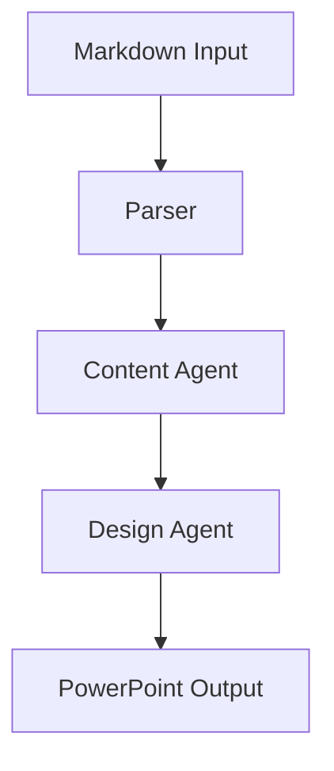

# 📝 Markdown Style Guide

This document defines the visual and structural standards for all markdown files in this codebase.

## 📋 Table of Contents

- [File Organization](#file-organization)
- [Formatting Standards](#formatting-standards)
- [Content Guidelines](#content-guidelines)
- [Code Documentation](#code-documentation)
- [Visual Elements](#visual-elements)
- [Automation & Enforcement](#automation--enforcement)

## 📁 File Organization

### **File Naming**

- Use lowercase with hyphens: `api-reference.md`, `user-guide.md`
- Be descriptive and specific: `agent-configuration.md` not `config.md`
- Use consistent prefixes for related files: `test-unit.md`, `test-integration.md`

### **Directory Structure**

```
docs/
├── api/              # API documentation
├── architecture/     # System design docs
├── guides/          # User and developer guides
├── diagrams/        # Visual documentation
├── deployment/      # Deployment guides
└── troubleshooting/ # Problem-solving docs
```

### **File Headers**

All markdown files should start with:

```markdown
# Document Title

Brief description of the document's purpose (1-2 sentences).

## Table of contents
- [Section 1](#section-1)
- [Section 2](#section-2)
```

## 🎨 Formatting Standards

### **Headings**

- Use ATX style (`#`) with space after hash
- Only one H1 per document
- Don't skip heading levels
- Use sentence case: `## Getting started` not `## Getting started`

```markdown
# Main Title (H1)
## Section Title (H2)
### Subsection Title (H3)
#### Detail Section (H4)
```

### **Lists**

- **Unordered**: Use `-` (hyphen) consistently
- **Ordered**: Use `1.` format with auto-numbering
- Add blank line before and after lists
- Use consistent indentation (2 spaces)

```markdown
## Features

- Feature one with description
- Feature two with description
  - Sub-feature with 2-space indent
  - Another sub-feature

## Steps

1. First step
2. Second step
   1. Sub-step with 3-space indent
   2. Another sub-step
```

### **Emphasis**

- **Bold**: Use `**text**` for important terms
- *Italic*: Use `*text*` for emphasis
- `Code`: Use backticks for inline code, filenames, commands

### **Links**

- Use descriptive link text: `[API documentation](api.md)` not `[here](api.md)`
- Use reference-style for repeated URLs:

```markdown
Check the [official docs][anthropic] and [API reference][anthropic].

[anthropic]: https://docs.anthropic.com
```

### **Code Blocks**

- Always specify language for syntax highlighting
- Use descriptive comments
- Keep examples concise but complete

```python
# Good: Complete example with context
async def process_slides(slides: List[Slide]) -> ProcessingResult:
    """Process slides with error handling."""
    try:
        return await processor.process(slides)
    except ProcessingError as e:
        logger.error("Processing failed", error=str(e))
        raise
```

### **Enhanced Table Formatting**

#### Standard Table Structure

```markdown
| Column 1 | Column 2 | Column 3 |
|:---------|:---------|:---------|
| Left-aligned | Center content | Right info |
| Use icons 🎯 | Add badges | Include links |
```

#### Feature Comparison Tables

```markdown
| Feature | Basic | Premium | Enterprise |
|:--------|:-----:|:-------:|:----------:|
| Users | 10 | 100 | Unlimited |
| Storage | 1GB | 10GB | 100GB |
| Support | ❌ | ✅ | ✅ |
```

#### API Parameter Tables

| Parameter | Type | Required | Description |
|-----------|------|----------|-------------|
| `slides` | List[Slide] | ✅ Yes | Input slides to process |
| `theme` | str | ❌ No | Theme name (default: "corporate") |

## 📖 Content Guidelines

### **Writing Style**

- **Voice**: Use active voice when possible
- **Tense**: Present tense for instructions, past tense for examples
- **Person**: Second person for user-facing docs ("you"), first person plural for team docs ("we")
- **Tone**: Professional but approachable

### **Structure**

- Start with overview/summary
- Use progressive disclosure (general → specific)
- Include practical examples
- End with next steps or related links

### **Terminology**

- Use consistent terms throughout project
- Define acronyms on first use: "Large Language Model (LLM)"
- Maintain glossary for complex terms

### **Examples**

- Include realistic, working examples
- Show both success and error cases
- Provide context for when to use each approach

## 💻 Code Documentation

### **API Documentation**

```markdown
### `generate_presentation(markdown_path, **kwargs)`

Generate presentation from markdown file.

**Parameters:**
- `markdown_path` (str): Path to input markdown file
- `output_path` (str, optional): Output file path. Defaults to auto-generated name
- `theme` (str, default="corporate"): Presentation theme
- `max_slides` (int, default=100): Maximum number of slides

**Returns:**
- `str`: Path to generated presentation file

**Raises:**
- `FileNotFoundError`: If input file doesn't exist
- `ValidationError`: If markdown is malformed

**Example:**
```python
# Basic usage
output = await generator.generate("presentation.md")

# With custom options
output = await generator.generate(
    "presentation.md",
    theme="academic",
    max_slides=25,
    output_path="custom_output.pptx"
)
```

```

### **Configuration Examples**
```markdown
## Configuration

Create `.env` file:
```bash
# Required API keys
ANTHROPIC_API_KEY=sk-ant-your-key-here
OPENAI_API_KEY=sk-your-key-here

# Optional settings
LOG_LEVEL=INFO
MAX_SLIDES=100
ENABLE_CACHING=true
```

```

## 🎯 Visual Elements

### **Icon Usage Guidelines**

#### 📋 Standard Icon Mappings
| Category | Primary Icon | Alternative Icons | Usage |
|:---------|:------------|:------------------|:------|
| **Architecture** | 🏗️ | 🏛️, 🌉, 🔧 | System design, patterns, infrastructure |
| **Code/Development** | 💻 | 🔧, ⚙️, 🛠️, 👨‍💻 | Code examples, tools, programming |
| **Security** | 🔒 | 🔐, 🛡️, 🔑, 🚨 | Security topics, authentication |
| **Performance** | ⚡ | 🚀, 📈, ⏱️, 🏃‍♂️ | Optimization, speed, efficiency |
| **Best Practices** | 💡 | 📋, ✨, 🎯, 🌟 | Guidelines, tips, recommendations |
| **Warning/Caution** | ⚠️ | 🚨, ❗, ⛔, 🔥 | Important notices, alerts |
| **Success/Complete** | ✅ | ✔️, 🎉, 👍, 🟢 | Positive outcomes, completion |
| **Error/Failed** | ❌ | ❗, 🔴, 🚫, 💥 | Negative outcomes, failures |
| **Documentation** | 📚 | 📖, 📝, 📄, 📋 | Text content, guides, manuals |
| **Data/Analytics** | 📊 | 📈, 📉, 💾, 🗃️ | Data topics, charts, storage |
| **Cloud/Services** | ☁️ | 🌐, 🔷, 🌍, 🖥️ | External services, web, servers |
| **Process/Workflow** | 🔄 | ➡️, 🔀, 📍, 🔁 | Steps, flows, procedures |
| **Configuration** | ⚙️ | 🔧, 🛠️, 📝, 🎛️ | Settings, setup, customization |
| **Testing** | 🧪 | ✅, 🔍, 🎯, 🧬 | Testing, validation, quality assurance |
| **Deployment** | 🚀 | 📦, 🌐, ⬆️, 🎯 | Releases, publishing, distribution |
| **Monitoring** | 👀 | 📊, 📈, 🔍, 📡 | Observability, tracking, alerts |
| **Troubleshooting** | 🔧 | 🩺, 🔍, ❓, 🛠️ | Problem solving, debugging |
| **Getting Started** | 🚀 | 🌟, ⭐, 🎯, 🏁 | Quick start, onboarding |
| **Resources** | 📚 | 🔗, 📎, 🌐, 💼 | Links, references, tools |
| **Examples** | 💡 | 📝, 🎯, 🔍, 📋 | Code samples, demonstrations |

#### 🎨 Heading Icon Rules
```markdown
# 🚀 Main Title (H1) - Use bold, distinctive icons
## 📖 Major Section (H2) - Use category-specific icons
### 🎯 Subsection (H3) - Use relevant contextual icons
#### 📝 Detail Level (H4) - Optional, smaller scope icons
```

### **Badge Standards**

#### 🏷️ Required Badge Types

**Status Badges:**

```markdown


```

**Version & Build Badges:**

```markdown


```

**Documentation Badges:**

```markdown


```

#### 🎨 Standard Color Coding

| Status | Color | Hex Code | Usage |
|:-------|:------|:---------|:------|
| **Success/Active** | `brightgreen` | `#4c1` | Completed, working, stable |
| **Information** | `blue` | `#007ec6` | Version, documentation, general info |
| **Warning/Progress** | `yellow` | `#dfb317` | In development, caution, pending |
| **Error/Critical** | `red` | `#e05d44` | Failed, deprecated, broken |
| **Neutral** | `lightgrey` | `#9f9f9f` | Unknown, not applicable |

#### 📏 Badge Placement Rules

**Document Header Badges:**

```markdown
# 🚀 Project Name


Brief project description here.
```

**Section Status Badges:**

```markdown
## 📖 API Documentation 

### 🔧 Configuration 
```

#### Complexity Badges

```markdown


```

#### Performance Impact Badges

```markdown


```

### **Visual Element Rules & Standards**

#### 🎯 Consistent Visual Hierarchy

**Document Structure:**

```markdown
# 🚀 Project Title (H1) - Bold, project-defining icon
## 📖 Major Sections (H2) - Category-specific icons
### 🔧 Subsections (H3) - Functional icons
#### 📝 Details (H4) - Minimal, contextual icons
```

**Icon Consistency Rules:**

- **Use the same icon** for similar concepts across all documentation
- **Maintain visual balance** - avoid icon overload in headings
- **Follow the Standard Icon Mappings** table for all icon choices
- **Test icon visibility** across different themes and devices

#### 🎨 Visual Spacing Standards

**Required Spacing:**

```markdown
# 🚀 Title

 

Brief description paragraph.

## 📖 Section Header

Content with proper spacing around elements.

### 🔧 Subsection

- List items with proper spacing
- Second item

```code blocks with blank lines above and below```

More content continues...
```

#### 🔍 Accessibility Guidelines

**Icon Accessibility:**

- Always include descriptive alt text for images
- Use high-contrast icon combinations
- Ensure icons enhance, not replace, textual information
- Test with screen readers when possible

**Badge Accessibility:**

```markdown

```

### **Header Navigation Standards**

#### 🧭 Required Header Format

**All markdown files must include a consistent header with breadcrumb navigation:**

```markdown
# 🎯 Document Title - Project Name

> **🏠 [Home](../../README.md)** | **📖 [Documentation](../README.md)** | **🔧 [Current Section](CURRENT_FILE.md)** | **👤 Current Page**

---
```

#### 📍 Breadcrumb Navigation Rules

**Structure Requirements:**

- Start with Home icon (🏠) linking to root README.md
- Include Documentation link (📖) to docs/README.md
- Add relevant section link with appropriate icon
- End with current page name (no link, bold text)
- Use pipe separators (|) between navigation items
- Wrap entire navigation in blockquote (>)

**Icon Guidelines for Navigation:**

- 🏠 **Home** - Always links to root README.md
- 📖 **Documentation** - Links to docs/README.md
- 🔧 **Developer Guide** - For development-related docs
- 👤 **User Guide** - For user-facing documentation
- 📋 **API Reference** - For API documentation
- 🏗️ **Architecture** - For system design docs
- ⚙️ **Configuration** - For setup and config docs

**Path Examples:**

```markdown
<!-- Root level file -->
> **🏠 [Home](README.md)** | **📖 Current Page**

<!-- Docs folder file -->
> **🏠 [Home](../README.md)** | **📖 Documentation** | **👤 Current Page**

<!-- Docs subfolder file -->
> **🏠 [Home](../../README.md)** | **📖 [Documentation](../README.md)** | **🔧 [Guides](README.md)** | **👤 Current Page**
```

### **Color Coding Guidelines**

| Color | Hex Code | Usage | Examples |
|:------|:---------|:------|:---------|
| 🟢 **Green** | `#28a745` | Success, Good, Complete | Active, Low Impact |
| 🟡 **Yellow** | `#ffc107` | Warning, Caution, Medium | Beta, Medium Impact |
| 🔴 **Red** | `#dc3545` | Error, High Priority | Critical, High Impact |
| 🔵 **Blue** | `#007bff` | Information, Primary | Default, Links |
| ⚫ **Gray** | `#6c757d` | Disabled, Inactive | Deprecated, N/A |

### **Callouts**

Use consistent formatting for special content:

```markdown
> **💡 Tip:** Use caching to improve performance in production environments.

> **⚠️ Warning:** This operation will overwrite existing files.

> **📝 Note:** The API key must have presentation generation permissions.
```

### **Diagrams**

- Use mermaid for simple diagrams
- Store complex diagrams in `docs/diagrams/`
- Include alt text for accessibility



## 🤖 Automation & Enforcement

### **Linting Rules**

This project uses markdownlint with the following key rules:

- Line length: 100 characters (code blocks exempt)
- Allowed HTML: `<br>`, ``, `<div>`, `<details>`, `<summary>`
- Ordered lists: Use `1.` format
- No trailing punctuation in headings

### **Pre-commit Hooks**

Install and configure:

```bash
pip install pre-commit
pre-commit install
```

### **IDE Setup**

**VS Code Extensions:**

- markdownlint
- Markdown All in One
- Markdown Preview Enhanced

**Settings:**

```json
{
  "markdownlint.config": {
    "extends": ".markdownlint.json"
  },
  "[markdown]": {
    "editor.formatOnSave": true,
    "editor.wordWrap": "wordWrapColumn",
    "editor.wordWrapColumn": 100
  }
}
```

## 📚 Examples

### **Good Documentation Structure**

```markdown
# Agent Configuration Guide

This guide explains how to configure agents for optimal performance.

## Overview

Agents are configurable components that process different aspects of presentation generation.

## Configuration Files

### Basic Configuration
Create `config/agents.yaml`:
```yaml
research_agent:
  enabled: true
  max_results: 10
  timeout: 30
```

### Advanced Options

For production environments, consider these additional settings...

## Troubleshooting

### Common issues

**Problem:** Agent fails to initialize
**Solution:** Check API key configuration in `.env` file

## Next Steps

- [Agent Development Guide](../../claude_examples/agent-development.md)
- [API Reference](../../api/agents.md)

```

### **Poor Documentation Example**
```markdown
# agents

how to setup agents

you need to configure them first. here's how:

put this in a file:
```

some_setting: true

```

then run it and it should work. if not, check the logs.
```

## 🚀 Copy-Paste Templates

### **Document Header Template**

```markdown
# 🚀 Document Title

<div align="center">


### 📚 Brief Description

</div>

---
```

### **Section Header Template**

```markdown
## 📖 Section Title

> **💡 Brief section description or key insight**

### 🎯 Subsection Title
```

### **Feature Table Template**

```markdown
| Feature | Description | Status |
|:--------|:------------|:-------|
| 🎯 **Feature 1** | Description here | ✅ Active |
| 🚀 **Feature 2** | Description here | 🚧 Beta |
| 💡 **Feature 3** | Description here | 📅 Planned |
```

### **API Documentation Template**

```markdown
### `function_name(parameters)`

Brief description of what the function does.

**Parameters:**
- `param1` (type): Description
- `param2` (type, optional): Description with default

**Returns:**
- `return_type`: Description of return value

**Example:**
```python
result = function_name(param1="value")
print(result)
```

```

### **Troubleshooting Section Template**
```markdown
## 🔧 Troubleshooting

### Common issues

**Problem:** Brief description of the issue
**Solution:** Step-by-step solution

**Problem:** Another common issue
**Solution:** How to resolve it

### Getting Help
- Check [documentation link](url)
- Review [troubleshooting guide](url)
- Contact support at [email/link]
```

## 🔍 Review Checklist

Before submitting documentation:

- [ ] **Structure**
  - [ ] Clear title and description
  - [ ] Table of contents for long documents
  - [ ] Logical section organization
  - [ ] Consistent heading hierarchy

- [ ] **Content**
  - [ ] Active voice used
  - [ ] Examples included
  - [ ] Error cases covered
  - [ ] Next steps provided

- [ ] **Formatting**
  - [ ] Consistent list formatting
  - [ ] Code blocks have language specified
  - [ ] Links use descriptive text
  - [ ] Tables are properly formatted

- [ ] **Technical**
  - [ ] All code examples tested
  - [ ] API signatures accurate
  - [ ] Configuration examples valid
  - [ ] Links work correctly

## 📞 Getting Help

- **Style Questions**: Reference this guide or ask in team discussions
- **Technical Issues**: Check existing documentation or create an issue
- **Tool Problems**: Verify markdownlint configuration and IDE setup

## 📚 Visual Resources

### **Emoji Reference Tools**

- **[Emojipedia](https://emojipedia.org/)** - Comprehensive emoji database with copy-paste functionality
- **[Unicode Emoji Charts](https://unicode.org/emoji/charts/)** - Official Unicode emoji reference
- **[GitHub Emoji Cheat Sheet](https://github.com/ikatyang/emoji-cheat-sheet)** - Complete list of `:emoji_name:` codes for GitHub-flavored markdown
- **[Gitmoji](https://gitmoji.dev/)** - Emoji guide for commit messages

### **Icon Libraries**

- **[Font Awesome](https://fontawesome.com/)** - Thousands of icons with HTML embedding support
- **[Heroicons](https://heroicons.com/)** - Beautiful hand-crafted SVG icons
- **[Feather Icons](https://feathericons.com/)** - Simply beautiful open source icons
- **[Lucide](https://lucide.dev/)** - Beautiful & consistent icon toolkit
- **[Simple Icons](https://simpleicons.org/)** - Brand icons for popular services
- **[Tabler Icons](https://tabler-icons.io/)** - Over 4,400+ free SVG icons
- **[Phosphor Icons](https://phosphoricons.com/)** - Flexible icon family

### **Graphics Resources**

- **[Shields.io](https://shields.io/)** - Generate SVG badges and shields
- **[Badgen](https://badgen.net/)** - Fast badge generating service
- **[For the Badge](https://forthebadge.com/)** - Badges for your projects

### **Charts & Diagrams**

#### Text-to-Diagram Tools

- **[Mermaid](https://mermaid.js.org/)** - Generate diagrams from text (widely supported)
- **[PlantUML](https://plantuml.com/)** - Create UML diagrams from text
- **[Draw.io/Diagrams.net](https://app.diagrams.net/)** - Online diagramming tool
- **[Excalidraw](https://excalidraw.com/)** - Virtual whiteboard for sketching

#### ASCII Art & Simple Charts

- **[ASCII Art Generator](https://www.asciiart.eu/)** - Convert text to ASCII art
- **[ASCII Flow](https://asciiflow.com/)** - Draw ASCII diagrams
- **[MonoDraw](https://monodraw.helftone.com/)** - ASCII art editor for Mac

### **Quick Emoji Categories**

| Category | Common Emojis | Usage |
|:---------|:-------------|:------|
| **Status** | ✅ ❌ ⚠️ 🚧 📅 | Completion states, warnings |
| **Actions** | 🚀 🔧 📝 🔍 💡 | Getting started, tools, writing |
| **Content** | 📚 📖 📊 💻 🎯 | Documentation types |
| **Process** | 🔄 ➡️ 📍 🔀 ⏱️ | Workflows, steps, timing |

---

*This style guide is a living document. Suggest improvements via pull request.*
